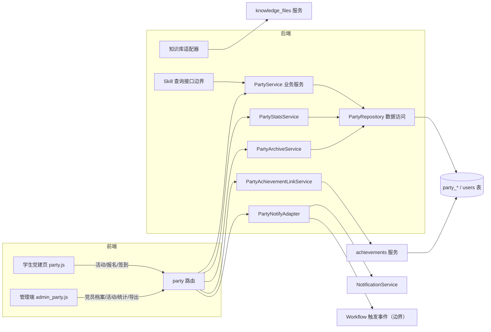
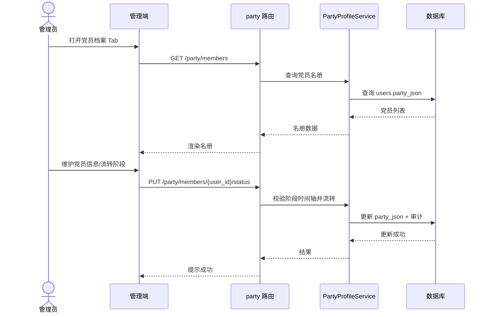
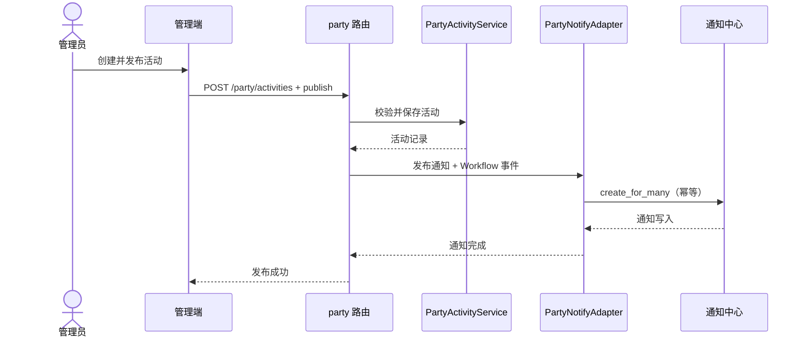
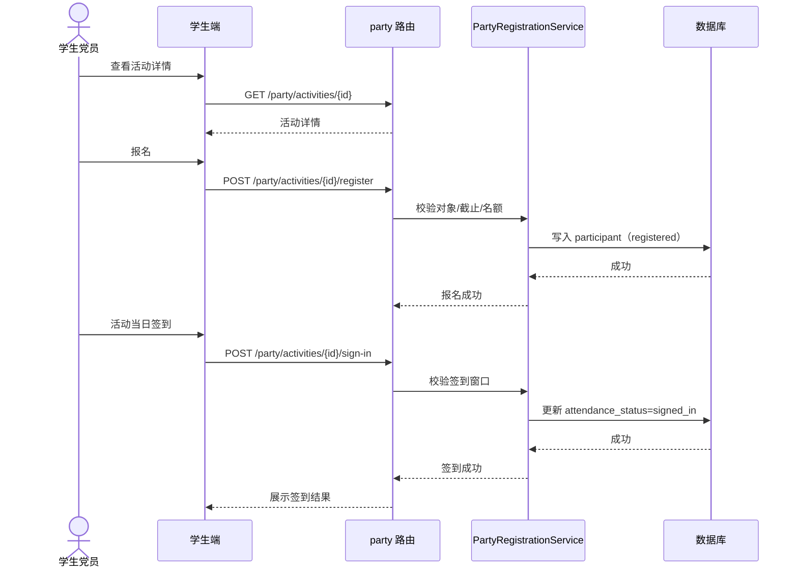

# 党建数字化管理体系概要设计

> 文档版本：v0.1
> 编写日期：2026-08-05
> 输入文档：[党建数字化管理体系需求文档](./dangjian_proposal.md)
> 适用范围：党建数字化管理体系（党员档案、党建活动、报名签到、工作档案、统计、成长档案联动、AI/Workflow 依赖边界）
> 技术基线：FastAPI + SQLAlchemy + SQLite/PostgreSQL + 原生 JS 前端，沿用现有 model/schema/repository/service/route 分层

---

## 1. 设计目的与范围

本文档基于 `dangjian_proposal.md` 生成概要设计，用于指导“党建数字化管理体系”的模块拆分、模块职责、模块关系、数据模型、接口、关键流程、前端组件和实施顺序。

本次设计覆盖：

1. 党员档案：`users.party_json` 扩展字段、发展阶段状态机、党员名册、发展材料。
2. 党建活动：活动 CRUD、状态流转、学习材料、活动总结。
3. 报名与签到：报名/取消报名、自助签到、管理员代签/补签、参与记录。
4. 党建工作档案：活动归档、党员发展档案、查询与 CSV 导出。
5. 党建统计：党员人数、班级分布、活动参与率、材料上传量、发展情况。
6. 成长档案联动：党员身份与活动经历一键写入 `achievements`。
7. 依赖边界：党建材料进知识库、党建查询 Skill 查询接口、Workflow 触发事件。

本次设计不覆盖：

- 党建查询 Skill 的触发词、提示词、返回格式与 Agent 内部实现（由后续“AI Agent 业务 Skills”文档细化）。
- Workflow 调度器、失败重试、任务运行记录（由后续“Workflow 工作流自动化”文档细化）。
- 创新项目空间、竞赛推荐/导师匹配 Skill、成果管理 Skill 等其他 P0 模块。

## 2. 设计决策记录

需求文档第 14 章待确认事项已按推荐默认值确认如下：

| 序号 | 待确认事项 | 最终设计决策 |
| --- | --- | --- |
| 1 | 党员身份字段存放 | 独立新增 `users.party_json`，不并入 `profile_json` |
| 2 | 发展阶段状态机 | 时间轴字段（`apply_date/activist_date/target_date/probation_date/full_date`）记录完整过程，`apply_status` 保存当前阶段，服务端校验一致性 |
| 3 | 普通学生/教师活动可见性 | 普通学生可按活动对象报名；教师默认不可查看党员名册，活动详情按活动可见性控制 |
| 4 | 签到方式 | 本期支持管理员手工签到（`manual`）与学生自助签到（`self`）；`qr/location` 枚举预留 |
| 5 | 活动参与率分母 | 应参加名单（`target_roles`/`target_member_ids_json` 展开）作为分母 |
| 6 | 成长档案联动方式 | 一键写入 + `pending` 审核；不新增“党建经历”独立成果分类 |
| 7 | 涉敏材料 | 党员发展材料不进知识库、不参与 AI 检索 |
| 8 | 班级字段 | 班级/年级在 `party_json` 内维护，本期不新增 `users` 通用班级字段 |
| 9 | 导出范围 | 本期支持 CSV 导出党员名册、参与名单、统计；PDF/Word 后续实现 |
| 10 | 校友历史记录 | 校友不开放党建功能，历史参与记录仅管理员可查，校友不计入当前党员名册与统计 |

补充设计决策：

- 支部归属固定默认“大数据党支部”，`branch_name` 允许管理端修改，本期不做多支部管理。
- 班级枚举写入运行时配置 `party_classes`，默认“大数据25级,大数据24级,大数据23级,大数据22级”。
- 自助签到窗口默认活动开始前后各 60 分钟，配置项 `party_sign_in_window_minutes`。
- 活动通知 `ref_type="party_activity"`，幂等判定沿用 `type + ref_type + ref_id`。
- 成长档案联动使用 `achievements.details_json` 写入 `source_type="party"`、`source_id` 标记，防止重复生成。

## 3. 模块划分

### 3.1 模块清单

| 编号 | 模块 | 职责摘要 |
| --- | --- | --- |
| M1 | 党员档案模块（Party Profile） | `party_json` 读写、党员名册、阶段时间轴与状态机、班级/支部归属、发展材料管理 |
| M2 | 党建活动模块（Party Activity Core） | `party_activities` CRUD、状态流转、发布、学习材料与活动总结 |
| M3 | 报名签到模块（Registration & Attendance） | `party_activity_participants`、报名/取消报名、自助签到、代签/补签、名额控制 |
| M4 | 工作档案模块（Party Archive） | 活动归档、党员发展档案、按年份/班级/类别查询、CSV 导出 |
| M5 | 党建统计模块（Party Stats） | 党员人数、班级分布、活动参与率、材料上传量、发展情况、多维筛选 |
| M6 | 成长档案联动模块（Achievement Link） | 党员身份与活动经历一键写入 `achievements`（`pending` 审核） |
| M7 | 通知与依赖适配模块（Notification & Dependency Adapter） | 通知落库、Workflow 触发事件、知识库入库、党建查询 Skill 查询接口边界 |
| M8 | 兼容与迁移模块（Compatibility & Migration） | `users.party_json` 迁移、新表创建、旧数据处理、路由注册顺序 |

### 3.2 模块关系图



### 3.3 依赖关系

| 模块 | 依赖 | 被依赖 |
| --- | --- | --- |
| M1 党员档案 | 用户模块、文件服务 | M2、M4、M5、M7、M8 |
| M2 党建活动 | M1（活动对象判定）、文件服务 | M3、M4、M5、M7 |
| M3 报名签到 | M1、M2 | M4、M5、M7 |
| M4 工作档案 | M1、M2、M3 | M5 |
| M5 党建统计 | M1、M2、M3、M4 | 无 |
| M6 成长档案联动 | M1、M2、M3、成果档案模块 | 无 |
| M7 通知与依赖适配 | M1、M2、M3、通知中心、知识库、Agent 工具 | 无 |
| M8 兼容与迁移 | 数据库、全局路由 | 全局约束 |

## 4. 模块职责与内部组成

### 4.1 M1 党员档案模块

职责：

- `users` 表新增 `party_json` 列与 `party` 读写属性，承载党员身份与阶段信息。
- 党员名册查询、新增、更新、批量导入；仅 `admin` 可维护。
- 发展阶段状态机：`apply_status` 保存当前阶段，时间轴字段保存过程；服务端校验阶段时间单调递增。
- 党员发展材料管理（`party_materials` 表）：申请书、思想汇报、政审材料、考察材料等；涉敏，不进知识库。
- 班级/年级在 `party_json` 内维护，班级枚举从运行时配置 `party_classes` 读取。

内部组成：

- 模型：`backend/app/models/party.py`（`PartyMaterial`）；`user.py` 增加 `party_json` 与 `party` 属性。
- Schema：`backend/app/schemas/party.py`（`PartyProfileCreate/Update/Info`、`PartyStatusChange`、`PartyMaterialCreate/Info`）。
- 仓储：`backend/app/repositories/party_repo.py`（成员名册、阶段流转、材料 CRUD）。
- 服务：`backend/app/services/party_profile_service.py`（字段校验、状态机、审计）。
- 路由：`api/routes/party.py` 中 `/members`、`/materials` 段落。

设计要点：

- `party_type`（正式党员/预备党员/入党积极分子）与 `apply_status` 联动校验，示例：`party_type=正式党员` 时 `apply_status` 至少为“转为正式党员”。
- 阶段流转写审计日志（沿用现有审计中间件或新增操作记录）。
- 党员身份变更通知本人（走 M7 通知适配器）。

### 4.2 M2 党建活动模块

职责：

- `party_activities` CRUD，仅 `admin` 创建/编辑/发布/归档。
- 活动状态流转：`draft → published → ongoing → finished → archived`。
- 学习材料附件（`materials_json`）与活动总结（`summary`、`summary_attachments_json`）。
- 发布时通知目标用户（M7），并将学习材料送入班级知识库（M7）。

内部组成：

- 模型：`party.py` 中 `PartyActivity`。
- Schema：`PartyActivityCreate/Update/Info`、`PartyActivitySummary`。
- 仓储：`party_repo.py` 中活动查询部分（或独立 `party_activity_repo.py`）。
- 服务：`backend/app/services/party_activity_service.py`。

设计要点：

- `target_roles` 枚举：全体党员/党员与积极分子/预备党员与积极分子/全体学生/指定人员。
- `registration_deadline` 必须早于 `start_at`；发布后不可把截止时间改到当前时间之前。
- 活动开始报名后，`registration_deadline`、`target_roles`、`max_participants` 不可修改。
- 软删除沿用 `deleted_at`；删除活动前要求先归档（`archived` 状态），避免丢失档案。

### 4.3 M3 报名签到模块

职责：

- `party_activity_participants` 报名/取消报名/签到/代签/补签/缺席标记。
- 名额控制（`max_participants`）、报名截止控制、自助签到窗口控制。
- 参与记录供本人、管理员、档案与统计查询。

内部组成：

- 模型：`party.py` 中 `PartyActivityParticipant`。
- Schema：`PartyRegisterAction`、`PartyAttendanceAction`、`PartyParticipantInfo`。
- 仓储：`party_repo.py` 中参与记录部分。
- 服务：`backend/app/services/party_registration_service.py`。

设计要点：

- `(activity_id, user_id)` 唯一索引，重复报名返回业务错误。
- 取消报名仅限报名截止前且未签到的记录；取消后释放名额。
- 签到窗口默认活动开始前后各 60 分钟（`party_sign_in_window_minutes` 可配置）；窗口外自助签到拒绝，管理员可代签/补签。
- 本期 `sign_in_method` 使用 `manual/self`，`qr/location` 预留枚举值但不实现。
- 管理员代报名不受报名截止限制，但需记录操作者。

### 4.4 M4 工作档案模块

职责：

- 活动归档：活动信息 + 应参加名单 + 报名/签到记录 + 学习材料 + 活动总结与附件。
- 党员发展档案：党员身份阶段时间轴与材料清单。
- 查询维度：年份、班级、活动类别、党员类型、申请状态。
- CSV 导出：党员名册、活动参与名单、统计结果（UTF-8 BOM，兼容 Excel）。

内部组成：

- 服务：`backend/app/services/party_archive_service.py`、`party_export_service.py`。
- 路由：`party.py` 中 `/archive`、`/stats/export` 段落。

设计要点：

- 归档为只读视图，不引入独立归档表；活动 `finished/archived` 状态即档案就绪。
- CSV 导出走现有分页与查询服务，限制导出条数上限（建议单次不超过 5000 条）。
- PDF/Word 导出本期不实现，接口预留扩展参数 `format=csv`。

### 4.5 M5 党建统计模块

职责：

- 党员人数：按 `party_type`、`class_name`、`grade` 分组。
- 班级分布：各班级党员人数。
- 活动参与率：签到人数/应参加人数；应参加名单由 `target_roles` 展开或 `target_member_ids_json` 直接给出。
- 报名率（可选）：报名人数/应参加人数。
- 材料上传量：学习材料 + 党员发展材料数量，按年月/活动/党员统计。
- 发展情况：按 `apply_status` 分组，含年度转正数。

内部组成：

- 仓储：`party_repo.py` 统计查询部分或独立 `party_stats_repo.py`。
- 服务：`backend/app/services/party_stats_service.py`。
- 路由：`party.py` 中 `/stats` 段落。

设计要点：

- 统计只统计 `deleted_at IS NULL` 的数据。
- 班级/年份/活动类别筛选均为可选参数，组合查询。
- 统计结果纳入管理端“党建/竞赛/项目/成果多维统计”入口，本期先提供党建自身统计接口，跨模块多维统计后续统一编排。

### 4.6 M6 成长档案联动模块

职责：

- 党员身份一键生成“组织管理（organization）”类成果，状态 `pending`。
- 已完成签到的党建活动按性质一键生成“组织管理/社会实践（social）”类成果，状态 `pending`。
- 防重复：`details_json` 写入 `source_type="party"` 与 `source_id`，联动前检查。

内部组成：

- 服务：`backend/app/services/party_achievement_link_service.py`。
- 路由：`party.py` 中 `/achievements/link` 段落。

设计要点：

- 复用现有 `AchievementService` 的模板校验与创建流程；`organization` 模板必填字段（如考核评定、荣誉）无数据时填“无”，结束年份无数据填“进行中”。
- 联动产生的成果沿用现有 `pending → approved/rejected` 审核流程。
- 身份联动仅对“正式党员/预备党员”提供入口；入党积极分子不自动生成身份成果。

### 4.7 M7 通知与依赖适配模块

职责：

- 活动发布立即通知、阶段流转通知、报名/签到结果通知落库。
- 定义 Workflow 触发事件边界（不实现调度器）。
- 学习材料进入班级知识库；涉敏材料不进入。
- 定义党建查询 Skill 的只读查询接口边界（不实现 Agent 内部逻辑）。

内部组成：

- 服务：`backend/app/services/party_notify_adapter.py`、`party_knowledge_adapter.py`、`party_skill_boundary.py`。

#### 4.7.1 通知适配

| 通知场景 | `type` | `ref_type` | `ref_id` |
| --- | --- | --- | --- |
| 活动发布通知 | `party_activity_notice` | `party_activity` | 活动 ID |
| 活动提醒（截止/开始） | `party_activity_reminder` | `party_activity` | 活动 ID |
| 党员阶段变更 | `party_status_change` | `party_member` | 用户 ID |

幂等判定沿用 `NotificationService` 的 `type + ref_type + ref_id` 检查；批量通知复用 `NotificationRepository.create_for_many`。

#### 4.7.2 Workflow 触发事件边界

| 事件 | 触发时机 | 载荷 | 落点 |
| --- | --- | --- | --- |
| `party.activity_published` | 活动发布 | `{activity_id, target_user_ids}` | 通知中心 |
| `party.registration_deadline_approaching` | 截止前 24h/2h | `{activity_id, registered_user_ids}` | 通知中心 |
| `party.activity_starting` | 开始前 | `{activity_id, registered_user_ids}` | 通知中心 |
| `party.activity_finished` | 活动结束 | `{activity_id}` | 生成参与记录/归档提醒 |
| `party.status_changed` | 阶段流转 | `{user_id, from_status, to_status}` | 通知本人、审计 |

本文档只定义事件名与载荷；调度、幂等任务记录、失败重试由 Workflow 文档细化。

#### 4.7.3 党建查询 Skill 接口边界

| 工具名 | 权限 | 说明 |
| --- | --- | --- |
| `list_party_members` | admin | 党员名册查询（班级/类型/状态筛选） |
| `get_party_member` | admin/本人 | 党员信息查询 |
| `list_party_activities` | 登录用户（按可见性） | 活动列表查询 |
| `get_party_activity` | 可见用户 | 活动详情查询 |
| `get_party_my_records` | 本人 | 我的报名/签到记录 |

本期不开放党建写操作工具；如后续需要 Agent 写活动/材料，走现有任务确认机制。

### 4.8 M8 兼容与迁移模块

职责：

- Alembic 迁移：`users` 新增 `party_json`（Text，默认 `{}`）；新增 `party_activities`、`party_activity_participants`、`party_materials` 表。
- 旧数据处理：无 `party_json` 或空对象的用户视为普通学生，不影响现有功能。
- 路由注册顺序：`/party/mine`、`/party/members`、`/party/activities`、`/party/stats` 等静态段注册在 `/{party_activity_id}` 之前。
- 新增权限依赖：`require_party_member`（`student` 且 `party_json.party_type` 有效）。

设计要点：

- 迁移兼容 SQLite/PostgreSQL，不在迁移中做数据回填（当前无历史党建数据）。
- 软删除语义：党员档案删除与活动删除均使用 `deleted_at`，不物理删除。

## 5. 数据模型设计

### 5.1 users 表变更

| 字段 | 变更 | 说明 |
| --- | --- | --- |
| `party_json` | 新增 | Text/JSON，默认 `{}`，存党员身份与阶段信息 |
| `profile_json` | 不变 | 个人基础资料（专业/研究方向/技能/简介），不承载党员信息 |

`User` 增加 `party` 读写属性，沿用 `profile` 的 JSON 处理模式。

### 5.2 party_json 键结构汇总

| 显示名 | 键 | 类型 |
| --- | --- | --- |
| 党员类型 | `party_type` | enum（正式党员/预备党员/入党积极分子） |
| 支部归属 | `branch_name` | str（默认“大数据党支部”） |
| 班级 | `class_name` | str |
| 年级 | `grade` | str |
| 递交入党申请书时间 | `apply_date` | str（YYYY-MM） |
| 确定为入党积极分子时间 | `activist_date` | str（YYYY-MM） |
| 列为发展对象时间 | `target_date` | str（YYYY-MM） |
| 接受为预备党员时间 | `probation_date` | str（YYYY-MM） |
| 转为正式党员时间 | `full_date` | str（YYYY-MM） |
| 入党时间 | `party_join_date` | str（YYYY-MM） |
| 申请状态 | `apply_status` | enum（递交申请/确定为积极分子/列为发展对象/接受为预备党员/转为正式党员/停止发展） |
| 停止发展原因 | `stop_reason` | str（可选） |
| 介绍人 | `introducer_names` | str（中文逗号分隔） |
| 培养联系人 | `mentor_names` | str（中文逗号分隔） |
| 备注 | `remark` | text（可选） |

### 5.3 party_activities 表

| 字段 | 类型 | 说明 |
| --- | --- | --- |
| `id` | int | 主键 |
| `title` | str(200) | 活动标题 |
| `category` | str(30) | 组织生活会/主题党日/理论学习/志愿公益/发展工作/民主评议/专题教育/其他 |
| `content` | text | 活动通知正文 |
| `location` | str(200) | 地点 |
| `start_at` | datetime | 开始时间 |
| `end_at` | datetime | 结束时间 |
| `registration_deadline` | datetime | 报名截止（可空） |
| `target_roles` | str(30) | 参加对象枚举 |
| `target_member_ids_json` | text | 指定人员用户 ID 列表 |
| `max_participants` | int | 报名人数上限（可空） |
| `materials_json` | text | 学习材料附件列表 |
| `summary` | text | 活动总结 |
| `summary_attachments_json` | text | 总结附件列表 |
| `status` | str(20) | draft/published/ongoing/finished/archived |
| `created_by` | int | 创建管理员（FK users.id） |
| `created_at/updated_at/deleted_at` | datetime | 时间戳 |

索引：`ix_party_activities_status_start_at(status, start_at)`、`ix_party_activities_category_start_at(category, start_at)`。

### 5.4 party_activity_participants 表

| 字段 | 类型 | 说明 |
| --- | --- | --- |
| `id` | int | 主键 |
| `activity_id` | int | 活动 ID（FK） |
| `user_id` | int | 用户 ID（FK） |
| `registration_status` | str(20) | registered/cancelled |
| `attendance_status` | str(20) | none/signed_in/absent |
| `sign_in_time` | datetime | 签到时间（可空） |
| `sign_in_method` | str(20) | manual/self/qr/location |
| `created_at/updated_at` | datetime | 时间戳 |

索引：唯一索引 `uq_party_participant(activity_id, user_id)`、`ix_party_participant_user(user_id, activity_id)`、`ix_party_participant_attendance(activity_id, attendance_status)`。

### 5.5 party_materials 表

| 字段 | 类型 | 说明 |
| --- | --- | --- |
| `id` | int | 主键 |
| `user_id` | int | 所属党员（FK users.id） |
| `material_type` | str(30) | 申请书/思想汇报/政审材料/考察材料/其他 |
| `title` | str(200) | 材料名称 |
| `original_name` | str(255) | 原始文件名 |
| `stored_name` | str(255) | 存储文件名（UUID 命名） |
| `mime_type` | str(100) | 文件类型 |
| `size` | int | 文件大小 |
| `uploaded_by` | int | 上传管理员（FK users.id） |
| `uploaded_at` | datetime | 上传时间 |
| `deleted_at` | datetime | 软删除时间（可空） |

索引：`ix_party_materials_user(user_id, material_type)`、`ix_party_materials_uploaded_at(uploaded_at)`。

## 6. 接口设计（概要）

> 路由前缀 `/api/v1/party`；静态路径注册在 `/{party_activity_id}` 之前；权限依赖：`require_admin`、`require_party_member`（新增）、`get_current_user` + 可见性服务。

| 方法 | 路径 | 权限 | 说明 |
| --- | --- | --- | --- |
| GET | `/party/members` | admin | 党员名册（班级/类型/状态/分页） |
| POST | `/party/members` | admin | 新增/批量导入党员身份 |
| PUT | `/party/members/{user_id}` | admin | 更新党员基础信息 |
| PUT | `/party/members/{user_id}/status` | admin | 发展阶段流转 |
| POST | `/party/materials` | admin | 上传党员发展材料 |
| GET | `/party/members/{user_id}/materials` | admin | 党员材料列表 |
| GET | `/party/mine` | 党员本人 | 本人党员信息与参与记录 |
| GET | `/party/activities` | 登录用户（按可见性） | 活动列表（状态/类别/年份筛选） |
| POST | `/party/activities` | admin | 创建活动 |
| PUT | `/party/activities/{id}` | admin | 编辑活动 |
| POST | `/party/activities/{id}/publish` | admin | 发布并通知 |
| GET | `/party/activities/{id}` | 可见用户 | 活动详情（含材料/总结） |
| POST | `/party/activities/{id}/register` | 目标用户 | 报名 |
| DELETE | `/party/activities/{id}/register` | 本人 | 取消报名 |
| POST | `/party/activities/{id}/sign-in` | 本人/admin | 签到/代签 |
| PUT | `/party/activities/{id}/participants/{user_id}/attendance` | admin | 补签/标记缺席 |
| POST | `/party/activities/{id}/summary` | admin | 填写活动总结并归档 |
| GET | `/party/activities/{id}/archive` | admin | 活动档案 |
| GET | `/party/stats` | admin | 党建统计（筛选参数） |
| POST | `/party/stats/export` | admin | 统计/名册 CSV 导出 |
| POST | `/party/achievements/link` | admin/本人 | 一键写入成长档案 |

接口设计注意：

- `/mine`、`/members`、`/materials`、`/activities`、`/stats` 等静态段注册顺序固定，避免被动态参数吞掉。
- 报名/签到接口返回统一业务错误码（已截止/重复报名/超出名额/窗口未开放等）。
- 所有返回列表接口沿用现有分页封装，默认 `page_size=20`，上限 100。

## 7. 关键流程时序

### 7.1 党员档案维护与阶段流转



### 7.2 活动发布与通知



### 7.3 报名与签到



### 7.4 活动归档与成长档案联动

```mermaid
sequenceDiagram
    actor Admin as 管理员
    participant FE as 管理端
    participant API as party 路由
    participant ARCH as PartyArchiveService
    participant LINK as PartyAchievementLinkService
    participant ACH as achievements 服务
    participant DB as 数据库

    Admin->>FE: 填写活动总结并归档
    FE->>API: POST /party/activities/{id}/summary
    API->>ARCH: 汇总档案数据
    ARCH->>DB: 更新总结/状态
    DB-->>ARCH: 完成
    API-->>FE: 档案就绪
    Admin->>FE: 一键写入成长档案
    FE->>API: POST /party/achievements/link
    API->>LINK: 防重复检查
    LINK->>ACH: 创建 pending 成果（source 标记）
    ACH->>DB: 写入 achievements
    DB-->>ACH: 成功
    LINK-->>API: 联动结果
    API-->>FE: 提示待审核
```

## 8. 前端组件划分

沿用现有原生 JS 架构，不引入框架；新增组件：

| 组件文件 | 职责 |
| --- | --- |
| `frontend/js/views/party.js` | 学生党建页：活动列表、活动详情、报名/签到、我的党员信息、我的参与记录 |
| `frontend/js/admin_party.js` | 管理端党建管理：党员档案、活动管理、统计、档案/导出 |
| `frontend/js/party_activity_form.js` | 活动表单（类别/时间/对象/材料/总结） |
| `frontend/js/party_member_form.js` | 党员档案表单（身份字段与阶段时间轴） |
| `frontend/js/party_stats.js` | 统计卡片与筛选 |
| `frontend/js/party_export.js` | CSV 导出触发与下载 |

页面与交互约定：

- 学生党员左侧菜单新增“党建”；普通学生仅显示“党建活动”入口（活动公开时）；教师默认不显示党员名册入口。
- 管理后台新增“党建管理”页签，内含党员档案、活动管理、统计、档案导出四个区块。
- 报名/签到按钮按活动状态禁用或隐藏；签到成功用 toast 提示。
- 附件上传复用现有文件上传组件，格式 PDF/JPG/PNG，单文件不超过 20MB（沿用系统配置）。
- 所有列表沿用现有分页与搜索控件。

## 9. 实施顺序

| 阶段 | 内容 | 交付物 |
| --- | --- | --- |
| 1 | 数据模型与迁移 | Alembic 新增 `party_json` 与 3 张新表；`User.party` 属性 |
| 2 | 党员档案后端 | `party_members` CRUD、阶段状态机、材料上传、审计 |
| 3 | 党建活动与报名签到 | 活动 CRUD/状态流转、报名/取消/签到/补签、通知适配 |
| 4 | 档案与统计 | 活动归档、党员发展档案、统计接口、CSV 导出 |
| 5 | 成长档案联动 | 一键写入 `achievements`（source 标记防重） |
| 6 | 依赖适配 | 知识库入库适配器、Skill 查询接口边界、Workflow 事件定义 |
| 7 | 前端与管理端 | 学生党建页、管理端党建管理、联调与测试 |
| 8 | 验收 | 按第 12 章验收映射执行测试与验收 |

## 10. 设计假设与决策记录

除第 2 章确认的决策外，以下为概要设计采用的设计假设：

1. 只有一个“大数据党支部”，`branch_name` 默认固定，本期不做多支部管理。
2. 班级枚举维护在运行时配置 `party_classes`，不新增 `users` 通用班级字段。
3. 签到窗口默认活动开始前后各 60 分钟，可配置。
4. 活动通知幂等键为 `type + ref_type + ref_id`，批量通知走现有 `create_for_many`。
5. 成长档案联动必须满足 `achievements` 现有模板校验；`organization` 模板缺省字段填“无”，结束时间未定填“进行中”。
6. 党员发展材料不进入知识库；活动学习材料进入班级知识库。
7. 党建查询 Skill 本期只提供只读查询工具，写操作不开放。
8. 校友不开放党建入口，不计入当前名册与统计；历史参与记录仅管理员可查。
9. CSV 导出使用 UTF-8 BOM，兼容 Excel；PDF/Word 后续扩展。
10. 接口静态段与动态段路由顺序固定，并纳入测试。

## 11. 风险与依赖

| 风险/依赖 | 说明 | 应对 |
| --- | --- | --- |
| `party_json` 无数据库级结构约束 | SQLite/PostgreSQL JSON 不校验键与类型 | 服务端 schema 校验 + 前端同规则提示 |
| 阶段时间轴复杂度 | 多阶段字段易出现矛盾数据 | 状态机 helper + 一致性校验 + 审计 |
| 成长档案模板必填约束 | 联动生成的成果需满足 `organization/social` 模板 | 映射默认值（“无”“进行中”）+ 联动失败提示 |
| 通知幂等 | 重复发布或 Workflow 重试可能产生重复通知 | `type + ref_type + ref_id` 判定 + 测试 |
| 涉敏材料泄露 | 党员发展材料不应进入 AI 检索 | 默认不进知识库 + 权限测试 |
| 路由冲突 | 静态段被动态参数吞掉 | 路由注册顺序固定 + 测试 |
| 参与率口径 | 分母歧义影响统计结果 | 按设计决策固化应参加名单口径 |
| Skill/Workflow 依赖未实现 | 通知自动提醒与 AI 查询依赖后续模块 | 本期提供适配接口与事件定义，核心功能不阻塞 |
| 多班级统计 | 班级数据在 JSON 内，跨班统计依赖 `class_name` 规范 | 配置枚举统一班级值 + 校验 |

## 12. 验收映射

| 需求文档验收要点 | 设计落点 |
| --- | --- |
| 管理员可维护党员基础信息 | M1 党员档案、`party_json` 与状态机 |
| 管理员可发布活动并形成档案 | M2 党建活动、M4 工作档案 |
| 学生党员可报名、签到并查看记录 | M3 报名签到 |
| 数据按角色隔离 | M1 权限模型、M7 接口边界 |
| 管理端完成党建统计 | M5 党建统计 |
| 党建学习材料进入知识库 | M7 知识库适配器 |
| 党员经历联动成长档案 | M6 成长档案联动 |
| 活动通知落库且幂等 | M7 通知适配器 |
| 接口权限校验生效 | M8 依赖体系与全流程测试 |
