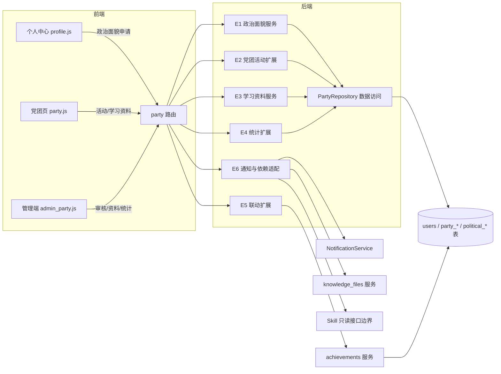
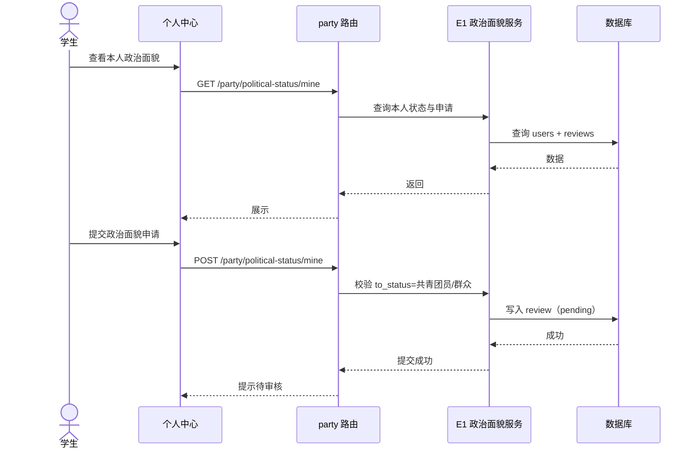
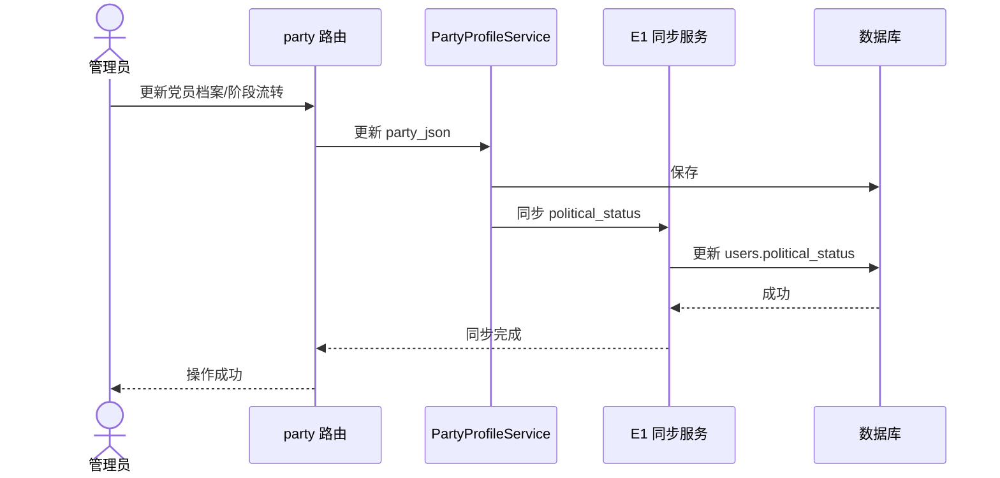
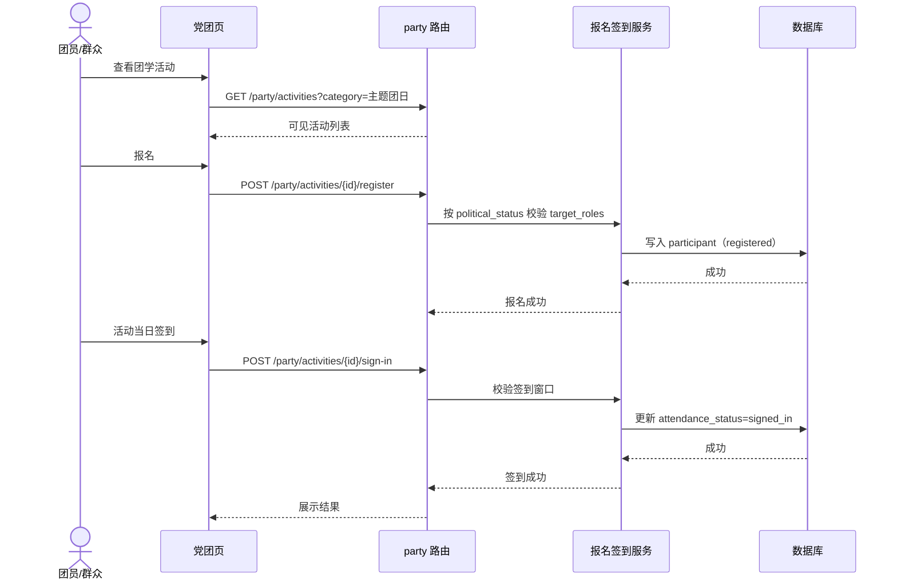
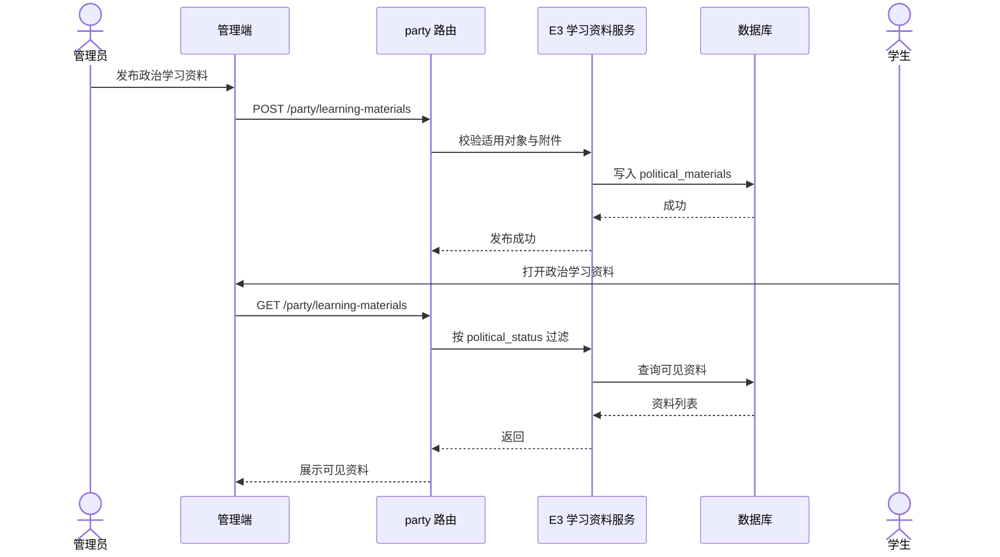

# 政治面貌与党团活动全覆盖概要设计

> 文档版本：v0.1  
> 编写日期：2026-08-06  
> 输入文档：[政治面貌与党团活动全覆盖需求文档](./dangjian_politic_proposal.md)  
> 适用范围：党建数字化管理体系扩展（政治面貌、团学活动、政治学习资料、统计、成长档案联动、AI/Workflow 依赖边界）  
> 技术基线：FastAPI + SQLAlchemy + SQLite/PostgreSQL + 原生 JS 前端，沿用现有 model/schema/repository/service/route 分层

---

## 1. 设计目的与范围

本文档基于 `dangjian_politic_proposal.md` 生成概要设计，用于指导“党员、团员、群众全覆盖”扩展的模块拆分、模块职责、模块关系、数据模型、接口、关键流程、前端组件和实施顺序。

本次设计覆盖：

1. 政治面貌：`users.political_status` 通用字段、学生提交、管理员单级审核、审计留痕。
2. 党团活动扩展：复用 `party_activities`，扩展活动类别与参加对象，团员/群众可参与。
3. 政治学习资料：新增公共资料库，按适用政治面貌可见。
4. 统计扩展：政治面貌分布、班级/年级分布、团学活动参与率、资料量。
5. 成长档案联动扩展：团学活动经历写入成长档案。
6. 依赖边界扩展：通知、Workflow 事件、党建查询 Skill 只读接口。
7. 兼容与迁移：新 Alembic 迁移、既有数据回填、旧接口兼容。

本次设计不覆盖：

- 党建查询 Skill 与 Workflow 调度器的内部实现。
- 既有党建模块（党员名册、党员发展材料、党建活动核心流程）的内部重构。
- 创新项目空间等其他模块。

## 2. 设计决策记录

需求文档第 14 章待确认事项已按用户确认结果定稿：

| 序号 | 待确认事项 | 最终设计决策 |
| --- | --- | --- |
| 1 | 政治面貌枚举 | 不含民主党派/无党派人士：中共党员/预备党员/入党积极分子/共青团员/群众 |
| 2 | 初始设置审核 | 首次设置与修改一样需要管理员审核 |
| 3 | “群众”对象语义 | 仅非党员、非团员学生；公开活动统一用“全体学生” |
| 4 | 团学活动类别 | 细分：主题团日/团学实践/团组织建设/其他团学 |
| 5 | 政治学习资料存储 | 新增 `political_materials` 表 |
| 6 | 团学活动联动分类 | 管理员在发布/联动时指定“组织管理/社会实践” |
| 7 | 团员身份写入成长档案 | 不写入；仅活动经历联动 |
| 8 | 教师/校友可见范围 | 教师仅可见公开活动与公开资料；校友不开放党团功能 |
| 9 | 统计口径 | 以 `political_status` 为准 |
| 10 | 审核通过通知 | 只通知本人 |

补充设计决策：

- 学生只能提交“共青团员/群众”的政治面貌申请；党员类（中共党员/预备党员/入党积极分子）只能由管理员维护党员档案（`party_json`）时自动同步到 `political_status`，学生不可直接申请党员类。
- 政治面貌审核为单级管理员审核：提交 → 审核 → 生效，审核通过后通知本人。
- 新增独立 Alembic 迁移，不修改已应用的 `i012f3c4d5e6` 迁移。
- 既有 `party_*` 表结构不变，仅扩展枚举语义；`category`/`target_roles` 校验在服务层完成。
- 政治学习资料按适用对象进入班级知识库供 RAG 检索；“指定人员”资料不进知识库。
- 扩展模块编号使用 E1-E7，与既有党建 M1-M8 区分，最终同属党建相关系统。

## 3. 模块划分

### 3.1 模块清单

| 编号 | 模块 | 职责摘要 |
| --- | --- | --- |
| E1 | 政治面貌模块（Political Status） | `political_status` 字段、学生申请、管理员审核、党员档案自动同步、审计 |
| E2 | 党团活动扩展（Party-League Activity Extension） | `party_activities` 类别/对象枚举扩展、报名校验、可见性 |
| E3 | 政治学习资料模块（Political Learning Materials） | `political_materials` 公共资料库、适用对象可见性 |
| E4 | 统计扩展（Political Stats Extension） | 政治面貌分布、团学活动参与率、资料量统计 |
| E5 | 成长档案联动扩展（Achievement Link Extension） | 团学活动经历一键写入成长档案 |
| E6 | 通知与依赖适配扩展（Notification & Dependency Adapter） | 政治面貌通知、Workflow 事件、Skill 只读接口、知识库适配 |
| E7 | 兼容与迁移（Compatibility & Migration） | 新迁移、既有数据回填、旧接口兼容、路由顺序 |

### 3.2 模块关系图

### 3.3 依赖关系

| 模块 | 依赖 | 被依赖 |
| --- | --- | --- |
| E1 政治面貌 | 用户模块、审计 | E2、E3、E4、E6、E7 |
| E2 党团活动扩展 | E1、现有活动模块 | E4、E5、E6 |
| E3 政治学习资料 | E1、文件服务 | E4、E6 |
| E4 统计扩展 | E1、E2、E3 | 无 |
| E5 成长档案联动扩展 | E2、成果档案模块 | 无 |
| E6 通知与依赖适配 | E1、E2、E3、通知中心、知识库、Agent 工具 | 无 |
| E7 兼容与迁移 | 数据库、全局路由 | 全局约束 |

## 4. 模块职责与内部组成

### 4.1 E1 政治面貌模块

职责：

- `users` 新增 `political_status` 与 `political_status_updated_at`，默认“群众”。
- 学生提交“共青团员/群众”政治面貌申请，写入 `political_status_reviews`（`pending`）。
- 管理员单级审核：通过后更新 `users.political_status` 并写审计；拒绝保留原值。
- 管理员维护党员档案（`party_json`）时自动同步 `political_status`：正式党员→中共党员、预备党员→预备党员、入党积极分子→入党积极分子。
- 学生本人可查看自己的政治面貌与最近申请状态。

内部组成：

- 模型：`backend/app/models/party.py` 新增 `PoliticalStatusReview`。
- Schema：`PoliticalStatusApply`、`PoliticalStatusReviewInfo`、`PoliticalStatusMineResponse`。
- 仓储：`party_repo.py` 扩展审核查询。
- 服务：`backend/app/services/party_political_status_service.py`（申请、审核、同步、审计）。
- 路由：`party.py` 中 `/political-status/*` 段落。

设计要点：

- 申请校验：`to_status` 仅允许 共青团员/群众；同状态重复提交拒绝。
- 审核幂等：一条申请只能审核一次。
- 党员档案同步：`PartyProfileService.change_status` 与 `update_member` 保存后调用同步逻辑；同步不产生审核记录。
- 学生不能直接申请党员类，接口层拒绝。

### 4.2 E2 党团活动扩展

职责：

- `party_activities.category` 增加细分值：主题团日/团学实践/团组织建设/其他团学。
- `target_roles` 增加：全体团员/党员与团员/群众。
- 报名与可见性按 `political_status` 判定。

内部组成：

- 服务：`party_activity_service.py` 扩展目标对象判定；新增 `party_target_roles.py` 作为枚举与判定单一数据源。
- Schema：`PartyActivityCreate/Update/Info` 的 `category`、`target_roles` 枚举扩展。

设计要点：

- 旧值全部保留，仅追加新值，避免破坏既有数据。
- 团学活动通过 `category` 属于“团学细分集合”（主题团日/团学实践/团组织建设/其他团学）识别。
- 报名校验：学生 `political_status` 必须满足 `target_roles`；群众可报“全体学生/群众”，团员可报“全体团员/党员与团员/全体学生”。
- 活动可见性：面向“全体学生”的活动所有在校学生可见；专属活动仅符合对象可见。

### 4.3 E3 政治学习资料模块

职责：

- 新增 `political_materials` 表，管理员发布/编辑/上下架。
- 资料指定适用对象：全体党员/全体团员/全体学生/群众/指定人员。
- 学生只能查看适用对象包含本人政治面貌的资料。

内部组成：

- 模型：`PoliticalLearningMaterial`。
- Schema：`PoliticalMaterialCreate/Update/Info`。
- 服务：`backend/app/services/party_learning_material_service.py`。
- 路由：`party.py` 中 `/learning-materials/*` 段落。

设计要点：

- 附件复用文件服务：PDF/JPG/PNG，单文件不超过 20MB。
- 可见性服务按 `political_status` 过滤；未登录不可见。
- “指定人员”资料仅目标用户可见且不进知识库。
- 软删除沿用 `deleted_at`。

### 4.4 E4 统计扩展

职责：

- 政治面貌分布：按 `political_status` 分组（中共党员/预备党员/入党积极分子/共青团员/群众）。
- 班级/年级分布：按 `class_name`/`grade` 分组。
- 团学活动参与率：仅统计 `category` 属于团学细分集合的活动，分母为应参加名单展开。
- 资料统计：活动学习材料 + `political_materials` 数量，按年月/类别统计。

内部组成：

- 仓储：`party_repo.py` 统计查询扩展或独立 `party_stats_repo.py`。
- 服务：`party_stats_service.py` 扩展 `political_counts` 等统计类型。

设计要点：

- 口径以 `political_status` 为准，`party_json` 作为党建管理档案。
- 筛选参数：班级、年级、年份、活动类别、政治面貌。
- 列表类统计沿用分页，单次导出上限 5000 条。

### 4.5 E5 成长档案联动扩展

职责：

- 团学活动完成签到后，可一键写入成长档案。
- 活动性质由管理员在发布/联动时指定：“组织管理（organization）”或“社会实践（social）”。
- 团员身份不写入成长档案。

内部组成：

- 服务：`party_achievement_link_service.py` 扩展 `link_type="league_activity"`。
- 路由：`party.py` 中 `/achievements/link` 扩展。

设计要点：

- 复用 `source_type="party"`、`source_id` 防重机制。
- 联动成果状态 `pending`，沿用现有审核流程。
- 未签到活动不可联动。

### 4.6 E6 通知与依赖适配扩展

职责：

- 政治面貌审核通过后通知本人（`type=political_status_change`，`ref_type=political_status_review`）。
- 新增 Workflow 事件边界 `party.political_status_approved`。
- 党建查询 Skill 增加政治面貌与团学活动只读查询能力。
- 政治学习资料按适用对象进入班级知识库（“指定人员”资料除外）。

内部组成：

- 服务：`party_notify_adapter.py`、`party_knowledge_adapter.py`、`party_skill_boundary.py` 扩展。

设计要点：

- 通知幂等沿用 `type + ref_type + ref_id`。
- Skill 新增只读工具：`get_my_political_status`、`list_political_learning_materials`；团学活动复用 `list_party_activities`/`get_party_activity`；管理员可查政治面貌统计。
- Workflow 事件只定义常量与载荷，不实现调度器。

### 4.7 E7 兼容与迁移

职责：

- 新增独立 Alembic 迁移：`users.political_status`、`users.political_status_updated_at`、`political_status_reviews`、`political_materials`。
- 既有数据回填：已有 `party_json` 用户同步生成初始 `political_status`（正式党员→中共党员、预备党员→预备党员、入党积极分子→入党积极分子），其余默认“群众”。
- 旧接口兼容：`party_*` 既有接口不破坏；无 `political_status` 的用户视为“群众”。
- 路由静态段注册顺序固定；权限依赖复用 `require_admin`、`get_current_user`。

设计要点：

- 迁移 upgrade/downgrade 完整，SQLite/PostgreSQL 兼容。
- 不在迁移中修改 `party_json` 与 `party_*` 表结构。
- 回填后写入 `political_status_updated_at`，审计记录一次初始化。

## 5. 数据模型设计

### 5.1 users 表变更

| 字段 | 变更 | 说明 |
| --- | --- | --- |
| `political_status` | 新增 | String(30)，默认“群众”，枚举见设计决策记录 |
| `political_status_updated_at` | 新增 | DateTime，最近生效时间 |

### 5.2 political_status_reviews 表

| 字段 | 类型 | 说明 |
| --- | --- | --- |
| `id` | int | 主键 |
| `user_id` | int | 申请学生（FK users.id） |
| `from_status` | str(30) | 原政治面貌 |
| `to_status` | str(30) | 申请的政治面貌 |
| `status` | str(20) | pending/approved/rejected |
| `submitted_by` | int | 提交人（默认本人） |
| `submitted_at` | datetime | 提交时间 |
| `reviewed_by` | int | 审核管理员（可空） |
| `reviewed_at` | datetime | 审核时间（可空） |
| `remark` | text | 申请说明/审核意见 |

索引：`ix_political_review_status_submitted(status, submitted_at)`、`ix_political_review_user(user_id, status)`。

### 5.3 party_activities 枚举扩展

`category` 扩展值：

- 既有：组织生活会/主题党日/理论学习/志愿公益/发展工作/民主评议/专题教育/其他
- 新增：主题团日/团学实践/团组织建设/其他团学

`target_roles` 扩展值：

- 既有：全体党员/党员与积极分子/预备党员与积极分子/全体学生/指定人员
- 新增：全体团员/党员与团员/群众

> 表结构不变，枚举校验在服务层完成。

### 5.4 political_materials 表

| 字段 | 类型 | 说明 |
| --- | --- | --- |
| `id` | int | 主键 |
| `title` | str(200) | 资料标题 |
| `description` | text | 资料说明 |
| `applicable_roles_json` | text | 适用对象列表（全体党员/全体团员/全体学生/群众/指定人员） |
| `target_user_ids_json` | text | 指定人员用户 ID 列表（适用对象含指定人员时使用） |
| `attachments_json` | text | 附件列表 |
| `status` | str(20) | draft/published/archived |
| `created_by` | int | 创建管理员（FK users.id） |
| `created_at/updated_at/deleted_at` | datetime | 时间戳 |

索引：`ix_political_materials_status_created(status, created_at)`、`ix_political_materials_created_by(created_by)`。

## 6. 接口设计（概要）

> 路由前缀 `/api/v1/party`；静态路径注册在 `/{party_activity_id}` 之前；权限依赖复用 `get_current_user`、`require_admin`。

| 方法 | 路径 | 权限 | 说明 |
| --- | --- | --- | --- |
| GET | `/party/political-status/mine` | 本人 | 本人政治面貌与最近申请状态 |
| POST | `/party/political-status/mine` | 本人 | 提交政治面貌设置/修改（共青团员/群众） |
| GET | `/party/political-status/reviews` | admin | 政治面貌审核列表（筛选/分页） |
| PUT | `/party/political-status/reviews/{review_id}/approve` | admin | 审核通过并生效 |
| PUT | `/party/political-status/reviews/{review_id}/reject` | admin | 审核拒绝 |
| GET | `/party/learning-materials` | 登录用户（按适用对象） | 政治学习资料列表 |
| POST | `/party/learning-materials` | admin | 发布政治学习资料 |
| PUT | `/party/learning-materials/{id}` | admin | 编辑/上下架 |
| DELETE | `/party/learning-materials/{id}` | admin | 软删除 |
| GET | `/party/stats` | admin | 扩展 `type=political_counts` 与团学活动参与率 |
| GET | `/party/activities` | 登录用户（按可见性） | 复用，`category`/`target_roles` 枚举扩展 |
| POST | `/party/activities/{id}/register` | 目标用户 | 复用，报名校验按政治面貌 |
| POST | `/party/activities/{id}/sign-in` | 本人/admin | 复用 |
| POST | `/party/achievements/link` | admin/本人 | 扩展 `link_type=league_activity` |

接口设计注意：

- 审核接口只允许单次审核，重复操作返回业务错误。
- 政治面貌申请接口拒绝党员类 `to_status`。
- 学习资料列表按当前用户 `political_status` 过滤，越权不可见。
- 统计接口沿用现有分页与错误码规范。

## 7. 关键流程时序

### 7.1 政治面貌提交与审核

### 7.2 党员档案自动同步政治面貌

### 7.3 团学活动报名与签到

### 7.4 政治学习资料发布与查看

## 8. 前端组件划分

沿用现有原生 JS 架构，不引入框架；扩展组件：

| 组件文件 | 职责 |
| --- | --- |
| `frontend/js/views/profile.js` | 政治面貌展示与申请入口 |
| `frontend/js/views/party.js` | 活动类别筛选增加团学细分；新增政治学习资料区块 |
| `frontend/js/admin_party.js` | 政治面貌审核、学习资料管理、统计扩展 |
| `frontend/js/political_status_form.js` | 政治面貌申请表单与审核状态展示 |
| `frontend/js/political_materials.js` | 学习资料列表/详情/上传组件（或并入现有组件） |

页面与交互约定：

- 学生个人中心展示政治面貌、生效时间、最近申请状态；申请按钮按状态禁用。
- 党团页类别筛选包含团学细分值；资料区块只展示本人适用对象范围内的资料。
- 管理端新增“政治面貌审核”和“政治学习资料”两个区块。
- 附件上传复用现有文件上传组件，PDF/JPG/PNG、20MB。
- 既有党团活动页面不做破坏性重构。

## 9. 实施顺序

| 阶段 | 内容 | 交付物 |
| --- | --- | --- |
| 1 | 迁移与回填 | E7：新 Alembic 迁移、既有 `party_json` 数据回填 |
| 2 | 政治面貌 | E1：字段、审核表、申请/审核接口、党员档案同步 |
| 3 | 党团活动扩展 | E2：类别/对象枚举、报名校验、可见性 |
| 4 | 政治学习资料 | E3：资料表、发布/查看接口、可见性过滤 |
| 5 | 统计扩展 | E4：政治面貌分布、团学参与率、资料量 |
| 6 | 成长档案联动 | E5：团学活动联动 |
| 7 | 通知与依赖适配 | E6：通知、Workflow 事件、Skill 只读接口 |
| 8 | 前端整合 | 个人中心、党团页、管理端联调 |
| 9 | 验收 | 按第 12 章验收映射执行 |

## 10. 设计假设与决策记录

除第 2 章确认的决策外，以下为概要设计采用的设计假设：

1. 学生只能申请共青团员/群众；党员类状态由党员档案自动同步。
2. 政治面貌审核为单级管理员审核，审核通过只通知本人。
3. 团学活动通过 `category` 细分值识别（主题团日/团学实践/团组织建设/其他团学）。
4. 政治学习资料默认进入班级知识库供 RAG 检索；“指定人员”资料不进知识库。
5. 统计口径以 `political_status` 为准。
6. 新增独立 Alembic 迁移，不改已应用迁移。
7. 既有 `party_*` 接口与前端入口保持兼容，内部命名继续使用 `party` 前缀。
8. 教师仅可见公开活动与公开资料；校友不开放党团功能。
9. 团员身份不写入成长档案。

## 11. 风险与依赖

| 风险/依赖 | 说明 | 应对 |
| --- | --- | --- |
| `political_status` 与 `party_json` 双写一致性 | 两处状态可能不一致 | 党员档案变更统一走同步服务 + 一致性测试 |
| 枚举扩展兼容 | 新增枚举值可能影响旧筛选 | 保留旧值仅追加新值 + 回归测试 |
| “群众”对象语义 | 群众与全体学生容易混淆 | 服务层统一判定函数 + 测试 |
| 学习资料可见性 | 越权查看风险 | 后端过滤 + 权限测试 |
| 统计口径 | 政治面貌与党员档案冲突 | 以 `political_status` 为准并固化文档 |
| 迁移回填 | 既有数据回填错误 | 回填前校验 + 迁移测试 |
| 审核幂等 | 重复审核覆盖数据 | 状态机限制 + 测试 |
| Skill/Workflow 依赖 | 调度与提示词未实现 | 本期只实现接口边界，不阻塞核心功能 |

## 12. 验收映射

| 需求文档验收要点 | 设计落点 |
| --- | --- |
| 学生可查看并提交政治面貌，管理员审核生效 | E1 政治面貌模块 |
| 管理员可发布团学活动，学生按政治面貌报名签到 | E2 党团活动扩展 |
| 群众可参加公开团学活动，不可查看党员名册 | E1/E2 权限模型 |
| 政治学习资料按适用对象可见 | E3 政治学习资料模块 |
| 统计覆盖党员/团员/群众 | E4 统计扩展 |
| 团学活动可一键写入成长档案 | E5 成长档案联动扩展 |
| 既有党建功能不受影响 | E7 兼容与迁移 |
| AI Skill 支持政治面貌与团学活动只读查询 | E6 依赖适配扩展 |
| 接口权限校验生效 | E7 依赖体系与全流程测试 |
