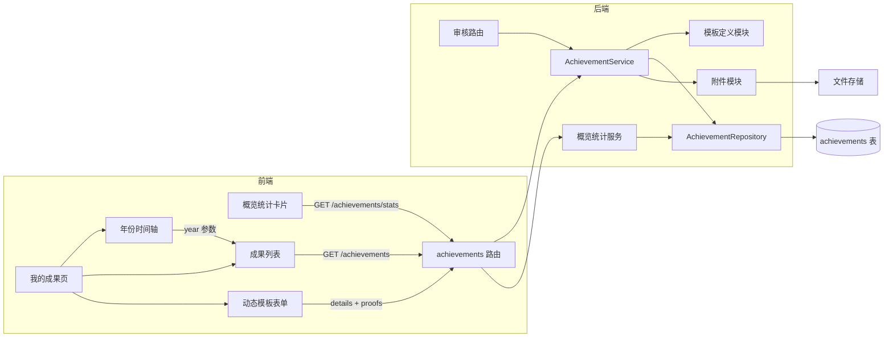
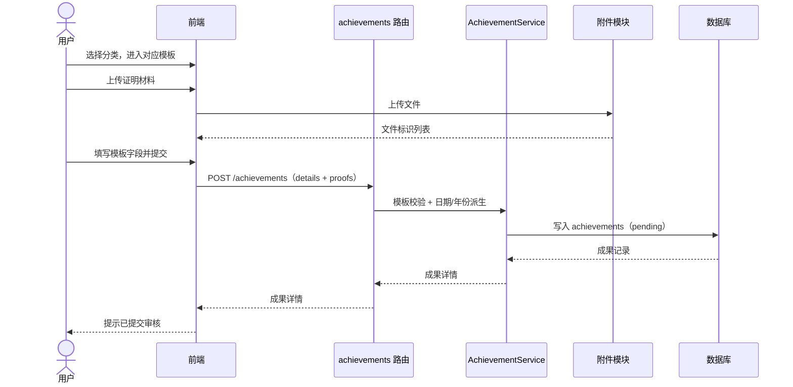
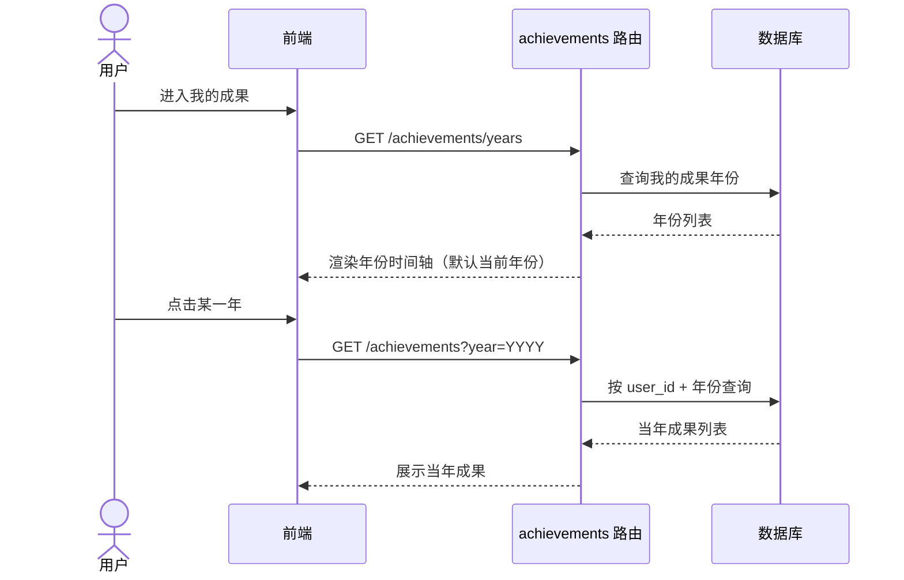
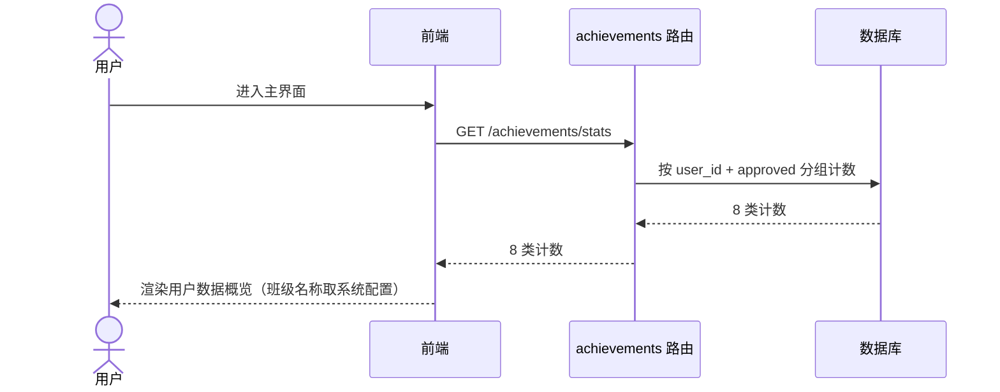
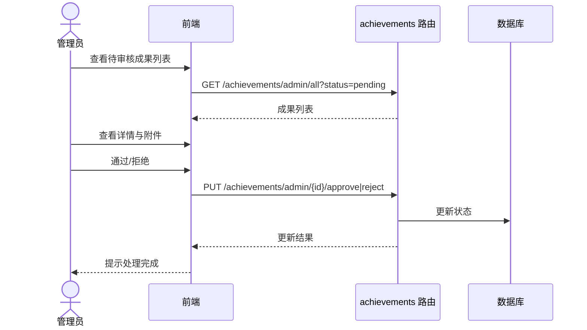

# 成果与社区 · 我的成果改造概要设计

> 文档版本：v0.1  
> 编写日期：2026-08-05  
> 输入文档：[成果与社区 · 我的成果模板细化需求文档](./achievements_proposal.md)  
> 适用范围：成果与社区 → 我的成果改造  
> 技术基线：FastAPI + SQLAlchemy + SQLite/PostgreSQL + 原生 JS 前端，沿用现有 model/schema/repository/service/route 分层

---

## 1. 设计目的与范围

本文档基于 `achievements_proposal.md` 生成概要设计，用于指导“我的成果”改造的模块拆分、模块职责、模块关系、数据模型、接口、关键流程、前端组件和实施顺序。

本次设计覆盖：

1. 8 类成果各自的动态模板（学术论文、竞赛获奖、项目课题、软著专利、创新创业、组织管理、社会实践、文体活动）。
2. 模板专有字段通过 `details_json` 扩展存储。
3. 证明材料附件上传、展示、替换、删除。
4. 我的成果按年份时间轴筛选。
5. 主界面“用户数据概览”按 8 类统计。
6. 管理端审核联动与旧数据兼容。

本次设计不覆盖：资源社区、成果广场、教师方向、学习计划等既有模块；它们仅在依赖关系中作为外部模块出现。

---

## 2. 设计决策记录

需求文档第 12 章的待确认事项已确认如下：

| 序号 | 待确认事项 | 最终设计决策 |
| --- | --- | --- |
| 1 | 主界面统计口径 | 仅统计审核通过（`approved`）的成果 |
| 2 | 进行中/在任的结束年份、结束月份 | 填预计结束时间，或填“进行中” |
| 3 | 软著专利未授权 | 授权年份、授权月份填“无” |
| 4 | 论文类型 | 枚举：期刊论文、会议论文、工作论文、其他 |
| 5 | 组织管理“职务”字段 | 增加，用户自由填写文本（如部长、会长） |
| 6 | 按年份查看 | 设计为年份时间轴，点击对应年份展示当年成果 |
| 7 | 附件格式与大小 | PDF/JPG/PNG，单文件不超过 20MB，可配置 |

---

## 3. 模块划分

### 3.1 模块清单

| 编号 | 模块 | 职责摘要 |
| --- | --- | --- |
| M1 | 模板定义模块（Template Registry） | 8 类成果模板的字段、文案、控件类型、必填、枚举与校验规则的单一数据源 |
| M2 | 成果核心模块（Achievement Core） | 成果 CRUD、`details_json` 读写、`achievement_date` 派生、统一成果年份计算、权限隔离 |
| M3 | 附件模块（Attachment） | 附件上传、格式/大小校验、存储、`proofs_json` 关联、替换与删除 |
| M4 | 审核模块（Review） | 管理员查看成果详情与附件，通过/拒绝，状态流转 |
| M5 | 年份筛选与列表模块（Year Timeline & List） | 年份时间轴数据、按年份查询、列表排序与展示 |
| M6 | 概览统计模块（Overview Stats） | 主界面“用户数据概览”，按 8 类统计已审核通过成果 |
| M7 | 前端动态表单模块（Dynamic Form） | 按分类渲染模板表单、附件上传组件、前端校验、编辑回显 |
| M8 | 兼容与迁移模块（Compatibility） | 新增列迁移、旧数据回退展示、`member_ids_json` 兼容保留 |

### 3.2 模块关系图

### 3.3 依赖关系

| 模块 | 依赖 | 被依赖 |
| --- | --- | --- |
| M1 模板定义 | 无（静态配置） | M2、M7 |
| M2 成果核心 | M1、M3、数据库 | M4、M5、M6、M7 |
| M3 附件 | 文件存储服务 | M2、M7 |
| M4 审核 | M2 | 无 |
| M5 年份筛选与列表 | M2 | 无 |
| M6 概览统计 | M2 | 无 |
| M7 前端动态表单 | M1、M3、M2 接口 | 无 |
| M8 兼容与迁移 | 数据库 | 全局约束 |

---

## 4. 模块职责与内部组成

### 4.1 M1 模板定义模块

职责：

- 定义 8 类成果的模板：字段清单、显示名、控件类型、必填、枚举、格式规则、填写提示、模板标题文案。
- 作为前端动态表单和后端校验的单一数据源，避免前后端规则漂移。

内部组成：

- 后端：`backend/app/services/achievement_templates.py`，以分类为键的模板注册表（纯代码配置，本期不落库）。
- 前端：`frontend/js/achievement_templates.js`，与后端结构一致。

设计要点：

- 每个字段项包含：`key`、`label`、`type`（text/number/select/textarea/bool/url）、`required`、`enum`、`format`、`hint`。
- 字段 `key` 与 `details_json` 键一一对应；`title`、`level` 等通用字段不在 `details_json` 内。
- 后续如需管理端维护模板，可将注册表迁移到数据库，本期不做。

### 4.2 M2 成果核心模块

职责：

- 成果创建、查询、更新、软删除；仅本人可管理，管理员可审核。
- `details_json` 读写与校验（复用 M1 校验规则）。
- 从模板年月字段派生 `achievement_date`（格式 `YYYY-MM`）和统一成果年份。
- 列表查询支持 `year`、`category`、`status` 筛选和分页。

内部组成：

- 模型：`achievements` 表新增 `details_json` 列。
- Schema：`AchievementCreate/Update/Info` 增加 `details`。
- 服务：`AchievementService`，负责模板校验、日期派生、年份计算。
- 仓储：`AchievementRepository`，扩展按年份查询。
- 路由：`achievements.py` 扩展。

统一成果年份派生规则：

| 分类 | 年份来源 |
| --- | --- |
| 学术论文 | 发表年份 |
| 竞赛获奖 | 获奖年份 |
| 项目课题 | 立项年份 |
| 软著专利 | 授权年份；未授权时使用申请年份 |
| 创新创业 | 开始年份 |
| 组织管理 | 开始年份 |
| 社会实践 | 开始年份 |
| 文体活动 | 开始年份 |

`achievement_date` 派生规则：年份取统一成果年份，月份取该分类对应的主要月份（论文发表月份、竞赛获奖月份、专利授权月份否则申请月份、其余分类开始月份），格式 `YYYY-MM`。

### 4.3 M3 附件模块

职责：

- 成果证明材料上传、预览、下载、替换、删除。
- 格式与大小校验：PDF/JPG/PNG，单文件不超过 20MB（可配置）。
- 写入 `proofs_json`：每条记录包含文件标识、原始文件名、存储路径/键、大小、MIME、上传时间。
- 附件归属随成果归属，禁止跨用户访问。

内部组成：

- 复用现有文件服务与存储目录，新增成果附件上传路由。
- 表单提交时，附件先上传获得文件标识，再随成果创建/更新写入 `proofs_json`。

设计要点：

- 至少 1 份附件为提交前提，前端和后端双重校验。
- 删除成果时附件软删除或异步清理，沿用现有文件清理机制。

### 4.4 M4 审核模块

职责：

- 管理员查看全部成果列表与详情，详情按分类渲染模板字段并展示附件。
- 通过/拒绝操作沿用现有接口与状态机：`pending → approved / rejected`。

内部组成：

- 沿用 `achievements.py` 的 `/admin/*` 路由。
- 详情响应增加 `details` 与附件列表，审核页按分类渲染。

### 4.5 M5 年份筛选与列表模块

职责：

- 提供我的成果年份时间轴数据。
- 按年份查询当前用户的成果并展示。

内部组成：

- 后端新增年份接口，返回用户有成果的年份列表（可按年份附带计数）。
- 列表接口增加 `year` 参数，按 `achievement_date` 降序、`created_at` 降序排列。
- 前端新增年份时间轴组件和列表渲染组件。

设计要点：

- 时间轴展示“全部”与有数据的年份，进入页面默认选中当前年份。
- 点击年份后列表仅展示该年份成果。

### 4.6 M6 概览统计模块

职责：

- 主界面展示“用户数据概览”，按 8 类统计当前用户已审核通过（`approved`）的成果数量。
- 文案中的班级名称从系统配置读取。

内部组成：

- 后端新增统计接口，按 `user_id + status=approved` 分组计数。
- 前端在概览页渲染统计卡片，每类数量可点击跳转到“我的成果”对应分类（可选增强）。

### 4.7 M7 前端动态表单模块

职责：

- 分类选择后按 M1 模板渲染字段，控件映射：是/否用单选或开关，枚举用下拉，年份/月份用数字输入，长文本用多行输入，人名列表用带提示的文本框。
- 附件上传组件位于表单顶部，支持多份、预览、删除、替换。
- 前端按模板规则做必填与格式校验，所有条目必填，“无”“forthcoming”等占位值视为已填写。
- 编辑时按 `details` 回显；旧数据无 `details` 时回退显示通用字段。

内部组成：

- `frontend/js/achievement_templates.js`：模板注册表。
- `frontend/js/achievement_form.js`：动态表单与校验。
- `frontend/js/achievement_upload.js`：附件组件（或并入表单组件）。

### 4.8 M8 兼容与迁移模块

职责：

- Alembic 迁移新增 `details_json` 列，默认空对象。
- 旧数据（无 `details_json`）列表与详情回退显示 `title/description/level/achievement_date`。
- 编辑旧数据时按当前分类模板打开表单，用户补全必填字段后保存生成 `details`。
- `member_ids_json` 列保留，不采集、不展示，仅兼容历史数据。

---

## 5. 数据模型设计

### 5.1 achievements 表变更

| 字段 | 变更 | 说明 |
| --- | --- | --- |
| `details_json` | 新增 | Text/JSON，默认空对象，存各分类专有字段 |
| `achievement_date` | 语义调整 | 由模板年月派生，格式 `YYYY-MM`，用于列表排序与年份筛选 |
| `proofs_json` | 继续使用 | 附件记录列表 |
| `member_ids_json` | 保留 | 不再采集，兼容旧数据 |
| `title/level/status/is_public` | 保留 | 通用字段继续使用 |

索引建议：在现有 `user_id/category/status` 索引基础上，增加 `(user_id, achievement_date)` 组合索引支撑年份查询。

### 5.2 details_json 键结构汇总

> 字段中文名、填写规则与示例以需求文档第 6 章为准，此处仅列存储键与类型。

| 分类 | details 键（类型） |
| --- | --- |
| 学术论文 | authors(str)、journal(str)、sci_indexed(bool)、ssci_indexed(bool)、cssci_indexed(bool)、is_top_journal(bool)、paper_type(enum)、pub_year(int)、pub_month(int)、wos_url(str)、volume(str)、issue(str)、citation_count(int)、research_direction(str)、pages(str)、keywords(str)、doi(str)、abstract(text) |
| 竞赛获奖 | award_grade(str)、organizer(str)、award_year(int)、award_month(int)、teacher_names(str)、is_team(bool)、is_leader(bool)、member_names(str)、description(text) |
| 项目课题 | project_unit(str)、project_field(str)、project_funding(str)、leader_name(str)、participant_names(str)、project_year(int)、start_year(int)、start_month(int)、end_year(str/int)、end_month(str/int)、approval_no(str) |
| 软著专利 | patent_type(enum)、participant_names(str)、field(str)、apply_year(int)、apply_month(int)、grant_year(str/int)、grant_month(str/int)、application_no(str)、grant_no(str)、abstract(text) |
| 创新创业 | project_category(enum)、leader_name(str)、member_names(str)、teacher_names(str)、start_year(int)、start_month(int)、end_year(str/int)、end_month(str/int)、summary(text) |
| 组织管理 | position(str)、assessment(enum)、honor_title(str)、start_year(int)、start_month(int)、end_year(str/int)、end_month(str/int) |
| 社会实践 | practice_unit(str)、is_team(bool)、member_names(str)、is_leader(bool)、start_year(int)、start_month(int)、end_year(str/int)、end_month(str/int)、process_description(text) |
| 文体活动 | organizer(str)、start_year(int)、start_month(int)、end_year(str/int)、end_month(str/int)、summary(text) |

说明：

- `is_team/is_leader/sci_indexed` 等布尔字段存储布尔值，前端以“是/否”展示。
- `end_year/end_month/grant_year/grant_month` 允许“进行中”“无”等占位文本，因此类型允许字符串。
- `level` 列对应赛事级别、项目级别、结项级别、活动级别；学术论文、软著专利、组织管理、社会实践不使用。

---

## 6. 接口设计（概要）

> 接口清单只列方法与用途，字段级定义在详细设计中完成。

| 方法 | 路径 | 权限 | 说明 | 变更 |
| --- | --- | --- | --- | --- |
| POST | `/api/v1/achievements` | 本人 | 创建成果，提交 `details` 与附件关联 | 扩展 |
| GET | `/api/v1/achievements` | 本人 | 我的成果列表，支持 `year/category/status/page/page_size` | 扩展 |
| GET | `/api/v1/achievements/{id}` | 本人/管理员 | 成果详情，含 `details` 与附件 | 扩展 |
| PUT | `/api/v1/achievements/{id}` | 本人 | 更新成果 | 扩展 |
| DELETE | `/api/v1/achievements/{id}` | 本人 | 软删除 | 不变 |
| GET | `/api/v1/achievements/years` | 本人 | 我的成果年份列表（时间轴数据） | 新增 |
| GET | `/api/v1/achievements/stats` | 本人 | 8 类已审核通过成果计数 | 新增 |
| POST | `/api/v1/achievements/files` | 本人 | 成果附件上传 | 新增 |
| GET | `/api/v1/achievements/files/{file_id}` | 本人/管理员 | 附件预览/下载 | 新增（复用文件服务） |
| GET | `/api/v1/achievements/admin/all` | 管理员 | 全部成果列表 | 扩展 |
| PUT | `/api/v1/achievements/admin/{id}/approve` | 管理员 | 审核通过 | 不变 |
| PUT | `/api/v1/achievements/admin/{id}/reject` | 管理员 | 审核拒绝 | 不变 |

路由设计注意：

- `/years`、`/stats`、`/files` 等静态路径必须注册在 `/{achievement_id}` 之前，避免被动态参数吞掉。
- 年份筛选使用派生后的 `achievement_date`（`YYYY-MM`）或统一成果年份列实现，不要求用户重复选择口径。

---

## 7. 关键流程时序

### 7.1 新增成果（含附件）

### 7.2 按年份查看成果

### 7.3 主界面概览统计

### 7.4 管理员审核

---

## 8. 前端组件划分

沿用现有原生 JS 架构，不引入框架。`community.js` 继续作为页面容器，新增组件：

| 组件文件 | 职责 |
| --- | --- |
| `achievement_templates.js` | 8 类模板注册表，与后端模板定义一致 |
| `achievement_form.js` | 动态表单渲染、必填/格式校验、编辑回显 |
| `achievement_upload.js` | 附件上传、预览、删除、替换 |
| `achievement_timeline.js` | 年份时间轴，点击年份筛选 |
| `achievement_list.js` | 成果列表与详情展示（含论文 DOI 标题跳转） |
| `overview_stats.js` | 主界面用户数据概览卡片（或并入现有概览页） |

页面交互约定：

- 我的成果页默认选中当前年份，时间轴含“全部”入口。
- 新增/编辑共用动态表单；旧数据无 `details` 时回退通用字段展示。
- 列表展示标题、类别、级别（如有）、年份、审核状态、附件数量。
- 学术论文列表点击标题跳转 DOI 链接。

---

## 9. 实施顺序

| 阶段 | 内容 | 交付物 |
| --- | --- | --- |
| 1 | 数据模型与模板注册表 | Alembic 新增 `details_json`；模板定义模块；后端模板校验服务 |
| 2 | 后端 CRUD 扩展 | `details` 读写、日期/年份派生、`year` 筛选、`years` 与 `stats` 接口 |
| 3 | 附件能力 | 附件上传、校验、`proofs_json` 关联、预览下载 |
| 4 | 前端动态表单 | 模板注册表前端版、动态表单、附件组件、校验与回显 |
| 5 | 列表与时间轴 | 年份时间轴、列表筛选、概览统计卡片 |
| 6 | 审核适配与兼容 | 审核页详情渲染、旧数据回退、接口联调与测试 |

---

## 10. 设计假设与决策记录

除第 2 章已确认决策外，以下为概要设计采用的设计假设，评审时可调整：

1. 年份时间轴展示“全部”与有数据的年份，进入页面默认选中当前年份。
2. 时间轴默认只展示用户有成果的年份；如需连续年份刻度（含无数据年份），可在详细设计调整。
3. 概览统计数量可点击跳转到“我的成果”对应分类（可选增强）。
4. `details_json` 键统一使用英文 snake_case，中文名只用于界面展示。
5. 编辑旧数据时，用户需按当前分类模板补全必填字段后才能保存。
6. 附件先上传后随成果提交；未提交的成果不保留孤立附件，沿用现有清理机制。

---

## 11. 风险与依赖

| 风险/依赖 | 说明 | 应对 |
| --- | --- | --- |
| `details_json` 无数据库级结构约束 | SQLite/PostgreSQL JSON 不校验键与类型 | 后端以模板注册表做全量校验，前端同规则提示 |
| 前后端模板不一致 | 字段或校验规则漂移 | 模板定义作为单一数据源，前后端结构对齐并纳入验收 |
| 静态路由被动态路由吞掉 | `/years`、`/stats`、`/files` 与 `/{id}` 冲突 | 路由注册顺序固定，静态路径在前并补测试 |
| 附件存储与配额 | 与现有文件配额、清理任务耦合 | 复用文件服务，设置类型与大小白名单 |
| 旧数据兼容 | 历史记录无 `details` | 回退展示通用字段，编辑时引导补全 |
| 年份口径争议 | 不同分类年份来源不同 | 统一成果年份规则在需求文档与本文档双重固化，评审确认 |

---

## 12. 验收映射

| 需求文档验收要点 | 设计落点 |
| --- | --- |
| 8 类模板字段与文案一致 | M1 模板定义、M7 动态表单 |
| 所有条目必填与占位规则 | M1 校验规则、M7 前端校验、M2 后端校验 |
| 附件上传多份并作为提交前提 | M3 附件模块 |
| 按年份筛选，默认当前年份 | M5 年份筛选与列表模块 |
| 主界面按 8 类统计 | M6 概览统计模块 |
| 创建、编辑、删除、审核流程不受影响 | M2、M4 沿用现有状态机 |
| 旧数据可正常展示和编辑 | M8 兼容与迁移模块 |
