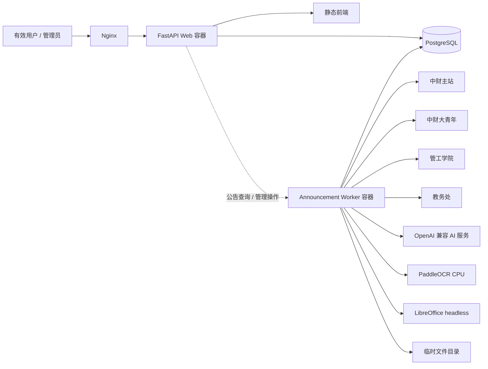
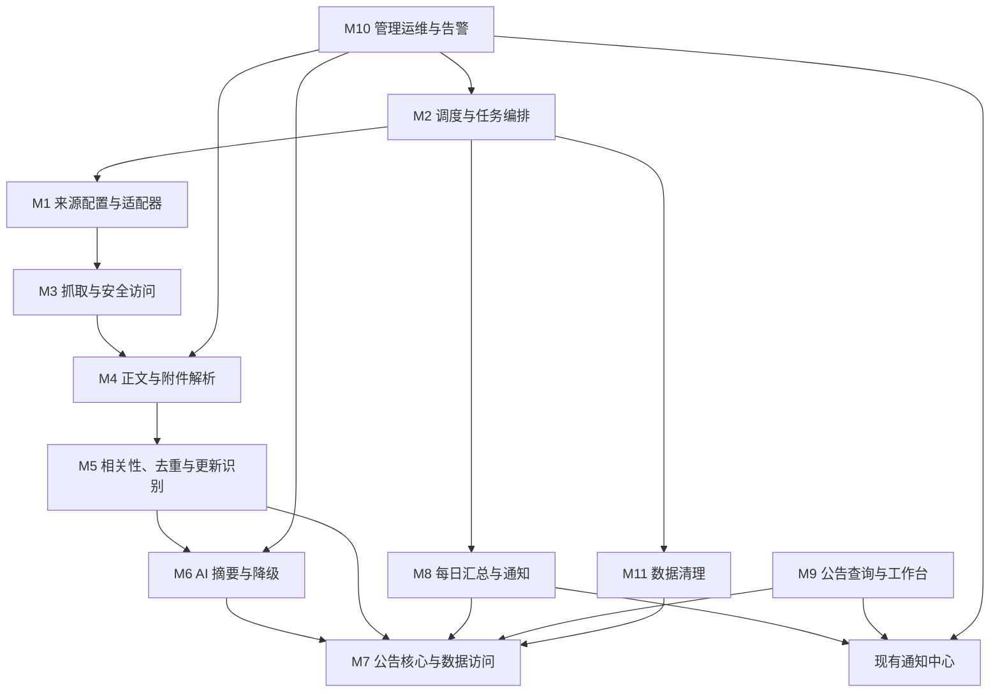
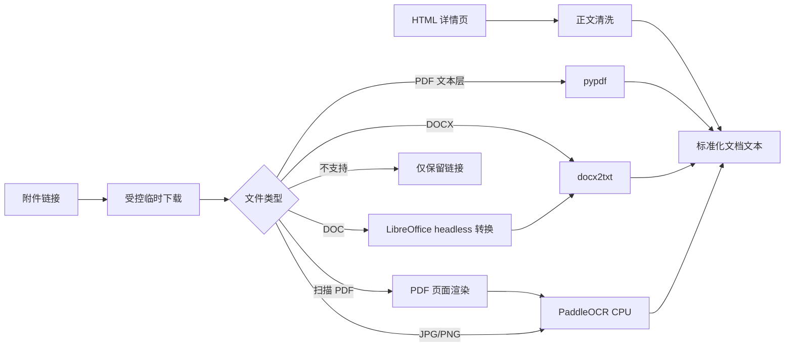
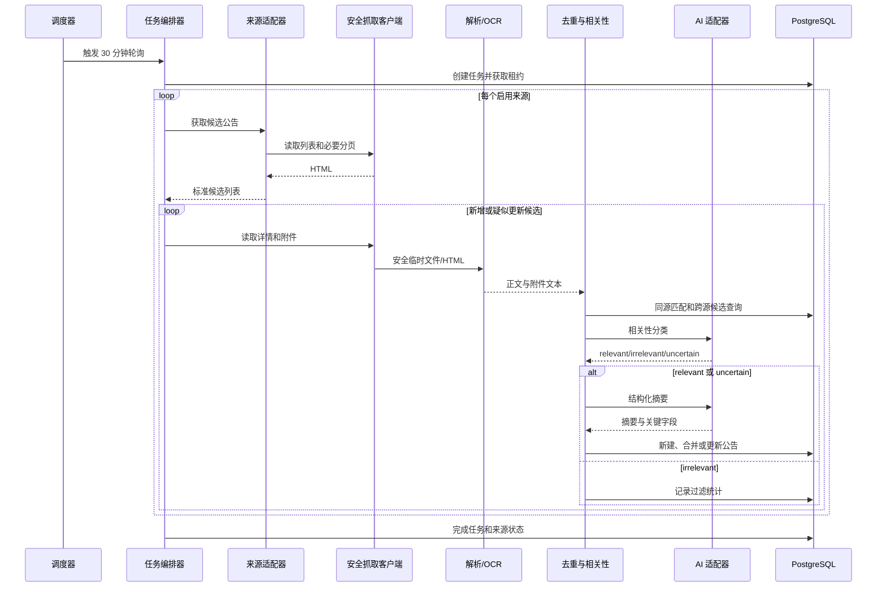
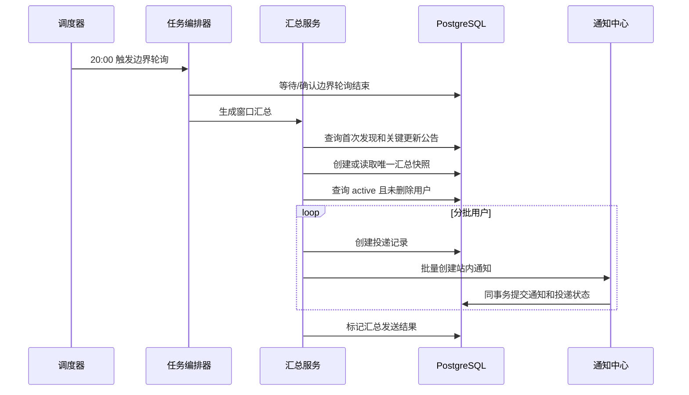
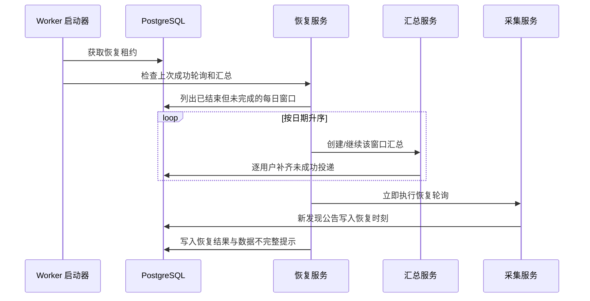

# 学校公告自动采集与推送概要设计

> 文档版本：v1.0  
> 编写日期：2026-08-12  
> 输入需求：`doc/pachong_proposal.md`  
> 适用项目：龙马·视界（CampusMate）  
> 涉及模块：工作台、通知中心、管理后台、公告 Worker  
> 文档状态：设计决策已确认

---

## 1. 设计目的与范围

本文档将《学校公告自动采集与推送需求文档》转化为可实施的概要设计，重点说明：

1. 系统模块划分及模块间依赖关系。
2. Web 应用、独立 Worker、数据库、AI 服务与学校网站之间的部署关系。
3. 公告采集、筛选、解析、摘要、去重、更新、汇总、补发和清理的核心流程。
4. 数据实体、接口、前端组件和后台运维能力的设计边界。
5. 幂等、故障恢复、安全、资源隔离及测试验收方案。

本设计复用现有 FastAPI、SQLAlchemy、Alembic、PostgreSQL、原生 JavaScript 前端、通知中心和通用 AI 适配器。新增独立 Worker 容器，不引入 Redis 或外部消息队列。

首期固定覆盖：

- 中央财经大学主站通知公告；
- 中财大青年通知公告；
- 管理科学与工程学院通知公告；
- 中央财经大学教务处通知公告。

---

## 2. 现状与约束

### 2.1 现有系统能力

| 能力 | 现状 | 本设计处理 |
| --- | --- | --- |
| Web 服务 | FastAPI，生产环境使用多 Uvicorn Worker | 保持现状，公告后台任务不在 Web 进程内运行 |
| 数据访问 | SQLAlchemy Repository + Service 分层 | 新增公告模型、仓储和服务，沿用现有分层 |
| 数据迁移 | Alembic | 新增公告相关表、索引和通知幂等约束 |
| 数据库 | 生产 PostgreSQL，测试兼容 SQLite | PostgreSQL 提供租约锁；测试使用数据库唯一约束验证幂等 |
| AI | OpenAI 兼容文本对话适配器 | 复用非流式 `chat`，新增公告摘要与相关性分类服务 |
| 文件解析 | 已支持文本型 PDF 和 DOCX | 扩展图片/扫描 PDF OCR，并通过 LibreOffice 支持旧版 DOC |
| 站内通知 | `notifications` 表和通知中心 | 新增公告汇总类型及工作台深链接 |
| 后台任务 | Web 进程内仅有文件清理循环 | 新增独立 Worker，并逐步承接公告定时任务 |

### 2.2 已确认约束

1. 每 30 分钟轮询一次，时区为 `Asia/Shanghai`。
2. 每日 20:00 汇总前一日 20:00（不含）至当日 20:00（含）首次发现的公告。
3. 每个汇总窗口向每个 `status=active` 且未删除用户发送一条通知，用户规模不超过 1000。
4. 无新公告仍发送“今日无新通知”。
5. 停机恢复后按遗漏日期分别补发，每个窗口最多一次。
6. 使用独立 Worker 容器、PostgreSQL 租约锁，不增加 Redis。
7. OCR 使用 PaddleOCR CPU；旧版 `.doc` 使用 LibreOffice headless 转换。
8. 公告以官网发布日期计算 30 天保留期；通知记录继续保留。
9. AI 相关性置信度不足时保留，优先避免漏报。

### 2.3 设计原则

- 来源隔离：每个网站使用独立适配器，单站变更不影响其他来源。
- 批次隔离：单来源或单公告失败不回滚整次任务。
- 数据库兜底：幂等不能只依赖进程内判断，必须由唯一约束保证。
- 原文可追溯：摘要、分类和关键字段均保留来源链接，以官网原文为准。
- 任务可恢复：Worker 重启后基于数据库状态发现遗漏任务，而非依赖内存状态。
- 资源隔离：网络抓取、Office 转换、OCR 和 AI 调用不占用 Web 请求进程。

---

## 3. 总体架构

### 3.1 部署架构



Web 和 Worker 使用同一代码镜像、同一数据库配置及 AI 配置。Worker 使用独立启动命令，只运行调度和任务处理入口，不启动 HTTP 服务。

### 3.2 容器划分

| 容器 | 职责 | 横向扩展约束 |
| --- | --- | --- |
| `app` | 用户与管理员 API、静态页面、通知中心 | 可多进程或多副本；不执行公告定时任务 |
| `announcement-worker` | 调度、采集、解析、OCR、AI、汇总、告警和清理 | 首期运行 1 个副本；数据库租约锁允许误启动多个副本时仍保持单次执行 |
| `db` | 业务数据、任务状态、租约和幂等状态 | PostgreSQL 16，沿用现有部署 |
| `nginx` | Web 入口和静态资源代理 | 沿用现有部署 |

### 3.3 调度机制

Worker 内部使用 APScheduler 作为时钟触发器，业务执行状态仍以数据库为准：

| 调度项 | 计划 | 任务键示例 |
| --- | --- | --- |
| 来源轮询 | 每 30 分钟 | `poll:20260812T2000+0800` |
| 每日汇总 | 每天 20:00，等待边界轮询结束 | `digest:20260811T2000:20260812T2000` |
| 过期清理 | 每天低峰时段执行一次 | `retention:20260812` |
| 启动恢复 | Worker 每次启动时执行 | `recovery:<startup-id>` |

APScheduler 只负责触发。任务开始前创建或认领 `announcement_task_runs`，并申请 PostgreSQL advisory lock；数据库唯一键和投递明细表负责最终幂等。

---

## 4. 模块划分

### 4.1 模块清单

| 编号 | 模块 | 主要职责 | 运行位置 |
| --- | --- | --- | --- |
| M1 | 来源配置与适配器 | 四个来源配置、列表解析、详情解析、分页和 URL 规范化 | Worker |
| M2 | 调度与任务编排 | 定时触发、租约、任务状态、补发、重试和批次隔离 | Worker |
| M3 | 抓取与安全访问 | HTTP 请求、超时、限速、重定向和目标域名校验 | Worker |
| M4 | 正文与附件解析 | HTML 清洗、PDF/DOCX/DOC、图片和扫描 PDF OCR | Worker |
| M5 | 相关性、去重与更新识别 | 学生相关性筛选、同源去重、跨源合并、关键更新识别 | Worker |
| M6 | AI 摘要与降级 | 结构化摘要、字段校验、失败降级和手动重生成 | Worker |
| M7 | 公告核心与数据访问 | 公告聚合、状态机、Repository、保留期和事务边界 | Web + Worker |
| M8 | 每日汇总与通知 | 窗口计算、汇总快照、千人内批量投递、无公告通知和补发 | Worker |
| M9 | 公告查询与工作台 | 用户查询 API、工作台板块、筛选和通知深链接 | Web + 前端 |
| M10 | 管理运维与告警 | 任务查看、人工重试、失败详情、管理员告警和审计 | Web + Worker + 前端 |
| M11 | 数据清理 | 30 天到期判断、内容清理、临时文件清理和清理记录 | Worker |

### 4.2 模块关系图



### 4.3 关键依赖方向

1. 来源适配器依赖通用抓取客户端，不直接写数据库。
2. 解析模块只接收已下载内容并输出标准结构，不负责判定是否推送。
3. 去重与更新模块依赖公告 Repository 查询候选，不直接调用通知中心。
4. AI 模块依赖现有 `AIAdapter`，输出必须经 Schema 校验后才能写入公告。
5. 汇总模块只读取已持久化且可见的公告，不在 20:00 临时执行全文解析。
6. Web 查询接口不调用学校网站、OCR 或 AI，保证用户请求不受外部依赖影响。
7. 告警复用通知中心，但与普通用户每日汇总使用不同通知类型。

---

## 5. 模块设计

### 5.1 M1 来源配置与适配器

#### 职责

- 保存四个内置来源的代码、名称、列表地址、启用状态和解析器类型。
- 将不同网站的列表页转换为统一的 `AnnouncementCandidate`。
- 将详情页转换为统一的正文、附件链接和页面元数据。
- 处理相对 URL、分页、置顶项和列表非日期排序。

#### 适配器接口

```python
class AnnouncementSourceAdapter(Protocol):
    async def list_candidates(self, context: CrawlContext) -> list[AnnouncementCandidate]: ...
    async def fetch_detail(self, candidate: AnnouncementCandidate) -> AnnouncementDocument: ...
```

四个首期适配器建议分别为：

- `CufeMainAdapter`
- `CufeYouthAdapter`
- `CufeMseAdapter`
- `CufeJwcAdapter`

适配器只描述页面结构；重试、域名白名单、限速、下载和数据库事务由其他模块负责。

#### 候选扫描策略

- 每次扫描首页及足够覆盖 30 天的后续分页，不假设首条为最新内容。
- 当页面已连续出现超过 30 天且已处理的公告时，可停止继续翻页。
- 置顶公告即使发布日期较早也需读取 URL，用于识别内容更新，但超过保留期时不重新入库。
- 来源适配器解析不到标题、发布日期或 URL 时，将该条记录为解析失败，不构造不完整公告。

### 5.2 M2 调度与任务编排

#### 职责

- 注册轮询、汇总、清理和恢复任务。
- 为每次执行生成稳定任务键，并维护状态机。
- 获取数据库租约锁，防止多个 Worker 重复处理。
- 将每个来源作为独立子任务，隔离失败。
- 在启动时发现遗漏汇总窗口并按日期顺序补发。

#### 任务状态

```text
pending -> running -> success
                   -> partial_success
                   -> failed
```

管理员重试不覆盖原运行记录，而是创建带 `retry_of_id` 的新任务。人工操作与系统任务共用执行器，避免两套逻辑产生不同结果。

#### 租约与幂等

- PostgreSQL 使用 advisory lock 控制同类任务同一时刻只能有一个执行者。
- `task_key` 建立唯一约束，重复调度通过插入冲突识别已存在任务。
- 长任务定期更新 `heartbeat_at`；超过租约时间且无心跳的任务可在恢复流程中重新认领。
- SQLite 测试环境不依赖 advisory lock，以唯一键和单进程执行器验证业务幂等。

### 5.3 M3 抓取与安全访问

#### 职责

- 基于 `httpx.AsyncClient` 提供统一请求入口。
- 配置连接、读取、总任务超时及有限退避重试。
- 按来源实施低并发和请求间隔，不对学校网站造成高频压力。
- 校验请求目标、跳转目标和附件目标域名。
- 统一检测编码、响应类型、响应大小和异常类型。

#### 安全边界

- 仅允许 `http/https`，禁止 `file:`、`data:` 等协议。
- 只访问配置来源的 CUFE 域名及适配器明确允许的附件域名。
- 禁止访问环回地址、私网地址和云元数据地址，防止 SSRF。
- 限制重定向次数；每次跳转重新执行域名和 IP 校验。
- 文件下载大小、页面大小、并发数和超时均配置化，具体默认值在详细设计中固化。
- 响应内容不作为指令执行，HTML 仅用于解析和清洗。

### 5.4 M4 正文与附件解析

#### 处理管线



#### 技术边界

- PaddleOCR 使用 CPU 中文模型，不依赖 GPU。
- 扫描 PDF 先逐页渲染为图片，再进行 OCR；对页数和总处理时长设上限。
- `.doc` 由 LibreOffice headless 转换为 `.docx` 后交给现有 DOCX 解析器。
- 原始附件仅存于 Worker 临时目录，成功或失败后均删除，不进入长期业务存储。
- 解析文本、页码和附件状态写入数据库，随公告保留期清理。
- Excel、压缩包、音视频不解析，只保存名称、类型及原链接。

#### 解析结果状态

| 状态 | 含义 |
| --- | --- |
| `pending` | 等待下载或解析 |
| `parsed` | 已获得有效文本 |
| `unsupported` | 类型不在首期解析范围 |
| `partial` | 仅部分页面或内容成功 |
| `failed` | 下载、转换、OCR 或解析失败 |

### 5.5 M5 相关性、去重与更新识别

#### 相关性过滤

采用两阶段策略：

1. 确定性规则：栏目限定；明确排除采购、招标、自采、教师招聘、教师职称、导师遴选、校外招生宣传、新闻、喜报和活动回顾。
2. AI 分类：结合标题、正文、发布单位和附件文本，输出 `relevant/irrelevant/uncertain`、置信度和简短依据。

`relevant` 和 `uncertain` 进入用户公告；`irrelevant` 不进入工作台及每日汇总，但在任务统计中保留计数和分类依据。AI 分类失败按 `uncertain` 处理，避免漏报。

#### 去重顺序

1. URL 规范化后匹配 `source_id + canonical_url`，完成同来源幂等。
2. 标题规范化，去除空白、标点差异和固定栏目标签。
3. 在官网发布日期相同的候选集中计算标题相似度。
4. 达到配置阈值时合并至同一公告，并新增来源映射。
5. 低于阈值或存在明显冲突时保留为独立公告。

标题相似度阈值是运行配置，不在通用管理界面开放修改；阈值及算法在详细设计和样本测试中确定。

#### 更新识别

- `content_hash` 用于发现正文或附件内容变化。
- 重新提取并比较标题、适用对象、截止时间、地点和待办事项。
- 任一关键字段发生实质变化时，记录 `key_updated_at` 和变更字段列表，并进入下一次汇总。
- 仅排版、空白或非关键文字变化只更新展示内容，不进入汇总。

### 5.6 M6 AI 摘要与降级

#### 职责

- 调用现有 `AIAdapter.chat` 完成相关性分类和结构化摘要。
- 使用独立系统提示词，要求所有字段只能来源于输入文本。
- 将返回结果解析为 Pydantic Schema，拒绝不合法结构。
- 记录模型名称、摘要状态和错误摘要，不记录 API 密钥。

#### 输出结构

```json
{
  "summary": "100 至 200 个汉字的公告梗概",
  "publisher": "发布单位或 null",
  "audiences": ["适用对象"],
  "key_times": ["关键时间"],
  "deadline": "截止时间或 null",
  "location": "地点或 null",
  "action_items": ["需要完成的事项"]
}
```

空值在 API 和前端直接隐藏。结构解析失败可执行一次格式修复请求；仍失败则进入降级路径。

#### 降级顺序

1. 清理后的网页正文前 200 个汉字。
2. 网页正文为空时，使用成功解析的附件文本前 200 个汉字。
3. 均无文本时，使用标题和来源组成最小摘要。

降级公告正常展示和推送，`summary_status=degraded`，并进入管理员晚间异常汇总。

### 5.7 M7 公告核心与数据访问

#### 职责

- 统一控制公告创建、来源合并、内容更新和状态流转。
- 提供 Worker 写入事务与 Web 只读查询。
- 计算可见性和官网发布日期保留期。
- 为汇总模块提供稳定窗口查询。

#### 公告状态

```text
discovered -> processing -> ready
                         -> partial
                         -> failed
ready/partial -> expired
```

只有 `relevance_status in (relevant, uncertain)` 且处理状态为 `ready/partial`、官网发布日期未过期的公告进入工作台。最小摘要可生成时，即使部分附件失败也使用 `partial` 并允许进入汇总。

### 5.8 M8 每日汇总与通知

#### 职责

- 计算固定 24 小时统计窗口。
- 汇总首次发现或关键更新落入窗口的可见公告。
- 生成不可变的汇总快照，保证公告清理后通知仍可阅读。
- 为不超过 1000 个有效用户分批创建通知。
- 维护逐用户投递状态，实现重试和部分失败恢复。

#### 接收者规则

```sql
users.status = 'active' AND users.deleted_at IS NULL
```

角色不参与过滤，学生、教师、校友和管理员只要处于 `active` 状态均接收。

#### 投递设计

- 每个统计窗口只有一条 `announcement_digests`。
- 每个摘要与用户在 `announcement_digest_deliveries` 中只有一条投递记录。
- 单事务创建投递记录和站内通知；唯一约束拒绝重复投递。
- 1000 人以内按固定批次批量写入，避免逐用户提交事务。
- 通知使用 `type=school_announcement_digest`、`ref_type=school_announcement_digest`、`ref_id=digest.id`。
- 无公告时摘要快照保存空清单，通知标题为“今日无新通知”。

#### 停机恢复

Worker 启动时从最后成功汇总窗口向后扫描至最近已结束的 20:00 窗口，按时间顺序分别生成或继续投递。

由于公告归属严格以“系统首次发现时间”为准，停机期间未被系统发现的公告无法回填到历史窗口：恢复抓取后，它们以恢复时的首次发现时间进入当前或下一汇总窗口。遗漏窗口只能汇总停机前已发现但尚未投递的数据。该限制与需求约定的时间口径一致，管理员恢复告警中需提示停机期间采集可能不完整。

### 5.9 M9 公告查询与工作台

#### 后端职责

- 提供最近 30 天公告分页查询。
- 支持关键词、来源和日期筛选。
- 提供单个每日汇总快照查询，用于通知深链接。
- 只返回清洗和转义后的文本及经过验证的外部链接。

#### 前端职责

- 在工作台现有布局下增加全宽“学校公告”区域。
- 顶部展示当前或深链接指定的汇总窗口。
- 提供关键词、来源和日期口径筛选。
- 展示摘要、动态关键字段、状态标识、原文和附件链接。
- 局部加载失败不影响工作台其他面板。

#### 深链接

现有前端路由只保存单一 hash，需要扩展为“路由 + 参数”：

```text
#overview?announcement_digest_id=123
```

`state.js` 解析并保存路由参数；通知中心识别 `school_announcement_digest`，导航到 `overview` 后滚动至学校公告区域并加载对应汇总。该参数不授予额外权限，后端仍按当前用户身份校验通知和摘要可见性。

### 5.10 M10 管理运维与告警

#### 管理能力

- 查询轮询、汇总、清理、恢复和人工任务。
- 查看各来源数量、耗时、状态、连续失败次数和错误摘要。
- 对单来源重新抓取。
- 对失败任务创建重试任务。
- 对单公告重新解析或重新生成摘要。

人工请求只在数据库创建待执行任务，由 Worker 认领，FastAPI 不直接运行 OCR 或抓取。API 返回任务 ID，管理员页面轮询任务状态。

#### 告警分级

| 级别 | 场景 | 时机 | 接收人 |
| --- | --- | --- | --- |
| 严重 | 整体任务失败、汇总未发送、调度器异常、数据库或关键依赖不可用 | 恢复连接后立即发送；数据库不可用期间先写日志 | 所有 `active` 管理员 |
| 一般 | 单站一次失败、单篇正文/附件/OCR/AI 失败 | 当日晚间合并一条 | 所有 `active` 管理员 |
| 升级 | 单来源连续失败 | 晚间通知中突出连续次数 | 所有 `active` 管理员 |

管理员通知使用独立类型，例如 `school_announcement_alert`，不进入普通用户每日汇总。

### 5.11 M11 数据清理

- 以官网发布日期计算保留期，而非首次发现时间。
- 公告发布日期当天记为第 1 天；展示至第 30 个自然日结束，次日清理。
- 清理正文、结构化摘要、附件解析文本、来源映射和公告业务记录。
- 不删除 `announcement_digests` 的快照、投递记录及现有 `notifications`。
- 临时下载文件在每个处理单元 `finally` 中立即删除；清理任务再兜底删除超时临时文件。
- 清理批次有稳定任务键并分批提交，失败后可继续执行。

---

## 6. 数据模型设计

### 6.1 `announcement_sources`

| 字段 | 类型 | 约束/说明 |
| --- | --- | --- |
| `id` | bigint | 主键 |
| `code` | varchar(50) | 唯一；四个内置来源稳定标识 |
| `name` | varchar(100) | 展示名称 |
| `list_url` | varchar(500) | 通知列表 URL |
| `adapter_key` | varchar(50) | 适配器注册键 |
| `is_enabled` | boolean | 是否启用 |
| `display_order` | integer | 前端来源排序 |
| `last_attempt_at` | datetime | 最近尝试时间 |
| `last_success_at` | datetime | 最近成功时间 |
| `consecutive_failures` | integer | 连续失败次数 |
| `created_at/updated_at` | datetime | 审计时间 |

首期通过 Alembic 种子数据写入四个来源，不允许普通用户修改。

### 6.2 `school_announcements`

| 字段 | 类型 | 约束/说明 |
| --- | --- | --- |
| `id` | bigint | 主键 |
| `title` | varchar(500) | 当前标准标题 |
| `normalized_title` | varchar(500) | 去重用规范标题，建立索引 |
| `official_publish_date` | date | 官网发布日期，建立索引 |
| `first_discovered_at` | datetime | 首次发现时间，建立索引 |
| `last_checked_at` | datetime | 最近检查时间 |
| `content_text` | text | 清洗后的正文 |
| `content_hash` | varchar(64) | 内容指纹 |
| `summary` | text | AI 或降级摘要 |
| `summary_status` | varchar(30) | `ai/degraded/failed` |
| `publisher` | varchar(200) nullable | 发布单位 |
| `audiences_json` | text/json | 适用对象数组 |
| `key_times_json` | text/json | 关键时间数组 |
| `deadline_text` | varchar(300) nullable | 截止时间原文 |
| `location` | varchar(300) nullable | 地点 |
| `action_items_json` | text/json | 待办事项数组 |
| `relevance_status` | varchar(30) | `relevant/irrelevant/uncertain` |
| `relevance_confidence` | decimal nullable | AI 置信度 |
| `relevance_reason` | varchar(500) nullable | 分类依据 |
| `processing_status` | varchar(30) | 公告处理状态 |
| `key_updated_at` | datetime nullable | 最近关键更新时刻 |
| `key_changed_fields_json` | text/json | 关键变更字段 |
| `expires_at` | datetime | 按官网发布日期计算，建立索引 |
| `created_at/updated_at` | datetime | 审计时间 |

JSON 字段在 PostgreSQL 可使用 JSONB；为保持现有 SQLite 测试兼容性，ORM 层需提供统一序列化访问方式。

### 6.3 `announcement_origins`

| 字段 | 类型 | 约束/说明 |
| --- | --- | --- |
| `id` | bigint | 主键 |
| `announcement_id` | bigint | 外键，级联删除 |
| `source_id` | bigint | 来源外键 |
| `canonical_url` | varchar(1000) | 规范原文 URL |
| `source_title` | varchar(500) | 该来源原标题 |
| `source_publish_date` | date | 该来源展示日期 |
| `source_content_hash` | varchar(64) nullable | 来源内容指纹 |
| `first_seen_at/last_seen_at` | datetime | 来源发现及检查时间 |

唯一约束：`(source_id, canonical_url)`。

### 6.4 `announcement_attachments`

| 字段 | 类型 | 约束/说明 |
| --- | --- | --- |
| `id` | bigint | 主键 |
| `announcement_id` | bigint | 外键，级联删除 |
| `origin_id` | bigint nullable | 附件所属来源 |
| `name` | varchar(500) | 官网附件名称 |
| `url` | varchar(1000) | 规范化外链 |
| `media_type` | varchar(150) nullable | 检测到的类型 |
| `parse_status` | varchar(30) | 解析状态 |
| `parsed_text` | text nullable | 临时解析结果，随公告清理 |
| `page_count` | integer nullable | PDF 页数 |
| `error_summary` | varchar(1000) nullable | 安全裁剪后的错误摘要 |
| `created_at/updated_at` | datetime | 审计时间 |

唯一约束：`(announcement_id, url)`。表中不保存原始二进制附件。

### 6.5 `announcement_task_runs`

| 字段 | 类型 | 约束/说明 |
| --- | --- | --- |
| `id` | bigint | 主键 |
| `task_key` | varchar(200) | 唯一幂等键 |
| `task_type` | varchar(30) | `poll/digest/cleanup/recovery/reparse/resummarize` |
| `source_id` | bigint nullable | 单来源任务时填写 |
| `announcement_id` | bigint nullable | 单公告任务时填写 |
| `retry_of_id` | bigint nullable | 原失败任务 |
| `trigger_type` | varchar(20) | `scheduled/manual/recovery` |
| `status` | varchar(30) | 任务状态 |
| `window_start/window_end` | datetime nullable | 汇总窗口 |
| `started_at/finished_at/heartbeat_at` | datetime nullable | 运行信息 |
| `stats_json` | text/json | 发现、创建、更新、跳过、失败等计数 |
| `error_summary` | text nullable | 错误摘要，不保存敏感信息 |
| `requested_by` | bigint nullable | 人工操作管理员 |
| `created_at` | datetime | 创建时间 |

### 6.6 `announcement_digests`

| 字段 | 类型 | 约束/说明 |
| --- | --- | --- |
| `id` | bigint | 主键 |
| `window_start/window_end` | datetime | 统计窗口；联合唯一 |
| `digest_date` | date | 窗口结束日期 |
| `item_count` | integer | 新增及关键更新数量 |
| `snapshot_json` | text/json | 不可变精简清单、外链和状态快照 |
| `title/content` | text | 站内通知使用的标题和正文 |
| `status` | varchar(30) | `pending/sending/sent/partial/failed` |
| `is_recovery` | boolean | 是否恢复补发 |
| `created_at/sent_at` | datetime nullable | 时间信息 |

摘要快照独立于公告表保留，因此 30 天清理后历史通知仍可读取原有清单。

### 6.7 `announcement_digest_deliveries`

| 字段 | 类型 | 约束/说明 |
| --- | --- | --- |
| `id` | bigint | 主键 |
| `digest_id` | bigint | 汇总外键 |
| `user_id` | bigint | 用户外键 |
| `notification_id` | bigint nullable | 创建成功后的通知 ID |
| `status` | varchar(20) | `pending/sent/failed` |
| `error_summary` | varchar(1000) nullable | 投递失败摘要 |
| `created_at/sent_at` | datetime nullable | 时间信息 |

唯一约束：`(digest_id, user_id)`。投递记录与通知在同一事务内创建，避免“记录已成功但通知未生成”的中间状态。

### 6.8 现有 `notifications` 扩展

不改变现有字段结构，新增约定：

- `type=school_announcement_digest`
- `ref_type=school_announcement_digest`
- `ref_id=announcement_digests.id`
- 管理告警使用 `type=school_announcement_alert`

公告投递幂等由 `announcement_digest_deliveries` 唯一约束保证，不对现有通知数据强行增加全局唯一约束，降低兼容风险。

---

## 7. 接口设计

所有接口沿用 `/api/v1` 前缀、当前认证依赖、分页规范和统一错误响应。

### 7.1 用户接口

| 方法 | 路径 | 权限 | 说明 |
| --- | --- | --- | --- |
| GET | `/school-announcements` | 登录用户 | 最近 30 天公告分页查询 |
| GET | `/school-announcements/sources` | 登录用户 | 可筛选来源列表 |
| GET | `/school-announcement-digests/{id}` | 登录用户 | 获取指定汇总快照 |

`GET /school-announcements` 查询参数：

- `q`：标题、摘要、待办事项关键词；
- `source`：来源代码；
- `date_basis`：`official_publish_date` 或 `first_discovered_at`；
- `date_from/date_to`：日期范围；
- `page/page_size`：分页。

后端强制限制在仍处于 30 天保留期的数据内，前端参数不能绕过。

### 7.2 管理接口

| 方法 | 路径 | 说明 |
| --- | --- |
| GET | `/admin/announcement-tasks` | 任务列表和筛选 |
| GET | `/admin/announcement-tasks/{id}` | 任务详情及来源统计 |
| POST | `/admin/announcement-sources/{id}/crawl` | 创建单来源手动抓取任务 |
| POST | `/admin/announcement-tasks/{id}/retry` | 创建失败任务的重试任务 |
| POST | `/admin/school-announcements/{id}/reparse` | 创建重新解析任务 |
| POST | `/admin/school-announcements/{id}/resummarize` | 创建重新摘要任务 |

管理写接口只创建任务，不同步等待任务执行；返回 `202 Accepted` 和任务 ID。所有操作记录当前管理员 ID，并进入现有审计中间件。

### 7.3 错误码建议

| 错误码 | 场景 |
| --- | --- |
| `ANNOUNCEMENT_NOT_FOUND` | 公告不存在或已过期清理 |
| `ANNOUNCEMENT_DIGEST_NOT_FOUND` | 汇总不存在或用户无权访问 |
| `ANNOUNCEMENT_TASK_NOT_FOUND` | 管理任务不存在 |
| `ANNOUNCEMENT_TASK_CONFLICT` | 同一目标已有运行中任务 |
| `ANNOUNCEMENT_SOURCE_DISABLED` | 来源被停用 |
| `ANNOUNCEMENT_RETRY_NOT_ALLOWED` | 当前状态不允许重试 |

---

## 8. 关键流程

### 8.1 轮询与公告处理



每条公告使用独立短事务提交，避免一个附件异常回滚同批其他公告。

### 8.2 每日汇总投递



### 8.3 停机恢复与分别补发



恢复流程先保证已有数据的历史汇总一致性，再执行恢复轮询。停机期间才发布的公告无法获得真实首次发现时间，不回填历史窗口。

### 8.4 关键更新

1. 轮询命中已知来源 URL。
2. 内容指纹发生变化，重新解析和生成结构化字段。
3. 比较关键字段规范值。
4. 仅普通文字变化：更新公告，不设置 `key_updated_at`。
5. 关键字段变化：保存变更字段和时间，下一汇总查询包含该公告并标记“已更新”。
6. 同一窗口多次更新只使用汇总生成时的最新快照。

### 8.5 管理员人工重试

1. 管理员通过 API 创建任务记录，接口返回 `202`。
2. Worker 轮询待执行人工任务并获取目标租约。
3. 使用与定时任务相同的抓取、解析或摘要服务执行。
4. 写入新任务结果和 `retry_of_id`。
5. 重试不会直接补发已结束汇总，也不会产生重复通知；若形成关键更新，则进入下一次正常汇总。

---

## 9. 前端设计

### 9.1 工作台组件

建议在 `frontend/js/views/overview.js` 中拆出公告相关渲染函数，避免继续扩大单一函数：

| 组件/函数 | 职责 |
| --- | --- |
| `announcementSection` | 学校公告全宽区域容器 |
| `announcementDigestHeader` | 当前汇总日期、数量和恢复补发状态 |
| `announcementFilters` | 关键词、来源、日期口径和日期范围 |
| `announcementList` | 分页清单及加载、空、错误状态 |
| `announcementItem` | 标题、摘要、动态字段、状态和链接 |

区域放在现有工作台主要统计与双栏内容之后，避免挤压首屏统计卡和待办。筛选触发公告 API，不重新加载工作台其他模块。

### 9.2 展示规则

- 标题、来源、官网发布日期和摘要始终占据主要信息层级。
- 发布单位、适用对象、截止时间、地点和待办事项有值才展示。
- `uncertain` 不向普通用户展示 AI 置信度，只按正常公告展示。
- `已更新`、`多来源`、`部分附件解析失败`使用紧凑状态标签。
- 原文及附件使用外链图标和明确站点名称，链接在新窗口打开并设置安全属性。
- 内容必须经过 `escapeHtml`，链接必须通过后端协议和域名校验。

### 9.3 通知中心适配

- `frontend/js/views/notifications.js` 的 `REF_ROUTES` 增加公告汇总映射。
- 通知行导航时携带 `ref_id`，进入工作台后定位学校公告区域。
- 工作台读取指定摘要失败时，仍展示最近公告区域并给出局部错误，不影响其他模块。

### 9.4 管理后台

在现有管理后台新增“公告任务”视图：

- 顶部展示最近轮询、最近汇总、连续失败来源和当日降级数。
- 任务表支持类型、状态、来源和日期筛选。
- 任务详情展示统计和经裁剪的错误摘要。
- 重抓、重试、重新解析和重新摘要使用明确按钮，提交后显示任务 ID 与运行状态。

---

## 10. 代码组织建议

```text
backend/app/
├── api/routes/
│   ├── school_announcements.py
│   └── admin_announcements.py
├── models/
│   └── announcement.py
├── repositories/
│   └── announcement_repo.py
├── schemas/
│   └── announcement.py
├── services/
│   ├── announcement_service.py
│   ├── announcement_digest_service.py
│   ├── announcement_summary_service.py
│   ├── announcement_relevance_service.py
│   ├── announcement_attachment_service.py
│   └── announcement_alert_service.py
├── announcements/
│   ├── adapters/
│   │   ├── base.py
│   │   ├── cufe_main.py
│   │   ├── cufe_youth.py
│   │   ├── cufe_mse.py
│   │   └── cufe_jwc.py
│   ├── crawler.py
│   ├── dedup.py
│   ├── extractors.py
│   └── security.py
└── workers/
    ├── announcement_worker.py
    └── announcement_scheduler.py

frontend/js/
├── views/
│   ├── overview.js
│   ├── notifications.js
│   └── admin.js
├── announcement_ui.js
└── state.js

deploy/
├── Dockerfile
└── docker-compose.yml

requirements-worker.txt
```

公告领域代码与通用 `backend/app/ai/parser.py` 分开。可复用文本型 PDF/DOCX 逻辑，但 OCR、受控外部下载和临时附件生命周期由公告附件服务负责，避免改变知识库文件解析的既有行为。

---

## 11. 配置与部署

### 11.1 新增配置项

| 配置 | 用途 |
| --- | --- |
| `ANNOUNCEMENT_WORKER_ENABLED` | 是否启用 Worker 调度 |
| `ANNOUNCEMENT_TIMEZONE` | 固定为 `Asia/Shanghai` |
| `ANNOUNCEMENT_POLL_MINUTES` | 默认 30 |
| `ANNOUNCEMENT_DIGEST_HOUR` | 默认 20 |
| `ANNOUNCEMENT_RETENTION_DAYS` | 默认 30 |
| `ANNOUNCEMENT_HTTP_*` | 超时、重试、限速和大小上限 |
| `ANNOUNCEMENT_OCR_*` | OCR 页数、时长、并发及模型目录 |
| `ANNOUNCEMENT_TEMP_PATH` | 临时附件目录 |
| `ANNOUNCEMENT_DELIVERY_BATCH_SIZE` | 通知批次大小 |

业务固定配置通过环境变量提供默认值；四个来源记录由迁移初始化。

### 11.2 Worker 依赖

新增 `requirements-worker.txt`，在核心依赖上增加：

- APScheduler；
- PaddleOCR CPU 及其 CPU 推理运行时；
- 图片处理和 PDF 页面渲染依赖；
- HTML 解析依赖。

Dockerfile 增加 LibreOffice headless 及中文字体。PaddleOCR 模型应在镜像构建阶段或受控部署阶段准备，不能等到生产任务首次运行时临时下载。

### 11.3 Compose 变更

`announcement-worker` 与 `app` 使用同一构建产物和环境变量，但启动命令不同：

```text
python -m backend.app.workers.announcement_worker
```

Worker 依赖数据库健康检查，并挂载临时处理卷或使用容器临时目录。原始附件不写入持久 `appstorage`。OCR 无 GPU 配置，限制并发，避免 CPU 和内存争用。

### 11.4 迁移顺序

1. 先部署数据库迁移和兼容旧前端的 Web 版本。
2. 写入四个来源种子数据。
3. 启动 Worker，执行最近 30 天初始化导入但禁止历史通知。
4. 验证初始化和四来源抓取结果。
5. 开启 30 分钟轮询和每日汇总。
6. 上线工作台和管理后台入口。

---

## 12. 并发、事务与幂等

### 12.1 并发控制

- 来源之间可有限并行，单来源内部低并发顺序抓取。
- CPU OCR 使用独立并发信号量，首期只允许少量并行任务。
- AI 调用使用独立并发和速率限制，不与用户聊天共享无限并发。
- 同一公告的解析、摘要和更新任务通过公告级租约串行化。

### 12.2 事务边界

- 每条公告新建/合并/更新为一个事务。
- 每批用户通知投递为一个事务。
- 任务统计采用独立短事务更新，避免长事务持有数据库锁。
- 外部 HTTP、OCR、LibreOffice 和 AI 调用期间不保持数据库写事务。

### 12.3 幂等键

| 场景 | 幂等依据 |
| --- | --- |
| 调度任务 | `announcement_task_runs.task_key` |
| 同源公告 | `source_id + canonical_url` |
| 跨源公告 | 官网发布日期 + 规范标题相似度，经事务锁定候选 |
| 每日汇总 | `window_start + window_end` |
| 用户投递 | `digest_id + user_id` |
| 附件 | `announcement_id + canonical attachment URL` |

---

## 13. 可观测性

### 13.1 日志

结构化日志至少包含：

- `task_id/task_key`
- `source_code`
- `announcement_id/origin_id`
- 处理阶段
- 耗时、重试次数和结果
- 安全裁剪后的错误类型

不得记录 API 密钥、完整认证头或附件敏感内容。

### 13.2 指标

建议统计：

- 每来源最后成功时间和连续失败次数；
- 每轮发现、创建、更新、合并和过滤数量；
- 正文、附件、OCR 和 AI 成功率；
- 单公告平均处理时长；
- 每日汇总人数、成功数和失败数；
- 待处理人工任务数；
- 到期清理数量。

首期指标可由任务表聚合并在管理后台展示，不要求新增独立监控平台。

---

## 14. 测试设计

### 14.1 单元测试

- 四个来源适配器使用固化 HTML 样本验证列表、分页、日期、正文和附件解析。
- URL 规范化、标题规范化和跨来源相似度边界。
- 相关性确定性排除规则和 AI 三态结果。
- AI JSON 校验、空字段隐藏和三级降级。
- 保留期计算：官网发布日期第 30 天仍可见，次日过期。
- 汇总窗口的开闭边界：起点不含、终点包含。

### 14.2 集成测试

- 同一轮询重复执行不重复创建公告。
- 跨站转载合并并保留多个来源链接。
- 内容普通更新与关键更新产生不同汇总行为。
- 附件 OCR 或 AI 失败时公告仍进入汇总。
- 1000 个 active 用户批量投递且无重复通知。
- `disabled`、`pending_change` 和软删除用户不接收通知。
- 汇总中途失败后重试只补齐未成功用户。
- 公告清理后摘要快照和历史站内通知仍存在。

### 14.3 Worker 恢复测试

- 两个 Worker 同时启动时只有一个获得任务租约。
- 任务运行中进程退出，租约过期后可恢复。
- 连续遗漏多个 20:00 窗口时按日期分别补发。
- 停机期间新公告在恢复轮询时记录首次发现时间，不错误回填历史窗口。
- 初始化导入最近 30 天公告但不生成历史通知。

### 14.4 前端测试

- 工作台公告区域加载、空状态、错误状态和分页。
- 关键词、来源、日期口径组合筛选。
- 可选字段为空时不渲染空标签。
- 多来源、已更新和部分附件失败状态。
- 通知中心深链接定位指定摘要。
- 公告局部失败不影响工作台现有统计、待办和通知区域。

### 14.5 安全测试

- 非允许域名、私网 IP、危险协议及恶意重定向被拒绝。
- 超大附件、超页数扫描 PDF、转换超时可终止并清理临时文件。
- 恶意 HTML、标题、附件名和 AI 输出不能注入脚本。
- 普通用户无法调用管理员任务接口或读取内部错误详情。

---

## 15. 实施顺序

| 阶段 | 内容 | 依赖 |
| --- | --- | --- |
| P1 | 数据模型、Alembic、Repository、四来源种子数据 | 无 |
| P2 | 安全抓取客户端、来源适配器和 HTML 样本测试 | P1 |
| P3 | 附件解析、PaddleOCR CPU、LibreOffice DOC 转换 | P2 |
| P4 | 相关性、去重、更新识别和 AI 摘要降级 | P2、P3 |
| P5 | Worker 调度、租约、任务记录和恢复 | P1、P4 |
| P6 | 每日汇总、批量通知、无公告和分别补发 | P5 |
| P7 | 用户查询 API、工作台区域和通知深链接 | P1、P6 |
| P8 | 管理任务 API、后台视图、告警和人工重试 | P5、P6 |
| P9 | 30 天清理、初始化导入、部署和全链路测试 | P1-P8 |

P1 至 P4 可使用离线页面样本开发。P5 之后接入真实调度；正式开启用户通知前必须完成初始化并进行一次不投递的汇总演练。

---

## 16. 需求追踪

| 需求 | 设计落点 |
| --- | --- |
| 四个固定公开来源 | M1、`announcement_sources` |
| 排除非学生相关公告 | M5 两阶段相关性过滤 |
| 每 30 分钟轮询 | M2 调度机制 |
| 20:00 固定窗口 | M8 汇总服务 |
| 一条汇总或无公告通知 | M8、通知中心适配 |
| 所有 active 用户 | M8 接收者查询 |
| 工作台学校公告区域 | M9、前端设计 |
| AI 摘要和动态字段 | M6 |
| PDF、DOC/DOCX、图片和扫描 PDF | M4、Worker 部署依赖 |
| AI/附件失败不阻断 | M4、M6 降级状态 |
| 同源去重和跨源合并 | M5、来源唯一约束 |
| 关键更新进入下一汇总 | M5、M8 |
| 最近 30 天及筛选 | M7、M9 |
| 按官网发布日期清理 | M11 |
| 历史站内通知保留 | `announcement_digests.snapshot_json` |
| 初始化不补发历史通知 | M2 初始化任务 |
| 管理员任务与重试 | M10、管理 API |
| 严重即时告警、单项晚间汇总 | M10 |
| 停机按日期分别补发 | M2、M8 恢复流程 |
| 无 GPU 本地 OCR | PaddleOCR CPU、并发限制 |
| 1000 用户以内 | M8 分批数据库投递 |

---

## 17. 风险与限制

| 风险/限制 | 设计应对 |
| --- | --- |
| 官网无精确发布时间 | 使用首次发现时间；恢复期不伪造历史发现时间 |
| 网站结构变化 | 来源适配器隔离、固化样本测试、连续失败告警 |
| CPU OCR 速度慢 | Worker 隔离、限制并发、页数与时长上限、降级推送 |
| PaddleOCR 和 LibreOffice 增大镜像 | 使用独立 Worker 依赖层；构建期准备模型和中文字体 |
| AI 误分类 | 确定性规则优先；不确定保留；原文链接始终可达 |
| 标题相似度错误合并 | 日期联合约束、保守阈值、冲突时不合并 |
| 外部链接日后失效 | 汇总保存不可变文字快照，不承诺恢复外部内容 |
| 无 Redis 队列 | PostgreSQL 任务表、租约锁、短事务和有限规模处理 |
| PostgreSQL 不可用时无法发送告警 | 先记录容器日志；数据库恢复后发送严重告警 |
| 旧版 DOC 转换不稳定 | LibreOffice 子进程超时与隔离，失败保留原链接 |

---

## 18. 已确认设计决策

1. 输出文件使用普通 ASCII 连字符：`pachong_high-level-design.md`。
2. 公告后台任务运行在独立 Worker 容器中，不放入 FastAPI Web 进程。
3. 不引入 Redis，使用 PostgreSQL 任务表、租约锁和唯一约束。
4. 使用 PaddleOCR CPU，无 GPU 依赖。
5. 使用 LibreOffice headless 支持旧版 `.doc`，继续复用 DOCX 和 PDF 文本解析能力。
6. 仅 `active` 且未删除用户接收每日汇总。
7. 用户规模按 1000 以内设计，采用数据库分批写入和逐用户投递幂等记录。
8. 停机恢复后按遗漏日期分别补发。
9. 相关性采用明确排除规则与 AI 分类组合，置信度不足时保留。
10. 公告保留期按官网发布日期计算，历史汇总通知及其快照保留。

当前不存在待确认的概要设计事项。具体抓取选择器、相似度算法及阈值、HTTP/OCR 资源上限、数据库字段精确长度和依赖版本将在详细设计与实现阶段基于样本测试固化，但不得改变本文确定的模块职责和业务口径。
