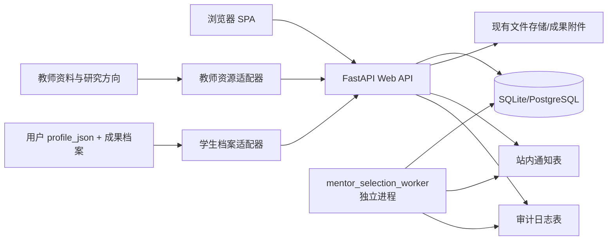
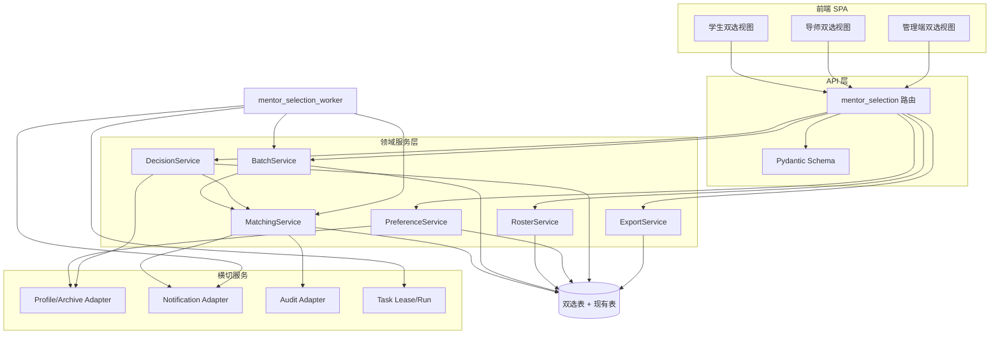
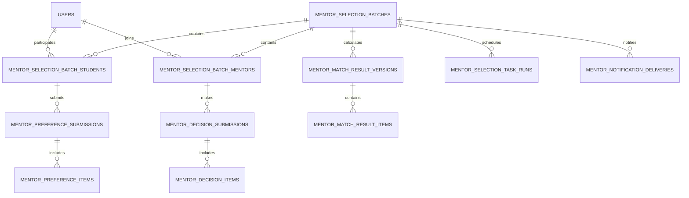
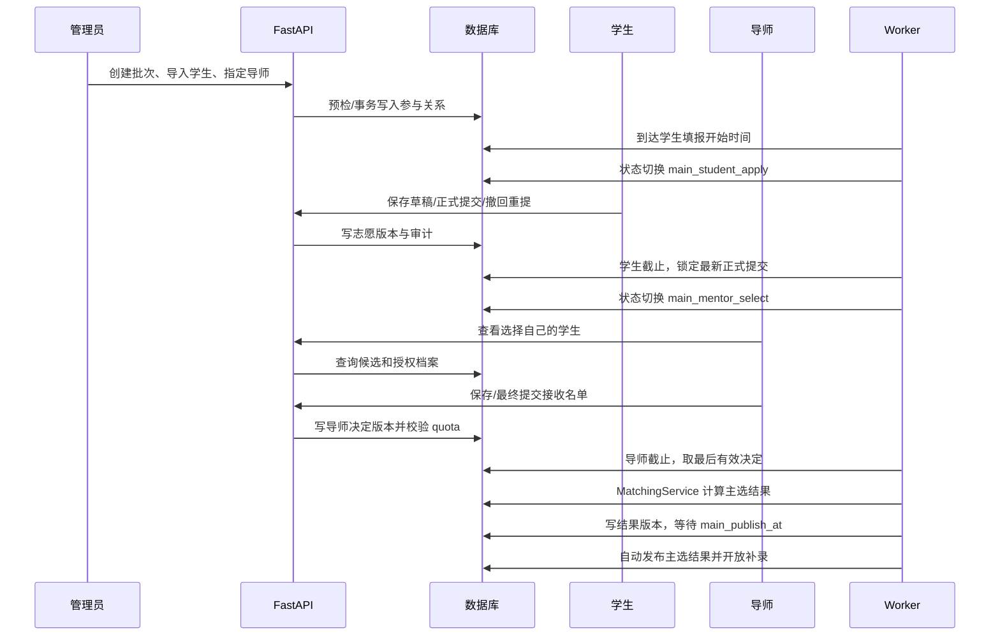
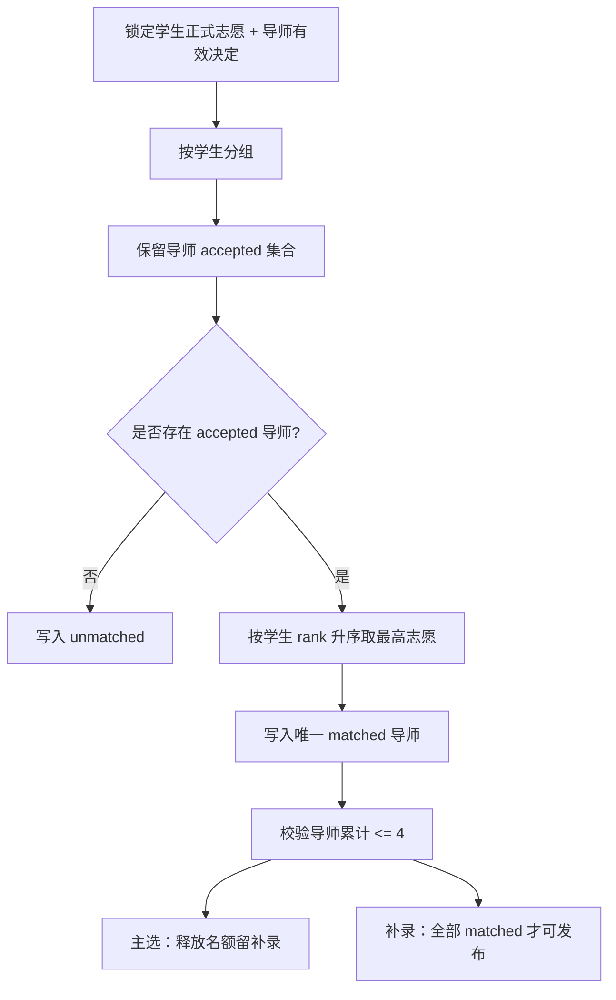
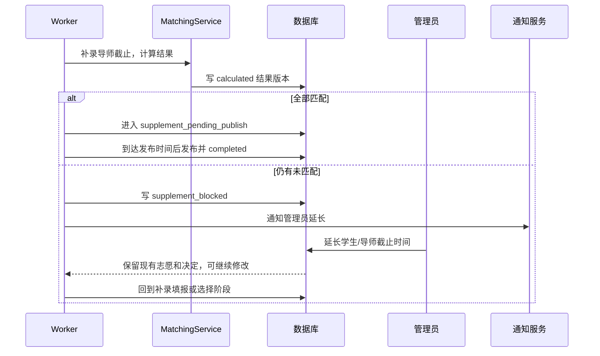

# 学术导师双选功能概要设计

> 文档版本：v0.1  
> 编写日期：2026-08-17  
> 输入文档：[学术导师双选功能需求文档](./shuangxuan_proposal.md)  
> 技术基线：FastAPI + SQLAlchemy + Alembic + SQLite/PostgreSQL + 原生 JavaScript 前端；沿用现有 model/schema/repository/service/route 分层和独立 Worker 模式

## 1. 设计目的与范围

本文档将 `shuangxuan_proposal.md` 拆分为领域模块，说明模块职责、模块关系、数据模型、接口边界、关键时序、前端组件、调度和迁移方案，为后续实现提供统一结构。

本次设计覆盖：

1. 双选批次和阶段状态机。
2. 管理员学生名单导入、导师参与名单维护和批次汇总。
3. 学生主选/补录志愿版本、陈述和逐导师理由。
4. 导师候选档案查看、接收/拒绝、名单保存和提交。
5. 主选/补录按学生志愿顺序匹配、名额控制和结果版本。
6. 独立调度 Worker：阶段切换、提醒、匹配计算和自动发布。
7. 学生档案与已审核成果适配、通知、审计、导入导出。
8. 前端学生端、导师端、管理端及旧交流申请迁移。

本次设计不覆盖：

- 学生画像、推荐算法或 AI 辅助志愿建议。
- 平台内预约、面试、沟通记录和评价。
- 管理员人工改配、导师超额接收或直接指派。
- 短信、邮件、企业微信等站外通知。
- 学习计划、教师研究方向维护本身的业务改造。

## 2. 设计决策记录

| 序号 | 决策点 | 设计决策 |
| --- | --- | --- |
| 1 | 文件名 | 输入为 `doc/shuangxuan_proposal.md`，本文件为 `doc/shuangxuan_high-level-design.md` |
| 2 | 自动化方式 | 新增独立 `mentor_selection_worker`，沿用 `announcement_worker` 的独立进程模式，不依赖 FastAPI 进程内后台任务 |
| 3 | Worker 轮询 | Worker 每 60 秒轮询一次；停机错过的任务在恢复后立即补执行 |
| 4 | 调度可靠性 | 使用数据库任务租约、任务键和结果状态实现多进程安全；执行语义为“至少一次调用、业务结果幂等” |
| 5 | Excel 支持 | `.xlsx` 使用 `openpyxl`，`.xls` 导入使用 `xlrd`，`.xls` 导出使用 `xlwt`；CSV 沿用标准库/现有导出服务 |
| 6 | 重开学生阶段 | 全部批次学生重新填报；既有有效结果作废，学生须在新开放阶段重新正式提交 |
| 7 | 重开导师阶段 | 保留学生最近一次正式提交的志愿，作废旧导师决定和匹配结果，所有参与导师重新选择 |
| 8 | 补录延长 | 保留已有补录志愿和导师决定，双方可继续修改并重新提交；仍属于同一固定补录轮次 |
| 9 | 通知去重 | 新增通知投递表，以“批次 + 轮次 + 事件 + 用户”唯一约束保证幂等 |
| 10 | 自动发布失败 | Worker 自动重试；成功后立即补发布并通知管理员，不提供人工改配路径 |
| 11 | 时间存储 | 沿用项目 `local_now()` 使用 UTC+8；时间比较和接口返回均明确 `Asia/Shanghai` |
| 12 | 旧交流申请 | 上线迁移前备份，随后删除 `communication_applications` 数据、模型、路由和前端入口，不迁移为双选数据 |

补充原则：关键写操作不能只依赖现有进程内 `IdempotencyMiddleware`；数据库唯一约束、版本号、事务和任务键是最终幂等边界。

## 3. 总体架构

### 3.1 部署与运行组件



Web API 负责用户交互、权限和同步写入；Worker 负责到期任务和自动发布。两者共享领域服务和数据库，不通过进程内内存传递状态。

### 3.2 模块清单

| 编号 | 模块 | 主要职责 | 主要依赖 |
| --- | --- | --- | --- |
| M1 | 批次与状态机 | 批次配置、阶段时间、单进行中约束、延长和重开 | M2、M6、M7 |
| M2 | 参与名单 | 学生导入预检/确认、导师勾选、资格快照 | 用户仓储、教师仓储、M1 |
| M3 | 学生档案适配 | 手机号、邮箱、简介、课程成绩；专业、成果和证明附件读取 | `profile_service`、成果服务、文件服务 |
| M4 | 学生志愿 | 主选/补录志愿版本、陈述、逐导师理由、保存/提交/撤回 | M1、M2、M3 |
| M5 | 导师选择 | 候选学生查询、接收/拒绝、保存/最终提交、4 人名额校验 | M1、M2、M3 |
| M6 | 匹配与结果 | 志愿顺序匹配、结果版本、名额累计、作废和发布条件 | M1、M4、M5 |
| M7 | 调度 Worker | 阶段推进、截止快照、提醒、计算和自动发布、失败重试 | M1、M6、M8 |
| M8 | 通知与审计 | 通知投递去重、站内通知、写/读审计、任务运行记录 | 现有通知/审计仓储 |
| M9 | 导入导出 | CSV/XLSX/XLS 解析、预检、汇总导出和权限 | M2、M6、文件库 |
| M10 | 前端与兼容迁移 | 学生/导师/管理员页面、旧交流申请移除、数据库迁移 | M1-M9、现有 SPA |

### 3.3 共享适配器

| 适配器 | 责任 |
| --- | --- |
| `AuthPermissionAdapter` | 复用 `get_current_user`、`require_admin` 等依赖，统一检查角色、批次参与关系和阶段权限 |
| `TeacherResourceAdapter` | 从 `users` + `teacher_directions` 组装教师姓名、职称、院系、简介、研究方向和标签 |
| `StudentProfileAdapter` | 白名单读写 `users.profile_json`，提供手机号、邮箱、专业、简介和课程成绩 |
| `AchievementArchiveAdapter` | 查询当前学生 `status=approved` 的成果，并通过文件服务校验证明附件访问 |
| `NotificationAdapter` | 封装通知创建和投递去重，写入现有 `notifications` 与新投递记录 |
| `AuditAdapter` | 封装 `AuditRepository`，支持批次、档案查看、附件查看、导入、导出和系统任务审计 |

### 3.4 模块关系



### 3.5 依赖方向

1. Route 只负责参数解析、身份依赖和响应映射，不直接拼接匹配查询。
2. 领域服务依赖 Repository、适配器和事务，不依赖前端。
3. `MatchingService` 不读取 HTTP 请求，只接收已锁定的志愿和导师决定快照。
4. Worker 调用与 API 相同的领域服务，不能复制一套状态或匹配逻辑。
5. Notification、Audit、TaskRun 为横切能力，不能反向依赖具体前端视图。

## 4. 模块职责与内部设计

### 4.1 M1 批次与状态机模块

内部组件：`BatchService`、`BatchStateMachine`、`BatchClock`、`BatchLockService`。

职责：

- 创建和校验批次时间；保证学生、导师、主选发布时间顺序。
- 管理 `draft -> main_student_apply -> main_mentor_select -> main_pending_publish -> main_published -> supplement_student_apply -> supplement_mentor_select -> supplement_pending_publish/supplement_blocked -> supplement_published -> completed`。
- 主选结果发布后才开放补录；补录未全部匹配时进入 `supplement_blocked`，延长后回到补录填报或选择阶段。
- 重开时作废有效结果：学生阶段重开要求全部学生重新提交；导师阶段重开保留学生正式志愿、清空导师决定并重新选择。
- 用数据库事务和 `active_key='mentor_selection_active'` 唯一约束保证同一时间只有一个进行中的批次。

状态机只允许服务端执行，管理端通过命令接口触发，不允许前端直接写状态字段。

### 4.2 M2 参与名单模块

内部组件：`RosterImportService`、`RosterValidationService`、`TeacherAssignmentService`。

- CSV/XLSX/XLS 文件先解析为统一行结构，再执行预检。
- 学生通过学号关联现有 `users`，校验姓名、角色 `student`、状态 `active`、未删除和批次内唯一。
- `batch_students` 保存姓名、学号和班级快照，避免用户资料后续变更影响历史名单。
- 教师从现有用户/教师方向数据中勾选，写入 `batch_mentors`；每位教师默认 `quota=4`。
- 开启主选前检查有效学生和导师数；导师少于 3 人时阻止开放。

### 4.3 M3 学生档案适配模块

内部组件：`StudentProfileAdapter`、`TeacherProfileAdapter`、`AchievementArchiveAdapter`、`ProofAccessPolicy`。

- 在现有 `profile_json` 白名单中加入 `phone`、`email`、`course_grades`，沿用 `bio`、`major`。
- `course_grades` 以 JSON 列表保存，不设置 GPA 或科目枚举；正式提交时校验至少 3 条有课程名和成绩的记录。
- 导师候选档案查询只由 `CandidateProfilePolicy` 组装授权字段，禁止返回学生其他志愿和理由。
- 成果只查询 `status=approved`，证明附件通过现有文件服务生成临时访问响应，不直接暴露物理路径。
- 结果发布后，非最终匹配学生的档案访问策略立即失效。

### 4.4 M4 学生志愿模块

内部组件：`PreferenceService`、`PreferenceVersionService`、`PreferenceValidator`。

- 每一轮采用“提交头 + 志愿明细”版本模型，草稿、正式提交、撤回和锁定互不覆盖历史版本。
- 主选正式提交校验 3-4 个不同导师、连续排名、统一个人陈述、逐导师理由和课程成绩；补录校验至少 1 个导师，不设上限。
- 截止时间以服务端时间判断；截止后所有保存、撤回、提交接口返回阶段锁定错误。
- 撤回不删除版本，创建新的 `withdrawn` 状态事件；重新提交产生新版本，当前有效版本唯一。
- 学生只能读写自己的批次关系和志愿。

### 4.5 M5 导师选择模块

内部组件：`CandidateQueryService`、`DecisionService`、`DecisionSnapshotService`、`QuotaGuard`。

- 候选查询按 `batch_id + teacher_id + round` 过滤，只返回选择该导师的正式提交学生。
- 读取学生档案时调用 M3，不把完整 `profile_json` 直接序列化返回。
- 导师决定以“导师提交头 + 决定明细”保存版本；决定值为 `accepted/rejected`。
- 保存时锁定导师可接收上限：主选最多 4 人，补录最多 `4 - main_matched_count` 人。
- 导师最终提交后禁止修改；未最终提交时，Worker 在截止时取最后保存版本。
- 导师不能读志愿排名、其他导师理由或其他导师候选名单。

### 4.6 M6 匹配与结果模块

内部组件：`MatchingService`、`ResultVersionService`、`PublishGuard`、`ResultVoidService`。

匹配输入是某一轮锁定的学生正式志愿和导师最后有效决定，算法如下：

1. 为每名学生收集其出现在 `accepted` 集合中的导师。
2. 按 `rank ASC` 选取最高志愿；不存在则输出 `unmatched`。
3. 一名学生最多生成一个 `matched` 结果；一名导师按整个批次累计最多 4 人。
4. 主选不做递补；释放名额仅作为补录容量。
5. 补录计算后必须没有 `unmatched` 才允许进入待发布状态。

每次计算创建不可变结果版本，发布通过 `published_at` 标识当前有效版本。重开将旧版本标记 `void`，不物理删除结果和审计记录。

### 4.7 M7 调度 Worker 模块

内部组件：`MentorSelectionWorker`、`DueTaskScanner`、`TaskLeaseService`、`RecoveryService`。

Worker 循环每 60 秒执行：

1. 扫描批次时间字段，创建阶段切换、提醒、计算和发布任务。
2. 通过 `task_key` 和租约领取任务；已有有效租约时跳过，过期租约可接管。
3. 执行状态转换、截止快照、匹配计算或自动发布。
4. 记录 `mentor_selection_task_runs` 的成功、失败、重试次数和错误摘要。
5. 服务恢复时先处理所有已到期但未成功的任务，再处理当前时间窗口任务。

任务以数据库状态为准，Worker 崩溃不会使阶段回退。主选计算与主选发布分离，补录计算在未全部匹配时写入 `supplement_blocked`，不创建有效发布版本。

### 4.8 M8 通知与审计模块

内部组件：`MentorNotificationService`、`NotificationDeliveryGuard`、`MentorAuditService`。

- 站内通知复用 `notifications` 表，`type='mentor_selection'`，`ref_type='mentor_selection'`，`ref_id=batch_id`。
- 新增投递表，唯一键为 `batch_id + round + event_key + user_id`；同一提醒重复执行只产生一条通知。
- 提前一天提醒按阶段截止字段生成；无待办用户不发送提醒。
- API 写操作和档案/附件查看、导入、导出、发布、作废、延长都写 `audit_logs`。
- Worker 系统操作 `operator_id=NULL`，`operator_name='mentor_selection_worker'`，记录 task key 和结果版本。

### 4.9 M9 导入导出模块

内部组件：`MentorRosterParser`、`ImportPreviewService`、`MentorExportService`。

- 解析器按扩展名选择 CSV、`openpyxl`、`xlrd`；统一输出列名和行号。
- 预检结果不落库，确认时重新读取原文件并校验文件摘要/确认令牌。
- 任何错误行存在时拒绝确认；确认写入批次关系必须在单事务中完成。
- 导出按管理员权限查询，支持 CSV、XLSX、XLS；导出范围由 `dataset` 参数选择，不允许学生/导师调用。
- 导出内容来自有效快照和结果版本，不直接拼接实时草稿，避免导出期间数据漂移。

### 4.10 M10 前端与兼容迁移模块

- `#mentorship` 入口保留，以新双选组件替换原教师匹配/交流申请区域；学习计划子功能继续保留。
- 新增学生、导师、管理员双选子视图，前端不承担阶段权限判断，所有操作以 API 响应为准。
- 迁移脚本先检查备份标记，再删除 `communication_applications` 数据、表、路由和菜单；不删除教师研究方向和学习计划。
- 更新 `main.py` 路由注册、`app.js` 视图入口、`overview.js` 快捷入口和相关测试契约。

## 5. 数据模型设计

### 5.1 实体关系



### 5.2 `mentor_selection_batches`

| 字段 | 类型 | 说明 |
| --- | --- | --- |
| `id` | int PK | 批次 ID |
| `name` | varchar(200) | 批次名称 |
| `academic_year` | varchar(20) | 学年 |
| `term` | varchar(20) | 学期 |
| `status` | varchar(50) | 状态机状态 |
| `active_key` | varchar(60) nullable unique | 进行中批次固定值，历史批次为 NULL |
| `student_apply_start/end` | datetime | 主选学生填报时间 |
| `mentor_select_start/end` | datetime | 主选导师选择时间 |
| `main_publish_at` | datetime | 主选自动发布时间 |
| `supplement_student_start/end` | datetime | 补录学生填报时间 |
| `supplement_mentor_start/end` | datetime | 补录导师选择时间 |
| `supplement_publish_at` | datetime | 补录自动发布时间 |
| `version_no` | int | 乐观锁版本 |
| `created_by` | int FK | 创建管理员 |
| `created_at/updated_at/deleted_at` | datetime | 时间戳和软删除 |

时间顺序由 `BatchValidator` 校验；所有时间保存为项目约定的带时区时间。

### 5.3 参与关系表

`mentor_selection_batch_students`：

| 字段 | 说明 |
| --- | --- |
| `id` | 主键 |
| `batch_id/student_id` | 批次和用户外键，联合唯一 |
| `student_no_snapshot/name_snapshot` | 导入时身份快照 |
| `class_name` | 导入文件中的班级 |
| `status` | eligible/submitted/matched/unmatched |
| `created_at/updated_at` | 时间戳 |

`mentor_selection_batch_mentors`：

| 字段 | 说明 |
| --- | --- |
| `id` | 主键 |
| `batch_id/teacher_id` | 批次和教师用户外键，联合唯一 |
| `quota` | 固定 4，不允许接口修改 |
| `main_matched_count` | 主选实际匹配人数 |
| `supplement_matched_count` | 补录匹配人数 |
| `status` | active/removed |
| `created_at/updated_at` | 时间戳 |

### 5.4 志愿表

`mentor_preference_submissions` 保存一次保存/提交版本的头信息：`batch_id`、`student_id`、`round`、`version`、`personal_statement`、`status`、`submitted_at`、`withdrawn_at`、`created_at`、`updated_at`。唯一约束为 `(batch_id, student_id, round, version)`，当前有效版本通过状态和最大版本查询。

`mentor_preference_items` 保存 `submission_id`、`teacher_id`、`rank`、`reason`。约束：同一 submission 内 `teacher_id` 唯一，`rank` 唯一且从 1 开始连续。

### 5.5 导师决定表

`mentor_decision_submissions` 保存导师在某轮的一次名单版本：`batch_id`、`teacher_id`、`round`、`version`、`is_final_submitted`、`saved_at`、`submitted_at`、`created_at`。唯一约束为 `(batch_id, teacher_id, round, version)`。

`mentor_decision_items` 保存 `submission_id`、`student_id`、`decision`（accepted/rejected）。同一 submission 内学生唯一；服务层和数据库约束共同保证 accepted 数不超过当前配额。

### 5.6 结果表

`mentor_match_result_versions`：`batch_id`、`round`、`version`、`calculated_at`、`published_at`、`voided_at`、`status`（calculated/published/void）。

`mentor_match_result_items`：`result_version_id`、`student_id`、`teacher_id nullable`、`matched_rank nullable`、`status`（matched/unmatched/void）。

同一批次同一轮最多一个 `published` 结果版本；重开事务中先作废旧版本，再创建新版本。

### 5.7 调度与通知表

`mentor_selection_task_runs`：`batch_id`、`task_type`、`round`、`task_key`、`status`（running/success/failed/blocked）、`lease_owner`、`lease_until`、`retry_count`、`error_summary`、`started_at`、`finished_at`。`task_key` 唯一。

`mentor_selection_notification_deliveries`：`batch_id`、`round`、`event_key`、`user_id`、`notification_id`、`sent_at`。唯一键 `(batch_id, round, event_key, user_id)`。

### 5.8 用户资料变更

继续使用 `users.profile_json`，由 `profile_service` 白名单校验新增：

```json
{
  "phone": "13800000000",
  "email": "student@example.com",
  "bio": "个人简介",
  "course_grades": [
    {"course_name": "高等数学", "score": "92"},
    {"course_name": "程序设计", "score": "优秀"},
    {"course_name": "专业课", "score": "88", "remark": "自主展示"}
  ]
}
```

不新增 GPA 字段，不限制课程名称或成绩表示方式；正式提交校验至少 3 条完整记录。

## 6. 接口设计（概要）

建议新增路由文件 `backend/app/api/routes/mentor_selection.py`，挂载 `/api/v1/mentor-selection`；管理、学生和导师接口统一复用 schemas 与权限依赖。

### 6.1 批次和管理接口

| 方法 | 路径 | 服务 | 权限 |
| --- | --- | --- | --- |
| POST | `/batches` | `BatchService.create` | admin |
| GET | `/batches` | `BatchService.list` | admin |
| GET | `/batches/{id}` | `BatchService.get_dashboard` | admin |
| PUT | `/batches/{id}` | `BatchService.update_config` | admin |
| POST | `/batches/{id}/students/import/preview` | `ImportPreviewService.preview` | admin |
| POST | `/batches/{id}/students/import/confirm` | `RosterImportService.confirm` | admin |
| DELETE | `/batches/{id}/students/{student_id}` | `RosterService.remove` | admin，未开始 |
| PUT | `/batches/{id}/mentors` | `TeacherAssignmentService.replace` | admin |
| POST | `/batches/{id}/extend` | `BatchService.extend` | admin |
| POST | `/batches/{id}/reopen` | `BatchService.reopen` | admin |
| GET | `/batches/{id}/summary` | `ResultVersionService.summary` | admin |
| GET | `/batches/{id}/export` | `MentorExportService.export` | admin |

`reopen` 请求必须显式传入 `round` 和 `target_stage`，避免把主选和补录误重开。重开学生阶段作用于该批次全部学生；重开导师阶段保留该轮学生正式志愿，作废导师决定。

### 6.2 学生接口

| 方法 | 路径 | 说明 |
| --- | --- | --- |
| GET | `/current` | 当前可参与批次、阶段和本人状态 |
| GET | `/{batch_id}/mentors` | 导师资料、正式申请人数、剩余名额 |
| GET | `/{batch_id}/preferences/mine` | 当前轮次和版本 |
| POST | `/{batch_id}/preferences` | 保存草稿 |
| POST | `/{batch_id}/preferences/submit` | 正式提交 |
| POST | `/{batch_id}/preferences/withdraw` | 截止前撤回 |
| GET | `/{batch_id}/result/mine` | 本人有效结果 |

### 6.3 导师接口

| 方法 | 路径 | 说明 |
| --- | --- | --- |
| GET | `/{batch_id}/candidates` | 选择自己的正式提交学生和统计 |
| GET | `/{batch_id}/candidates/{student_id}` | 授权范围内学生档案 |
| PUT | `/{batch_id}/decisions` | 保存接收/拒绝名单 |
| POST | `/{batch_id}/decisions/submit` | 最终提交名单 |
| GET | `/{batch_id}/quota` | 已接收、待处理、剩余名额 |
| GET | `/{batch_id}/result/mine` | 最终接收学生 |

### 6.4 Worker 内部命令

Worker 不开放 HTTP 写接口，直接调用服务方法：

- `advance_due_stage(batch_id)`
- `send_due_reminders(batch_id)`
- `lock_and_calculate(batch_id, round)`
- `publish_result(batch_id, round)`
- `recover_failed_task(task_key)`

### 6.5 错误码

| 错误码 | 含义 |
| --- | --- |
| `MENTOR_SELECTION_NOT_ELIGIBLE` | 用户不在批次名单或账号无效 |
| `MENTOR_SELECTION_STAGE_LOCKED` | 当前阶段已结束或尚未开始 |
| `MENTOR_SELECTION_INVALID_PREFERENCE` | 志愿数量、重复、理由或档案不满足要求 |
| `MENTOR_SELECTION_QUOTA_EXCEEDED` | 导师拟接收人数超过可用名额 |
| `MENTOR_SELECTION_NOT_READY` | 补录仍有未匹配学生，不能发布/结束 |
| `MENTOR_SELECTION_VERSION_CONFLICT` | 客户端提交版本过期 |
| `MENTOR_SELECTION_IMPORT_INVALID` | 导入预检存在错误 |
| `MENTOR_SELECTION_EXPORT_FORBIDDEN` | 非管理员导出 |

## 7. 关键流程时序

### 7.1 主选填报与导师选择



### 7.2 志愿顺序匹配



### 7.3 补录阻塞与延长



### 7.4 结果撤回与重开

1. 管理员调用重开接口，服务在事务内锁定批次。
2. 将当前有效结果版本标记 `void`，记录作废原因和审计。
3. `target_stage=student_apply`：作废当前轮次志愿，参与学生全部重新正式提交。
4. `target_stage=mentor_select`：保留学生最近正式志愿，作废导师决定，导师全部重新选择。
5. 更新批次时间和状态，发送重开通知；Worker 从新截止时间继续处理。

## 8. 前端组件划分

### 8.1 入口与共享组件

| 文件/组件 | 责任 |
| --- | --- |
| `frontend/js/views/mentorship.js` | 保留教师方向、学习计划；嵌入或路由到双选工作区 |
| `frontend/js/views/mentor_selection.js` | 批次状态、学生/导师视图入口和数据加载 |
| `frontend/js/mentor_selection_student.js` | 学生导师列表、志愿排序、陈述和理由、提交/撤回、结果 |
| `frontend/js/mentor_selection_teacher.js` | 候选学生、档案抽屉、接收/拒绝、名额和最终提交 |
| `frontend/js/mentor_selection_admin.js` | 批次、导入、导师勾选、汇总、延长/重开、导出 |
| `frontend/js/mentor_selection_common.js` | 阶段状态、倒计时、错误码映射、结果标签 |

### 8.2 页面状态

- 所有视图从 `/current` 获取阶段，不通过本地时间自行推断可写状态。
- 表单保存携带 `version`，发生 `VERSION_CONFLICT` 时重新加载并提示用户合并/覆盖。
- 导师档案详情只渲染 API 返回字段；不在浏览器端过滤完整用户对象。
- 管理员汇总默认只读，延长、重开、导出使用确认弹窗并发送 `Idempotency-Key`。
- 结果页面区分主选结果、补录结果和当前有效结果；作废版本仅管理员在审计/历史视图查看。

### 8.3 导航兼容

- `app.js` 的 `mentorship` 路由标签从“教师与计划”调整为“学术导师与计划”或由管理员配置展示名；路径保持 `#mentorship` 以兼容现有快捷入口。
- `overview.js` 的教师推荐仍可跳转教师系统，但不提供旧交流申请按钮。
- 旧 `applications` 入口和“我的申请/收到的申请”双选相关 Tab 删除，学习计划 API 和页面保留。

## 9. 代码组织建议

```text
backend/app/
  models/mentor_selection.py
  schemas/mentor_selection.py
  repositories/mentor_selection_repo.py
  services/
    mentor_selection_batch_service.py
    mentor_selection_roster_service.py
    mentor_selection_preference_service.py
    mentor_selection_decision_service.py
    mentor_selection_matching_service.py
    mentor_selection_export_service.py
    mentor_selection_notification_service.py
    mentor_selection_task_service.py
  api/routes/mentor_selection.py
  workers/mentor_selection_worker.py
  workers/mentor_selection_scheduler.py
frontend/js/
  views/mentor_selection.js
  mentor_selection_student.js
  mentor_selection_teacher.js
  mentor_selection_admin.js
  mentor_selection_common.js
alembic/versions/
  <revision>_add_mentor_selection.py
  <revision>_remove_communication_applications.py
```

现有 `teachers.py`、`applications.py` 中的学习计划逻辑先保留到兼容迁移完成；双选新路由不复用交流申请的业务模型，避免历史申请状态污染新的批次状态机。

## 10. 配置与部署

### 10.1 新增配置

| 配置项 | 用途 |
| --- | --- |
| `MENTOR_SELECTION_WORKER_INTERVAL_SECONDS` | Worker 轮询间隔，默认 60 秒 |
| `MENTOR_SELECTION_TASK_LEASE_MINUTES` | 任务租约时长 |
| `MENTOR_SELECTION_REMINDER_HOURS` | 截止提醒提前时长，需求值为 24 小时 |
| `MENTOR_SELECTION_IMPORT_MAX_ROWS` | 单次名单导入上限，部署时配置 |
| `MENTOR_SELECTION_EXPORT_MAX_ROWS` | 单次导出保护上限，部署时配置 |
| `MENTOR_SELECTION_TIMEZONE` | 固定 `Asia/Shanghai` |

配置沿用现有设置加载方式；时间提醒业务值固定为提前一天，管理员只能配置阶段时间，不能改变提醒规则。

### 10.2 依赖

主依赖或部署依赖新增：

```text
openpyxl   # .xlsx 读写
xlrd       # .xls 读取
xlwt       # .xls 写出
```

依赖加入 `requirements.txt` 或经部署确认后放入 `requirements-optional.txt`。导入服务必须校验扩展名、文件大小、行列结构和编码，不执行单元格公式。

### 10.3 Worker 启动

部署编排新增独立进程，等价于现有公告 Worker：

```text
python -m backend.app.workers.mentor_selection_worker
```

Worker 支持 `--once` 便于测试和运维手工补跑；生产环境以循环模式运行。Web 服务重启不影响批次状态，Worker 重启可根据数据库到期字段恢复任务。

### 10.4 迁移顺序

1. 备份数据库并写入迁移前检查标记。
2. 创建双选新表、索引和通知投递表。
3. 扩展 `profile_json` 白名单，不需要物理新增 users 列。
4. 部署 API、前端和 Worker。
5. 验证新流程和回滚点后，执行删除 `communication_applications` 数据、表、模型注册、路由和页面。
6. 迁移脚本执行结果写入部署记录和审计，不把旧交流申请转换为双选结果。

## 11. 并发、事务与幂等

### 11.1 事务边界

| 操作 | 单事务内容 |
| --- | --- |
| 导入确认 | 文件摘要校验、行校验、批次学生关系写入、审计 |
| 学生提交 | 阶段检查、志愿版本写入、当前状态更新、审计 |
| 导师保存/提交 | 阶段检查、名额锁定、决定版本写入、审计 |
| 匹配计算 | 锁定批次和有效版本、写结果版本、更新统计 |
| 发布 | 校验结果条件、发布结果、更新批次状态、生成通知事件 |
| 重开 | 作废结果、清理指定轮次有效状态、更新阶段时间、审计和通知 |

### 11.2 并发策略

- API 写操作使用批次/版本号乐观锁，版本不一致返回 `MENTOR_SELECTION_VERSION_CONFLICT`。
- 名额写入在导师决定提交事务中锁定 `batch_mentors`；SQLite 采用短事务和应用锁，PostgreSQL 使用行锁。
- Worker 任务通过 `task_key + lease_until` 领取；多 Worker 只有一个有效租约执行同一任务。
- `active_key`、参与关系唯一键、志愿明细唯一键、通知投递唯一键作为数据库最终约束。

### 11.3 自动任务幂等

任务重试时按以下顺序判断：已存在成功结果则直接返回；已存在发布版本则跳过发布；已存在通知投递记录则跳过通知；已存在作废版本则不重复作废。任何失败都保留错误摘要，不把批次标记为已完成。

## 12. 可观测性

### 12.1 日志

- 记录 `request_id`、`batch_id`、`round`、`task_key`、`result_version` 和用户 ID。
- Worker 记录扫描数量、领取数量、成功/失败/阻塞数量和耗时。
- 导入记录文件摘要、行数和错误计数，不记录原始手机号、邮箱或成绩内容。

### 12.2 指标

建议增加：

- `mentor_selection_batches_active`：进行中批次数。
- `mentor_selection_submissions_total`：学生/导师提交数。
- `mentor_selection_match_calculation_duration_ms`：匹配耗时。
- `mentor_selection_unmatched_students`：当前未匹配人数。
- `mentor_selection_worker_task_failures_total`：Worker 失败次数。
- `mentor_selection_notification_deduplicated_total`：去重通知次数。

管理员汇总页直接读取批次统计，不使用前端本地累加作为权威数据。

## 13. 测试设计

### 13.1 单元测试

- 状态机合法/非法迁移和时间顺序。
- 主选 3-4 志愿、补录至少 1 志愿、理由和课程成绩校验。
- 志愿排名匹配、重复接收、未匹配、名额累计和主选不递补。
- 导师最后保存名单的截止快照。
- 重开学生阶段/导师阶段的结果作废和数据保留规则。
- 通知投递唯一键、任务租约和重试幂等。

### 13.2 集成测试

- SQLite 内存数据库下批次、名单、志愿、决定、匹配和发布完整流程。
- CSV/XLSX/XLS 预检、错误阻止确认、确认重复提交。
- 导师只能访问自己的候选学生和批准成果附件。
- 主选发布后补录开放；补录未全部匹配阻止发布并延长；全部匹配自动完成。
- 重开后学生全部重新提交或导师重新选择。

### 13.3 Worker 恢复测试

- Worker 在每个阶段边界前后停止，恢复后补执行且不重复通知。
- 匹配计算成功但发布失败时重试发布，不创建第二个有效版本。
- 多 Worker 同时领取同一任务只有一个租约成功。
- `supplement_blocked` 任务延长后恢复到正确阶段。

### 13.4 前端与安全测试

- 学生、导师、管理员、校友的页面和 API 权限矩阵。
- 截止后按钮隐藏与服务端拒绝同时生效。
- 导师看不到其他志愿顺序和理由；结果发布后档案访问收回。
- 手机号、邮箱、课程成绩、成果附件和导出数据越权测试。
- 导出注入、恶意表格公式、文件扩展名伪造和超大文件保护。

## 14. 实施顺序

### Phase 1：领域表与批次基础

新增模型、迁移、schemas、Repository、批次状态机和名单导入预检；完成单进行中约束。

### Phase 2：学生志愿与档案

扩展 profile 白名单，完成课程成绩校验、主选/补录志愿版本和学生 API。

### Phase 3：导师选择与匹配

完成候选档案适配、导师决定版本、名额保护、主选/补录 MatchingService 和结果版本。

### Phase 4：Worker、通知与审计

完成独立 Worker、任务租约、阶段切换、提醒、自动计算/发布、失败恢复和通知去重。

### Phase 5：前端与导出

完成三端视图、倒计时、汇总、CSV/XLSX/XLS 导出和错误状态；更新导航兼容。

### Phase 6：旧模块迁移与验收

完成交流申请备份、删除迁移、回归测试、权限测试、Worker 恢复测试和需求验收映射。

## 15. 需求追踪矩阵

| 需求文档章节 | 设计模块 | 主要交付 |
| --- | --- | --- |
| 角色与数据可见性 | M3、M5、M8 | 授权档案查询、志愿隐藏、发布后访问收回 |
| 批次与状态流转 | M1、M7 | 状态机、Worker、时间和延长 |
| 学生主选/补录 | M3、M4、M10 | 资料字段、志愿版本、学生页面 |
| 导师选择 | M3、M5、M10 | 候选档案、决定版本、导师页面 |
| 匹配与结果 | M6、M7 | 顺序匹配、结果版本、自动发布 |
| 名单导入 | M2、M9 | CSV/XLSX/XLS 预检与确认 |
| 汇总与导出 | M6、M9、M10 | 管理端汇总、三类文件导出 |
| 通知与审计 | M7、M8 | 一天前提醒、事件通知、读写审计 |
| 旧交流申请替代 | M10 | 备份、删除迁移、入口和路由移除 |
| 验收与安全 | M8、M10、测试层 | 并发、恢复、权限、越权和幂等测试 |

## 16. 风险与限制

| 风险 | 影响 | 缓解措施 |
| --- | --- | --- |
| Worker 停机 | 阶段或发布延迟 | 数据库到期扫描、恢复补执行、失败通知 |
| 导师集中拒绝 | 补录无法完成 | 阻止发布和结束，管理员延长补录，不允许人工改配 |
| SQLite 并发写限制 | 高并发提交冲突 | 短事务、版本校验、应用锁；生产可使用 PostgreSQL |
| 课程成绩格式自由 | 展示和统计不统一 | 仅保存展示，不做 GPA 计算或横向比较 |
| `.xls` 生态老旧 | 解析/导出兼容性 | 单独依赖 `xlrd`/`xlwt`，失败时返回可读错误并支持 CSV 兜底 |
| 旧数据直接删除 | 不可恢复 | 迁移前强制备份标记，迁移记录和审计保留 |
| 结果重开 | 学生/导师已有操作作废 | 结果版本不可变、明确通知、审计记录作废原因 |

## 17. 已确认设计结论

1. 文件名统一为 `shuangxuan_proposal.md` 和 `shuangxuan_high-level-design.md`。
2. 采用独立 Worker，每 60 秒轮询，停机后补执行。
3. CSV、XLSX、XLS 均需要支持导入和导出。
4. 重开学生阶段时全部学生重新填报；重开导师阶段时保留学生正式志愿、导师全部重新选择。
5. 补录延长保留已有志愿和决定，仍属于一轮补录。
6. 通知投递必须去重，匹配和发布失败由 Worker 自动重试。
7. 补录结果未全部匹配时禁止发布和结束；管理员只能延长流程，不能直接指派。
8. 不实现推荐算法、平台内面试记录或超额接收。
