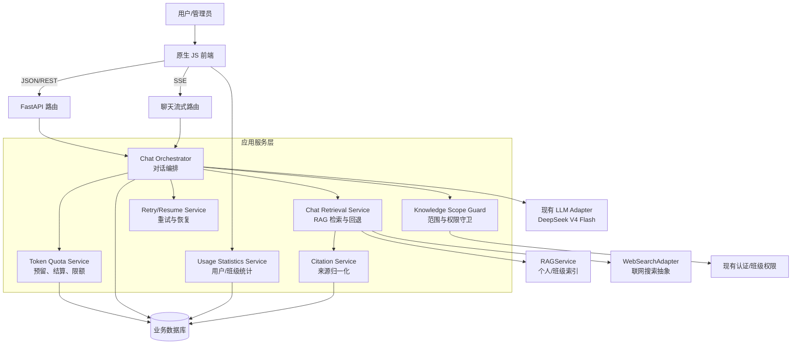
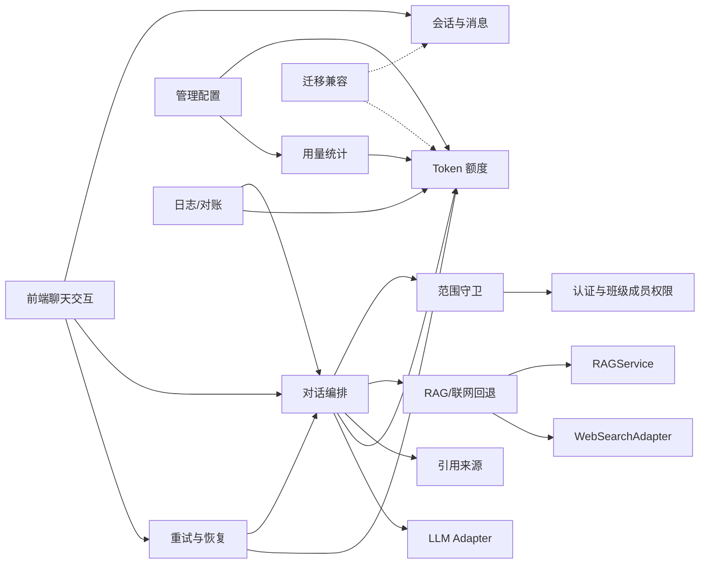
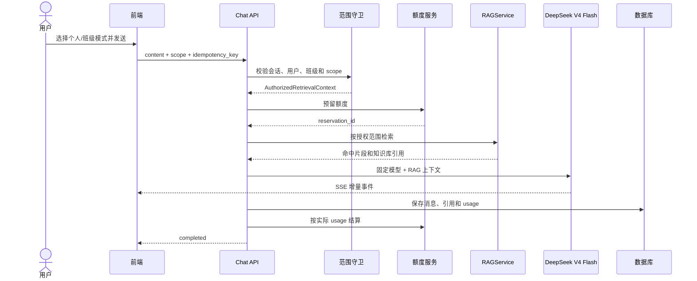
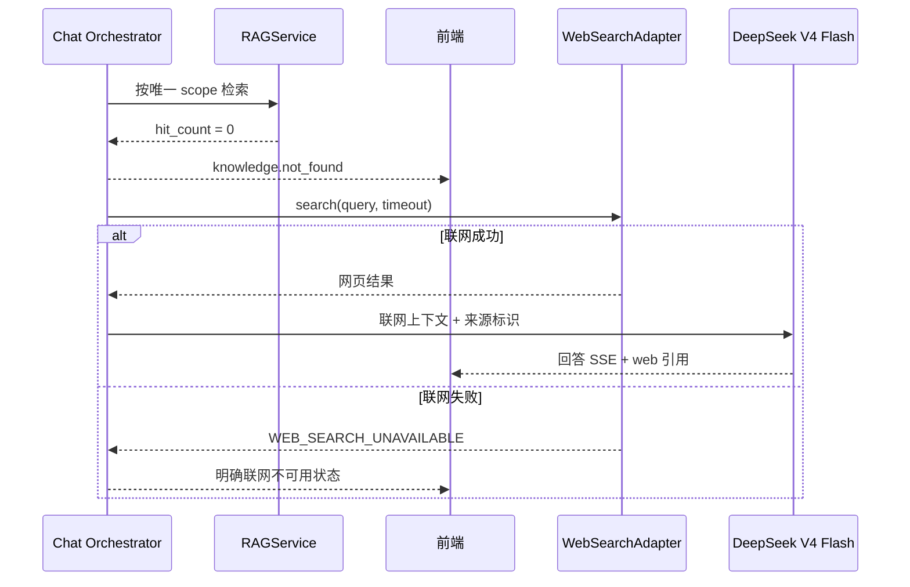
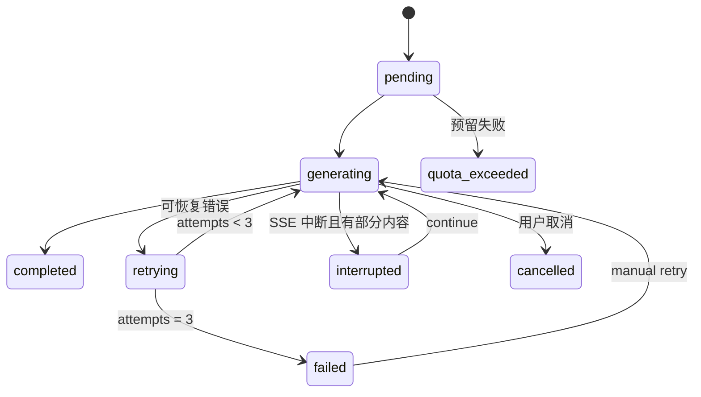
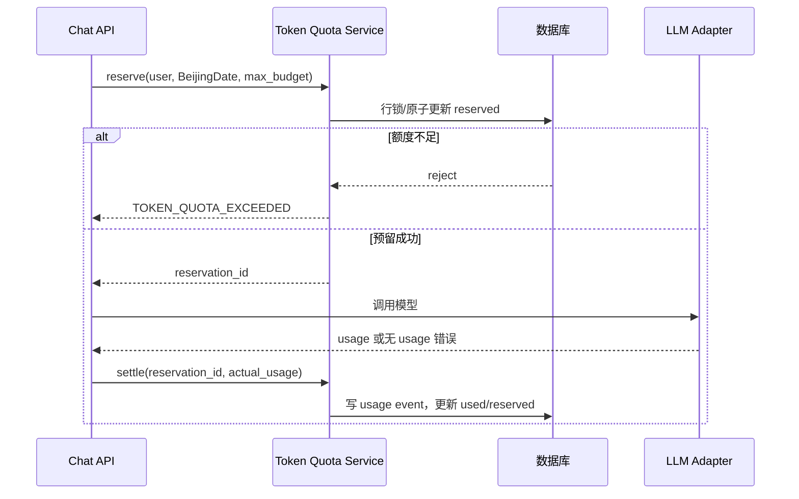

# AI 对话与知识库改进概要设计

> 文档版本：v0.1
> 编写日期：2026-08-19
> 输入文档：[AI 对话与知识库改进需求](./ai对话与知识库改进需求.md)
> 适用项目：`LM_SJ`
> 技术基线：FastAPI + SQLAlchemy + SQLite/PostgreSQL + 原生 JavaScript + SSE

---

## 1. 设计目标与范围

本文档将需求划分为可实现的后端、前端、数据和基础设施模块，明确模块之间的调用关系、数据边界和关键流程，作为详细设计、开发拆分和测试设计的依据。

本次设计覆盖：

1. 个人知识库、班级知识库和不调用知识库三种互斥检索模式。
2. 知识库权限隔离、缓存隔离、来源引用和无结果联网回退。
3. 基于现有 LLM 适配器、流式 SSE、超时和错误处理机制的对话可靠性改造。
4. 自动重试、手动重新发送、流式中断后的继续生成、断线恢复和稳定会话链接。
5. DeepSeek V4 Flash 固定模型配置。
6. 按用户和角色的每日 Token 额度、并发预留、实际用量结算和审计。
7. 用户用量查询及管理员按班级统计。
8. 数据迁移、权限、安全、可观测性和自动化验收测试。

本次不设计新的模型供应商、不设计公开分享链接，也不增加“个人 + 班级”联合检索模式。多端访问指同一用户登录后访问自己的持久化会话。

## 2. 已确认的设计决策

| 序号 | 事项 | 设计决策 |
| --- | --- | --- |
| 1 | 联网搜索 | 抽象为 `WebSearchAdapter`，本期不绑定具体供应商 |
| 2 | LLM 调用 | 复用现有 LLM 适配器、SSE、超时和错误处理；服务端固定 DeepSeek V4 Flash |
| 3 | 模型选择 | 前端和普通用户不能选择模型；请求中的模型字段由服务端覆盖或拒绝 |
| 4 | 会话链接 | 沿用现有会话 ID 路由和登录鉴权，不新增公开分享机制 |
| 5 | 角色额度 | 设计角色额度配置和用户临时覆盖，具体数值由管理员配置 |
| 6 | 并发扣减 | 请求开始预留额度，完成后按实际 usage 结算并释放差额 |
| 7 | 部分失败计量 | 有实际 usage 按实际值计入；没有 usage 进入待对账，不用估算值扣费 |
| 8 | 自动重试 | 首次失败后最多再调用 2 次，即单个逻辑请求最多 3 次模型调用 |
| 9 | 中断恢复 | 同时设计继续生成接口和重新发送接口 |
| 10 | 管理员统计 | 支持按管理员管理范围查看多个班级，支持按班级筛选和汇总 |
| 11 | 额度调整 | 立即影响后续请求，不回溯历史用量；已用量达到新额度时立即禁止新请求 |
| 12 | 重试计量 | 每次实际模型调用产生的 Token 均计入用户用量 |

## 3. 总体架构

### 3.1 分层结构



### 3.2 请求主链路

1. 前端提交会话 ID、消息内容、`knowledge_scope`、联网开关和幂等键。
2. API 层完成身份认证、请求参数校验和错误码转换。
3. `Chat Orchestrator` 获取会话，并由 `Knowledge Scope Guard` 校验会话所有者、班级成员关系和模式范围。
4. `Token Quota Service` 原子预留本次请求额度；不足则直接返回额度不足，不调用检索或模型。
5. `Chat Retrieval Service` 按严格范围调用 RAG；命中则生成知识库上下文，未命中且策略允许则发出未找到提示并调用联网适配器。
6. 对话编排器调用固定的 DeepSeek V4 Flash 适配器，通过现有 SSE 输出事件。
7. 服务端持久化消息、请求状态、引用和模型 usage，额度服务完成实际结算。
8. 前端以服务端消息状态为准更新界面；断线时通过查询接口恢复状态。

## 4. 模块划分

### 4.1 模块清单

| 编号 | 模块 | 主要职责 | 依赖 |
| --- | --- | --- | --- |
| M1 | 会话与消息持久化模块 | 会话稳定链接、消息历史、模式记录、权限校验 | 现有 ChatRepository、数据库、认证 |
| M2 | 知识库范围守卫模块 | 解析并校验 `personal/class/none`，隔离个人、班级和无知识库模式 | 班级成员权限、RAG |
| M3 | RAG 检索与联网回退模块 | 严格范围检索、无结果判断、联网搜索、上下文构造 | M2、RAGService、WebSearchAdapter |
| M4 | 引用来源模块 | 知识库和网页来源统一建模、持久化和返回 | M3、消息模块 |
| M5 | LLM 对话编排模块 | 复用现有适配器和 SSE，固定模型，编排上下文、生成和落库 | M1-M4、现有 LLM Adapter |
| M6 | 重试与恢复模块 | 自动重试、手动重新发送、继续生成、幂等、断线恢复 | M1、M5、M7 |
| M7 | Token 额度与计量模块 | 角色额度、用户覆盖、预留、结算、北京时间日切、审计 | 数据库、M5 |
| M8 | 用量统计模块 | 用户用量、班级筛选/汇总、管理员权限和查询 | M7、班级权限 |
| M9 | 前端聊天交互模块 | 模式选择、状态展示、SSE 重连、重试/继续生成/重新发送 | M1-M8 接口 |
| M10 | 管理配置与运营模块 | 角色额度、用户额度调整、统计页面、审计查看 | M7、M8、管理员权限 |
| M11 | 可观测性与对账模块 | 业务日志、错误码、请求链路、usage 待对账和告警 | M5-M8 |
| M12 | 迁移与兼容模块 | 现有字段兼容、数据库迁移、旧接口行为收敛 | 全局 |

### 4.2 模块关系



### 4.3 依赖原则

1. 前端不能直接决定检索范围、模型或额度；这些规则由服务端模块强制执行。
2. RAG 模块不能自行扩大范围；所有查询必须经过范围守卫产生的授权上下文。
3. LLM 模块不直接查询数据库索引，由检索模块提供已标记来源的上下文。
4. 额度模块在模型调用前负责预留，在模型调用后负责结算；重试和继续生成必须复用同一套计量逻辑。
5. 统计模块只读取已结算的用量和审计数据，不根据前端展示或请求次数推算 Token。

## 5. 核心模块概要设计

### 5.1 M1 会话与消息持久化

沿用现有 `chat_sessions`、`chat_messages`、`ChatRepository` 和会话 ID 路由，新增或扩展以下能力：

- 会话保存默认 `knowledge_scope` 和 `web_search_enabled`。
- 每条用户消息保存实际使用的 `knowledge_scope`、请求 ID 和逻辑请求 ID。
- 消息支持 `pending/generating/retrying/completed/failed/cancelled/quota_exceeded/interrupted` 状态。
- AI 消息保存已生成文本、完成标志、错误码和最后事件序号。
- 通过现有 `user_id` 过滤保证会话链接仅当前用户可访问。
- 访问会话时重新检查用户状态和班级成员关系；历史消息中包含班级引用时仍按当前权限过滤敏感来源。

稳定链接采用现有形式：`/chat/sessions/{session_id}`。本期不实现无需登录的分享链接。

### 5.2 M2 知识库范围守卫

定义内部枚举：

```text
KnowledgeScope = personal | class | none
```

守卫输入：当前用户、会话、请求范围、班级 ID、联网开关。

守卫输出：不可变的 `AuthorizedRetrievalContext`，包含：

- `user_id`；
- `class_id`（个人或无范围可为空）；
- `scope`；
- 可查询的知识库/索引标识；
- 是否允许联网回退；
- 审计字段和缓存分区键。

校验规则：

1. `personal` 只绑定当前用户的个人知识库。
2. `class` 必须确认用户当前属于该班级，只绑定该班级共享知识库。
3. `none` 返回空检索授权，RAG 服务不得被调用。
4. 旧接口若收到 `all` 或其他值，返回 `INVALID_KNOWLEDGE_SCOPE`，不得按默认范围处理。
5. 请求中的用户 ID、班级 ID 和模型由服务端身份与配置推导，不能信任前端传值。

### 5.3 M3 RAG 检索与联网回退

建议在现有 `chat_retrieval_service.py` 上扩展 `retrieve(context, query)`：

1. `scope=none` 直接返回 `knowledge_status=skipped`。
2. 个人或班级模式调用现有 `RAGService.search`，强制传入守卫生成的 scope、user_id 和 class_id。
3. 返回结果包含 `hit_count`、上下文片段和标准化引用元数据。
4. `hit_count=0` 时返回 `knowledge_status=not_found`，先产出“未找到相关资料”事件。
5. 若联网策略允许，调用 `WebSearchAdapter.search`；其失败只影响联网来源，不伪造知识库命中。
6. 检索缓存键至少包含 `user_id/class_id/scope/query_hash/index_version`。

联网适配器定义为供应商无关接口：

```text
search(query, *, user_id, class_id, timeout) -> WebSearchResult
```

适配器返回标题、链接、摘要、来源时间和错误状态；具体供应商、密钥和结果数列为运行时配置。

### 5.4 M4 引用来源

知识库和联网来源统一挂接到 AI 消息，不把来源仅拼接到正文中。

建议新增 `chat_message_citations` 表：

| 字段 | 说明 |
| --- | --- |
| `id` | 主键 |
| `message_id` | AI 消息 ID |
| `source_type` | `knowledge` 或 `web` |
| `knowledge_base_id` | 知识库 ID，可空 |
| `knowledge_base_name` | 展示名称，可空 |
| `document_id` | 文档 ID，可空 |
| `document_name` | 文档名称，可空 |
| `source_url` | 网页链接，可空 |
| `matched_excerpt` | 命中片段/网页摘要 |
| `rank` | 展示顺序 |
| `created_at` | 创建时间 |

引用保存时校验来源类型与范围一致：个人回答不能引用班级文档，`none` 模式不能有知识库引用。

### 5.5 M5 LLM 对话编排

沿用现有 `ChatService`、LLM 适配器和 SSE 路由，增加固定模型策略：

- 服务端常量或受保护配置 `DEEPSEEK_V4_FLASH_MODEL`。
- 忽略或拒绝前端传入的其他模型值。
- 普通用户 API 响应不提供模型选择字段；管理员运行配置页面也不允许把本功能改成其他模型。
- 继续复用现有超时、错误转换、SSE 心跳和 Markdown 安全渲染机制。
- 每个 SSE 事件携带 `request_id`、事件序号和状态，便于重连后续读。

编排顺序：范围校验 → 额度预留 → 检索/回退 → 创建请求记录 → LLM 流式调用 → 持久化增量文本 → usage 结算 → 完成事件。

### 5.6 M6 重试与恢复

#### 自动重试

`RetryPolicy` 根据错误分类决定是否重试：

- 可重试：网络错误、超时、模型服务 5xx、临时联网/RAG 服务错误。
- 不可重试：鉴权失败、权限不足、参数错误、上下文过长、额度不足、用户主动取消。
- 首次失败后最多再执行 2 次，退避等待由配置控制。

每次模型实际调用拥有独立 `attempt_no` 和 usage 记录，但共享一个逻辑 `request_id`。重试必须复用幂等键，不能重复创建用户消息。

#### 重新发送

重新发送适用于用户明确点击操作：

1. 校验原消息属于当前用户且状态为失败/未完成。
2. 创建新的逻辑请求，关联 `parent_request_id`。
3. 使用原消息内容、会话上下文和原消息记录的知识库模式，除非用户先切换会话模式。
4. 重新走额度预留、检索、模型调用和结算流程。

#### 继续生成

继续生成适用于已保存部分输出的流式中断消息：

1. 校验消息状态为 `interrupted` 且存在可恢复的上下文快照。
2. 以已生成内容作为前缀，向同一会话发起新的 continuation 请求。
3. 追加内容写入原 AI 消息或关联 continuation 记录，禁止覆盖已保存内容。
4. 新请求独立预留和结算 Token，并通过 `parent_request_id` 关联。

#### 断线恢复

建议增加：

- `GET /api/v1/chat/requests/{request_id}`：查询请求状态、部分内容、最后事件序号和 usage 状态。
- SSE 支持 `Last-Event-ID` 或等效事件序号续传。
- 前端重连先查询服务端状态，再决定续传、继续生成或展示失败，不自动重复提交原消息。

### 5.7 M7 Token 额度与计量

#### 数据模型

建议新增：

1. `token_quota_policies`：角色默认额度、模型、是否启用、更新时间。
2. `user_token_quota_overrides`：用户临时额度、有效时间、调整原因和审计字段。
3. `user_daily_token_usage`：用户、北京时间统计日、额度快照、预留量、已用输入/输出/总量、待对账量和版本号。
4. `chat_token_usage_events`：每次实际模型调用的 attempt、usage、状态、幂等键和结算状态。
5. `token_quota_audit_logs`：管理员调整前后值、操作者、原因、时间和目标用户。

#### 预留与结算

1. 按用户和北京时间统计日锁定 `user_daily_token_usage` 行。
2. 检查 `used + reserved < effective_quota`，不足则返回 `TOKEN_QUOTA_EXCEEDED`。
3. 预留值取服务端配置的单次最大输入/输出预算，具体上限列为配置项。
4. 模型完成或失败后，记录真实 usage；从 reserved 中扣除实际总量，差额释放。
5. 没有 usage 的失败调用进入 `pending_reconciliation`，不使用估算值扣除；对账完成后再更新已用量。
6. 自动重试的每次实际调用都写入 usage event 并计入用量。
7. 管理员调整立即更新后续请求使用的有效额度；已用量不回溯，若已用量不小于新额度则拒绝新请求。

#### 日切

所有统计日由服务端使用 `Asia/Shanghai` 计算，数据库保存日期而不是客户端日期。定时任务可预生成新日记录，但请求入口必须能够在缺少记录时幂等创建。

### 5.8 M8 用量统计

用户统计只查询当前用户的 `user_daily_token_usage` 和已结算 usage events。

管理员统计查询前先解析管理范围：

```text
管理员 -> 可管理班级集合 -> 用户集合 -> 用量聚合
```

支持：按班级筛选、多个班级汇总、按用户、日期、模型和请求状态查询。待对账用量单独展示，不混入已结算总量，避免统计口径不一致。

### 5.9 M9 前端聊天交互

沿用 `frontend/js/views/chat.js`、`frontend/js/api.js` 和现有 SSE 解析逻辑，增加：

- 三态互斥模式选择器，显示当前模式；不显示模型选择器。
- 生成中、重试中、断开、失败、已取消、额度不足和未找到资料状态。
- 引用展示组件，区分知识库文档与网页链接。
- 失败消息的重新发送按钮。
- 流式中断消息的继续生成按钮。
- SSE 重连和请求状态查询。
- 会话链接刷新后恢复最近模式和消息状态。
- 用量/额度入口，展示已用、额度、剩余和北京时间重置时间。

前端只负责展示和发起操作；模式、模型、权限、额度和是否可重试均以服务端返回为准。

### 5.10 M10 管理配置与统计

管理员页面新增两组能力：

1. 角色默认额度：管理员、教师、学生分别配置每日 Token 额度。
2. 用户额度调整：按班级/用户设置临时覆盖，填写原因，查看审计记录。
3. 班级用量统计：按班级筛选或多个班级汇总，查看用户排行、请求状态和待对账量。

额度设置接口必须限制为管理员角色，变更后返回新的生效额度和生效时间。

## 6. 数据库设计

### 6.1 现有表扩展

#### `chat_sessions`

新增或确认以下字段：

- `knowledge_scope`：会话默认模式，枚举 `personal/class/none`；
- `web_search_enabled`：联网回退开关；
- `last_message_status`：最近消息状态；
- `updated_at`：用于会话列表和多端同步。

#### `chat_messages`

新增或确认以下字段：

- `knowledge_scope`：消息实际使用模式；
- `request_id`：逻辑请求 ID；
- `status`：消息状态；
- `partial_content` 或等效字段：中断时保存的内容；
- `last_event_id`：SSE 恢复位置；
- `error_code`、`error_message`；
- `input_tokens`、`output_tokens`、`total_tokens`；
- `completed_at`。

现有附件表继续复用，不改变附件权限规则。

### 6.2 索引与约束

- `chat_sessions(user_id, updated_at)`：会话列表。
- `chat_messages(session_id, created_at, id)`：历史消息顺序。
- `user_daily_token_usage(user_id, usage_date)`：唯一约束，防止重复日汇总。
- `chat_token_usage_events(idempotency_key)`：唯一约束，防止重复记账。
- `chat_message_citations(message_id, rank)`：引用顺序。
- 额度审计表按 `target_user_id, created_at` 建索引。

所有枚举字段由服务端校验，数据库迁移期间对旧 `rag_scope=all` 数据制定兼容策略：历史消息保留原值用于展示，新请求禁止继续使用 `all`。

## 7. 接口概要

以下接口为逻辑接口设计，优先扩展现有路由，不要求新增重复资源。

### 7.1 会话与消息

| 方法 | 路径 | 说明 |
| --- | --- | --- |
| `POST` | `/api/v1/chat/sessions` | 创建会话，接受默认知识库模式 |
| `GET` | `/api/v1/chat/sessions/{id}` | 获取会话，校验当前用户权限 |
| `GET` | `/api/v1/chat/sessions/{id}/messages` | 获取历史消息和引用 |
| `POST` | `/api/v1/chat/sessions/{id}/messages` | SSE 发送消息，固定 DeepSeek V4 Flash |
| `GET` | `/api/v1/chat/requests/{request_id}` | 查询请求状态、部分内容和结算状态 |
| `POST` | `/api/v1/chat/requests/{request_id}/retry` | 手动重新发送 |
| `POST` | `/api/v1/chat/requests/{request_id}/continue` | 流式中断后继续生成 |

发送消息参数至少包含：`content`、`knowledge_scope`、`web_search_enabled`、`idempotency_key`。禁止让前端选择 `model`；若收到该字段，服务端忽略或返回固定模型校验错误。

SSE 事件至少包括：`request.accepted`、`message.delta`、`knowledge.not_found`、`citation.added`、`request.retrying`、`request.interrupted`、`request.completed`、`request.failed`、`quota.exceeded`。

### 7.2 用量与额度

| 方法 | 路径 | 权限 | 说明 |
| --- | --- | --- | --- |
| `GET` | `/api/v1/chat/usage/me` | 登录用户 | 查询个人当日和历史用量 |
| `GET` | `/api/v1/admin/chat/usage` | 管理员 | 按班级、用户、日期和状态统计 |
| `GET` | `/api/v1/admin/chat/quota-policies` | 管理员 | 查询角色默认额度 |
| `PUT` | `/api/v1/admin/chat/quota-policies/{role}` | 管理员 | 修改角色默认额度 |
| `PUT` | `/api/v1/admin/users/{user_id}/chat-quota` | 管理员 | 修改用户临时额度 |
| `GET` | `/api/v1/admin/users/{user_id}/chat-quota/audit` | 管理员 | 查看额度调整审计 |

### 7.3 错误码

| 错误码 | HTTP | 场景 |
| --- | --- | --- |
| `INVALID_KNOWLEDGE_SCOPE` | 400 | 模式不是 `personal/class/none` |
| `KNOWLEDGE_SCOPE_FORBIDDEN` | 403 | 无权访问指定个人或班级范围 |
| `CHAT_REQUEST_NOT_FOUND` | 404 | 请求不属于当前用户或不存在 |
| `CHAT_REQUEST_NOT_RETRYABLE` | 409 | 当前状态不允许重试/继续生成 |
| `TOKEN_QUOTA_EXCEEDED` | 429 | 额度不足或已达到当日额度 |
| `MODEL_NOT_ALLOWED` | 400 | 请求试图使用其他模型 |
| `REQUEST_IN_PROGRESS` | 409 | 同一会话已有不可并发请求 |
| `USAGE_PENDING_RECONCILIATION` | 202 | usage 尚未取得，进入待对账 |
| `WEB_SEARCH_UNAVAILABLE` | 502 | 联网适配器不可用 |

## 8. 关键业务流程

### 8.1 知识库命中流程



### 8.2 无结果联网回退流程



### 8.3 失败重试与继续生成



### 8.4 Token 额度流程



## 9. 权限与安全边界

1. 所有会话、请求、引用和用量查询均以当前登录用户身份为准，禁止信任客户端传入的 `user_id` 或 `class_id`。
2. 个人知识库权限由用户 ID 约束；班级知识库权限由当前班级成员关系约束。
3. 管理员统计先解析其管理班级集合，再过滤用户和用量数据。
4. 用户退出班级后，新请求不得引用该班级资料；历史会话仍可打开，但受限引用不重新下发。
5. 模式、模型和额度校验均在服务端执行；前端隐藏控件不构成安全措施。
6. SSE 连接建立和重连均校验请求归属，`Last-Event-ID` 只能读取当前用户请求的事件。
7. 日志脱敏用户输入、文档正文、Token/API 密钥；保留范围、状态、错误码和计量审计字段。

## 10. 配置设计

### 10.1 固定配置

- 模型：`deepseek-v4-flash`（内部配置映射为实际供应商模型名）；
- 默认时区：`Asia/Shanghai`；
- 知识库模式：仅 `personal/class/none`；
- 自动重试上限：2 次重试；
- 普通用户不可修改模型。

### 10.2 管理员可配置

- 管理员、教师、学生每日 Token 额度；
- 用户临时额度；
- 单次请求预算上限；
- 各错误类别的超时和重试退避；
- 联网搜索启用状态、超时和结果数量；
- usage 待对账告警阈值；
- 统计数据保留期限和导出格式。

配置修改必须有版本号和审计记录；请求开始时保存额度快照，确保结算过程不受后续配置修改影响。

## 11. 迁移与兼容方案

1. 为 `chat_sessions` 和 `chat_messages` 增加模式、状态、请求和 usage 字段，字段允许为空以兼容历史数据。
2. 新增引用、请求、usage、额度策略、用户覆盖和审计表。
3. 历史 `rag_scope=all` 消息仅用于历史展示；迁移脚本不把历史结果重新归类，新请求禁止 `all`。
4. 现有个人/班级文件、文件夹、版本和解析结果表继续复用，不改变已有上传和权限接口。
5. 现有 SSE 客户端保留原事件兼容解析；新增事件使用可忽略字段，旧客户端至少能显示最终回答。
6. 先上线数据库迁移和服务端兼容字段，再启用强制范围校验和额度拦截，避免旧前端直接不可用。
7. 迁移完成后移除默认扩大范围的旧逻辑，并补充禁止 `all` 的回归测试。

## 12. 前端文件与后端文件建议

| 层 | 文件/模块 | 改造内容 |
| --- | --- | --- |
| 后端 | `backend/app/models/chat.py` | 会话、消息、请求状态和 Token 字段 |
| 后端 | `backend/app/services/chat_service.py` | 固定模型、编排、持久化和错误状态 |
| 后端 | `backend/app/services/chat_retrieval_service.py` | 范围授权、无结果回退和引用元数据 |
| 后端 | `backend/app/ai/retriever.py` | 强制个人/班级/无范围查询参数 |
| 后端 | `backend/app/api/routes/chat.py` | SSE、状态、重试和继续生成接口 |
| 后端 | 新增 `token_quota_service.py` | 额度预留、结算、日切和并发控制 |
| 后端 | 新增 `web_search_adapter.py` | 供应商无关的联网搜索接口 |
| 后端 | 新增 `chat_usage_service.py` | 用户和管理员统计 |
| 前端 | `frontend/js/views/chat.js` | 模式、状态、引用、重试、继续生成、断线恢复 |
| 前端 | `frontend/js/api.js` | SSE 事件、Last-Event-ID 和请求状态查询 |
| 前端 | `frontend/js/views/admin.js` | 额度配置、用户额度调整、班级统计 |
| 数据库 | `alembic/versions/` | 新增字段、引用、请求、usage 和额度表 |

文件名为实施建议，若现有项目已有同职责服务，应扩展现有文件而不是重复创建。

## 13. 测试设计

### 13.1 单元测试

- 三种 `KnowledgeScope` 校验及非法 `all` 拒绝；
- 个人、班级、退出班级后的权限边界；
- 缓存键包含 scope/user/class；
- 无结果回退和联网失败状态；
- 重试错误分类、最多 2 次重试；
- 幂等键防止重复消息和重复记账；
- usage 有值/无值时的结算和待对账；
- 北京时间日期计算、角色额度和即时用户覆盖。

### 13.2 集成测试

- 上传个人/班级文件 → 选择对应模式 → RAG 命中并展示正确引用；
- 个人模式无法命中班级文件，班级模式无法命中个人文件；
- `none` 模式无 RAG 调用记录；
- 无 RAG 结果先产生未找到事件，再调用 WebSearchAdapter；
- SSE 中断后查询状态、继续生成和重新发送；
- 断线重连恢复已持久化消息；
- 额度不足在模型调用前拒绝；
- 多并发请求不能突破用户每日额度。

### 13.3 安全与压测

- 篡改会话、请求、用户和班级 ID 的越权测试；
- SSE 重连和 Last-Event-ID 越权测试；
- 管理员跨管理范围查询拒绝；
- 额度日切并发测试；
- 模型超时、5xx、联网故障和大量重试压测；
- usage 待对账积压和重复回调对账测试。

## 14. 实施顺序

| 阶段 | 内容 | 主要交付物 |
| --- | --- | --- |
| 1 | 数据迁移与范围模型 | 枚举、会话/消息字段、引用/请求/usage/额度表 |
| 2 | 服务端权限与 RAG 隔离 | `Knowledge Scope Guard`、RAG scope 收敛、引用结构 |
| 3 | 固定模型与对话编排 | DeepSeek V4 Flash 配置、SSE 状态和持久化 |
| 4 | 重试与恢复 | 自动重试、重新发送、继续生成、状态查询、幂等 |
| 5 | Token 额度 | 角色策略、用户覆盖、预留结算、北京时间日切 |
| 6 | 联网回退与前端体验 | WebSearchAdapter、未找到提示、引用和断线恢复 UI |
| 7 | 统计与管理员配置 | 用户用量、班级筛选/汇总、额度调整和审计 |
| 8 | 联调与验收 | 全量测试、压测、安全测试、旧数据兼容验证 |

## 15. 风险与应对

| 风险 | 影响 | 应对 |
| --- | --- | --- |
| 旧数据存在 `all` 范围 | 新旧语义不一致 | 仅保留历史展示，新请求严格拒绝 `all` |
| SSE 中断时供应商无 usage | Token 无法即时结算 | 进入待对账，不使用估算值扣除 |
| 预留预算过大 | 用户可用额度被短时占满 | 单次预算可配置，超时/失败及时释放差额 |
| 多端同时发送 | 消息顺序或额度竞争 | 会话级并发锁 + 用户额度原子更新 |
| 联网服务供应商变更 | 接口和来源格式变化 | WebSearchAdapter 隔离供应商差异 |
| 管理员修改额度 | 历史报表不稳定 | 请求保存额度快照，调整只影响后续请求 |
| 班级成员关系变化 | 历史引用越权 | 每次读取和检索重新校验当前成员关系 |

## 16. 需求验收映射

| 需求要点 | 概要设计落点 |
| --- | --- |
| 三种知识库严格区分 | M2 范围守卫、M3 RAG 检索、12 章迁移兼容 |
| 班级成员共享 | M2 班级成员校验、权限边界 |
| 无结果提示后联网 | M3、8.2 无结果联网回退流程 |
| 引用知识库名/文档名/片段 | M4 引用来源表和前端引用组件 |
| 请求失败及有限重试 | M6 RetryPolicy、状态机和 SSE 事件 |
| 稳定链接、刷新、重连、多端 | M1 持久化、M6 状态查询和 Last-Event-ID |
| DeepSeek V4 Flash 固定 | M5 固定模型策略、10.1 固定配置 |
| 每用户每日 Token 限额 | M7 额度表、预留/结算和北京时间日切 |
| 角色默认额度和管理员调整 | M7、M10、额度审计 |
| 用户和管理员统计 | M8、M10、7.2 统计接口 |
| 继续生成和重新发送 | M6 两类接口及状态机 |
| 技术实现与测试要求 | 6-15 章数据、接口、安全、测试和实施顺序 |

