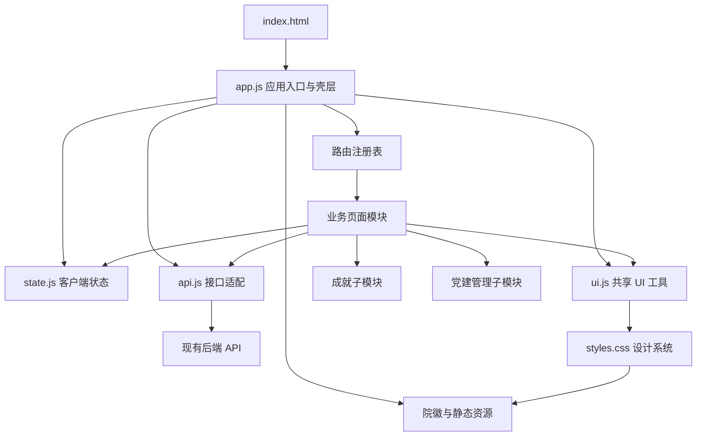
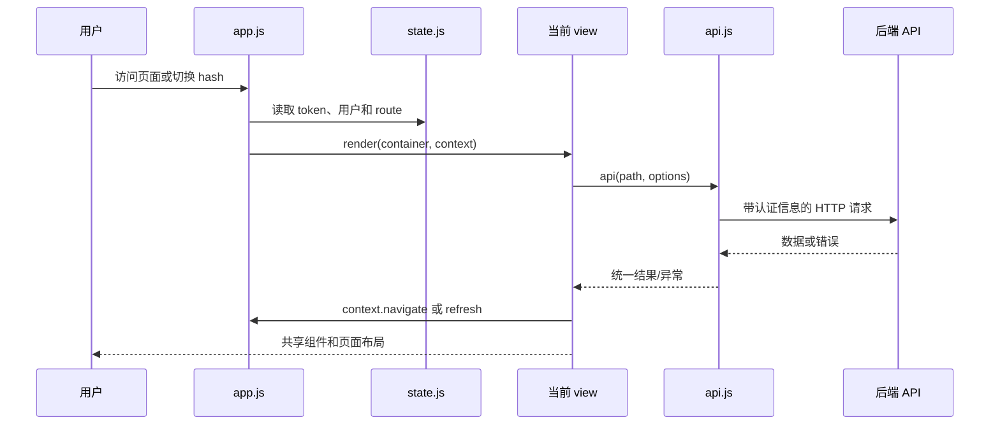

# 龙马·视界前端主题与布局优化概要设计

> 设计状态：依据 `frontend_proposal.md` 编制
> 编写日期：2026-08-07
> 适用范围：`BD/LM_SJ/frontend`
> 设计性质：前端视觉与布局改造，不改变业务接口、数据模型、权限和业务结果

## 1. 设计依据与约束

### 1.1 输入文档

- 需求文档：`frontend_proposal.md`
- 当前入口：`frontend/index.html`
- 当前应用壳层：`frontend/js/app.js`
- 当前全局样式：`frontend/assets/styles.css`
- 当前静态挂载：后端将 `frontend/` 映射至 `/static`
- 品牌资源：`image/院徽.jpg`

### 1.2 已确定的设计边界

1. 全部页面和登录页统一改版。
2. 保留原生 HTML/CSS/ES Module 技术栈和现有路由信息架构。
3. 保留现有 API 调用、权限过滤、表单提交、文件操作、聊天会话和数据结构。
4. 允许调整 DOM 结构、CSS 类、事件绑定和移动端抽屉行为，以满足布局要求。
5. 桌面端保留固定侧栏 + 顶部栏 + 内容区；移动端使用侧栏抽屉。
6. 主品牌使用院徽和“龙马·视界”，班徽不参与主导航品牌锁定。

## 2. 总体架构

### 2.1 分层结构

| 层级 | 模块 | 主要职责 | 允许依赖 |
| --- | --- | --- | --- |
| 宿主层 | `index.html` | 提供挂载点、vendor 和入口脚本 | 静态资源 |
| 应用层 | `app.js` | 启动、鉴权分流、路由、应用壳层、全局导航事件 | `state`、`api`、`ui`、views |
| 状态层 | `state.js` | token、用户、当前路由、侧栏、未读数等客户端状态 | 浏览器存储、location.hash |
| 接口层 | `api.js` | HTTP 请求、鉴权头、错误转换、查询串、下载 | `fetch`、浏览器 API |
| 设计系统层 | `ui.js` + `styles.css` | 图标、页面标题、面板、状态、弹窗、toast、格式化和 token | DOM、CSS token |
| 页面编排层 | `views/*.js` | 各业务页面加载数据、渲染视图、注册页面事件、释放清理函数 | `api`、`ui`、必要时 `state` |
| 业务子模块层 | `achievement_*.js`、`admin_party.js` | 成果表单/列表/时间线/上传，党建管理后台子视图 | `api`、`ui`、`state` |
| 资源层 | `frontend/assets/*` | 院徽、favicon、样式、第三方静态库 | 无业务依赖 |

依赖方向必须保持“上层编排下层能力”：页面模块不能直接修改全局 CSS token 或绕过 `api.js` 发请求；`ui.js` 不依赖任何业务页面。

### 2.2 模块关系图



### 2.3 页面生命周期

1. `index.html` 创建 `#app`、`#toast-region` 和 `#modal-root`。
2. `app.js` 启动 `bootstrap()`，从 `state.js` 判断 token 和用户缓存。
3. 未认证时渲染登录模块；已认证时调用 `/api/v1/users/me` 校验用户并进入当前路由。
4. `renderShell()` 生成侧栏、顶部栏和 `#view-root`，按角色过滤路由。
5. 当前 view 的 `render(container, context)` 加载数据并返回可选 cleanup 函数。
6. hash 变化或导航点击触发 `renderShell()`；旧 view cleanup 先执行，再挂载新 view。
7. 页面操作通过 `api.js` 更新后端，再由 view 局部重绘或请求 `refresh()` 重绘壳层。

## 3. 模块划分与概要设计

### 3.1 宿主与资源模块

#### `index.html`

- 保留语义化 HTML5 文档、中文语言声明和 viewport。
- favicon 改为院徽静态资源，`theme-color` 改为 `--brand-900` 对应色值。
- 保留 `marked.min.js` 和 `dompurify.min.js` 的现有加载顺序。
- 保留 `#app`、`#toast-region`、`#modal-root` 三个挂载点，不能让页面 view 直接替换这三个节点。

#### `frontend/assets/院徽.jpg`

- 由 `image/院徽.jpg` 提供来源，目标是通过 `/static/assets/院徽.jpg` 访问。
- 登录页、侧栏和 favicon 使用同一资源；显示时 `object-fit: contain`，不改变原图比例。
- 图片加载失败时显示带品牌色底的文本占位，不影响导航和登录表单使用。

### 3.2 应用入口与壳层模块（`app.js`）

`app.js` 是唯一的应用编排入口，职责拆分如下：

| 子职责 | 设计 |
| --- | --- |
| 启动 | 调用 `bootstrap()`，处理 token 缺失、失效和首次改密状态 |
| 路由 | 维护 `ROUTES` 注册表，保持现有 key 和角色过滤规则 |
| 登录页 | `renderLogin()` 只负责品牌区、表单 DOM 和登录事件；业务请求仍走 `api.js` |
| 应用壳层 | `renderShell()` 负责侧栏、顶部栏、遮罩、用户信息、退出和 view 容器 |
| 导航 | 统一绑定 `[data-route]`；导航后关闭移动端抽屉 |
| 未读数 | 通过现有通知接口更新顶部按钮和侧栏 badge |
| 清理 | 在切换 view 前调用 `currentCleanup`，避免重复事件监听和计时器 |

本次改造不得把业务数据请求集中塞进 `app.js`。工作台统计、聊天数据和管理数据仍由各自 view 负责。

### 3.3 客户端状态模块（`state.js`）

状态按作用域划分：

```text
认证状态：accessToken、user
导航状态：route、sidebarOpen
全局提示状态：unreadCount
页面临时状态：由各 view 闭包或局部变量维护，不写入全局 state
```

接口约束：

- `setAuth`、`clearAuth`、`setCurrentUser` 只改变认证相关状态和持久化值。
- `navigate(route)` 只更新 hash 和路由状态，不直接渲染页面。
- 移动端菜单开关由 `app.js` 控制，view 不直接操作侧栏 DOM。
- 新增 token 或断点配置放在 CSS，不放入运行时 state。

### 3.4 接口适配模块（`api.js`）

`api.js` 是所有 view 的 HTTP 边界：

- 统一拼接 API 基础路径、认证头和 JSON/multipart 请求。
- 统一将非 2xx 响应转换为可供 `toast` 或字段错误展示的错误对象。
- `qs()` 负责查询参数编码，避免各页面自行拼接字符串。
- `download()` 负责受权限保护的文件下载和文件名处理。
- 视觉改版不新增业务 API；若需要页面布局数据，使用当前接口响应，不改变响应字段。

### 3.5 共享设计系统模块（`ui.js` + `styles.css`）

#### `ui.js` 组件职责

| 能力 | 用途 |
| --- | --- |
| `icon()` | 统一线性图标和尺寸，图标按钮必须搭配 aria-label/title |
| `pageHeader()` | 页面标题、说明和操作区统一结构 |
| `showModal()` | 表单、详情、确认等弹窗，负责提交态、关闭和错误显示 |
| `toast()` | 成功/错误/信息提示，挂载到 `#toast-region` |
| `loadingState()` | 首次加载和局部加载状态 |
| `emptyState()` | 空数据、无权限和无结果状态 |
| `statusBadge()` | 状态语义到颜色 token 的映射 |
| 格式化函数 | 日期、文件大小、文本转义等展示辅助 |

#### `styles.css` 结构

样式按以下顺序组织，避免业务选择器覆盖 token：

1. `:root` 颜色、字号、间距、层级和断点变量。
2. reset、基础元素、焦点和可访问性样式。
3. 品牌与登录页样式。
4. 应用壳层：sidebar、topbar、main-content、scrim。
5. 共享组件：button、input、panel、table、badge、modal、toast、state。
6. 页面布局工具：page-header、toolbar、stats-grid、content-grid、list-row。
7. 业务特有样式：chat、party、admin、achievement 等命名空间。
8. 响应式覆盖：`>=1200`、`861-1199`、`601-860`、`<=600`。

推荐新增或保留的核心 token：

```css
--sidebar-width: 240px;
--header-height: 64px;
--content-max-width: 1480px;
--space-1: 4px;
--space-2: 8px;
--space-3: 12px;
--space-4: 16px;
--space-5: 24px;
--space-6: 32px;
--radius-sm: 6px;
--radius-md: 8px;
--shadow-float: 0 16px 40px rgba(20, 35, 63, 0.16);
```

### 3.6 业务页面模块

每个页面模块实现相同接口：

```js
export async function render(container, context) {
  // load data -> render loading/data/error -> bind events
  return () => { /* remove timers/listeners if any */ };
}
```

| 页面模块 | 主要数据职责 | 主要 UI 结构 | 依赖 |
| --- | --- | --- | --- |
| `overview.js` | 今日课程、作业、计划、通知、推荐、成果统计、管理员统计 | 页面头部、统计卡、主列表、快捷入口、党建/通知辅助区 | `api`、`ui`、`context.navigate` |
| `chat.js` | 会话、消息、附件、模型/skill 选择 | 会话侧栏、聊天头、消息区、输入区、移动端会话抽屉 | `api`、`ui`、`state` |
| `knowledge.js` | 个人/班级文件夹、文件列表、预览、下载 | 作用域切换、面包屑、工具栏、文件表格、预览弹窗 | `api`、`ui` |
| `courses.js` | 课程、课表、作业、提交和附件 | 筛选工具栏、课程/作业列表、详情和提交弹窗 | `api`、`ui` |
| `community.js` | 成果列表、统计、分类、时间线和推荐 | 统计区、筛选区、成果列表/时间线、上传/编辑弹窗 | `api`、`ui`、成就子模块 |
| `mentorship.js` | 教师、研究方向、申请和个人计划 | 教师列表、计划时间线、匹配和状态操作 | `api`、`ui` |
| `party.js` | 党建活动、政治面貌、学习资料、报名签到 | 状态面板、活动筛选、活动列表、资料区、详情弹窗 | `api`、`ui` |
| `notifications.js` | 通知列表、已读状态、未读计数 | 过滤器、按时间分组列表、全部已读 | `api`、`ui` |
| `profile.js` | 用户资料、登录设备、密码、政治面貌/校友申请 | 资料面板、安全面板、设备列表、编辑弹窗 | `api`、`ui`、`state` |
| `admin.js` | 用户、配置、技能、统计、党建管理入口 | tabs、筛选器、表格、统计卡、确认弹窗 | `api`、`ui`、`admin_party` |

### 3.7 成果子模块

| 文件 | 职责 |
| --- | --- |
| `achievement_templates.js` | 成果类别、等级、字段模板及展示元数据 |
| `achievement_list.js` | 成果列表行/卡片和筛选结果展示 |
| `achievement_timeline.js` | 时间线聚合和年度分组展示 |
| `achievement_form.js` | 新建/编辑成果表单的字段结构与校验展示 |
| `achievement_upload.js` | 成果证明材料上传控件和上传状态 |

这些模块由 `community.js` 编排，不能自行创建全局导航、弹窗根节点或修改后端接口协议。主题改造主要通过共享 `.panel`、`.badge`、`.toolbar`、`.button` 和新建成果命名空间样式完成。

### 3.8 党建管理子模块（`admin_party.js`）

`admin_party.js` 作为管理后台的独立业务子视图，负责党员档案、政治面貌审核、名册、学习资料、活动和统计。它复用：

- `api.js` 的查询、写入和下载能力；
- `ui.js` 的表格、状态、确认、弹窗、toast 和格式化能力；
- `styles.css` 的管理表格、统计卡和筛选工具栏。

它不负责管理员权限判断，权限仍由 `app.js` 路由过滤和后端接口共同保证。

## 4. 模块间关系与数据流

### 4.1 依赖规则

```text
index.html
  -> app.js
       -> state.js
       -> api.js
       -> ui.js
       -> views/*.js
             -> api.js
             -> ui.js
             -> state.js（仅需要共享用户/会话状态的页面）
                   -> achievement_* / admin_party 子模块
```

禁止关系：

- view 之间互相 import 并共享可变业务变量。
- view 直接调用 `fetch`、直接读写 token 或绕过 `api.js`。
- 业务模块直接改写 `document.body`、`#app`、侧栏或顶部栏。
- `ui.js` 反向依赖某个具体 view。

### 4.2 典型数据流



### 4.3 登录与认证流

1. `bootstrap()` 发现没有 token 时调用 `renderLogin()`。
2. 登录表单通过 `api('/api/v1/auth/login')` 提交。
3. `setAuth(result)` 写入 token 和初始用户信息。
4. 非首次改密用户请求 `/api/v1/users/me`，再导航到 `overview`。
5. 首次改密用户先渲染壳层并打开现有改密弹窗；成功后重新获取用户并进入工作台。
6. API 认证失败时清理认证状态并回到登录页；登录页显示 toast，不泄漏接口详情。

### 4.4 导航与移动抽屉流

1. `app.js` 根据 `state.user.role` 过滤 `ROUTES`。
2. 桌面端点击导航仅更新 hash；移动端同时将 `sidebarOpen` 置为 false。
3. 菜单按钮将侧栏和 scrim 添加 `open` 类，并锁定 body 滚动。
4. scrim、Esc 或导航点击关闭抽屉，焦点返回菜单按钮。
5. `hashchange` 触发旧 view cleanup 和新 view render，侧栏状态不污染业务页面。

### 4.5 工作台聚合流

`overview.js` 并行请求当前已有的课程、作业、计划、通知、推荐、成果统计和（管理员）系统统计接口，统一进入 loading/data/error 三态布局。请求失败的非关键区块使用局部错误提示，不阻塞其他已成功区块；不得为了视觉排序新增后端聚合接口。

## 5. 布局与组件组合设计

### 5.1 应用壳层 DOM 组合

```text
#app
└── .app-shell
    ├── aside.sidebar
    │   ├── .sidebar-brand
    │   ├── nav.sidebar-nav
    │   └── .sidebar-footer
    ├── button.sidebar-scrim
    ├── header.topbar
    └── main.main-content
        └── #view-root.view-root
```

桌面端 `sidebar` 固定定位，`topbar` 的 left 与侧栏宽度一致；移动端两者均适配视口，`.sidebar-scrim` 负责遮罩和关闭交互。

### 5.2 页面通用组合

```text
.view-root
├── .page-header
│   ├── 标题/说明
│   └── .page-actions
├── .toolbar（可选）
├── .stats-grid（可选）
└── .content-grid / .panel / .list-row / .data-table
```

页面模块只负责选择组合和填充数据，间距、颜色、焦点、响应式行为由设计系统统一提供。

### 5.3 工作台组合

```text
overview
├── page-header（欢迎语 + 主操作）
├── stats-grid（成果/课程作业/计划/通知）
├── content-grid
│   ├── primary-column
│   │   ├── 成果统计或近期成果
│   │   ├── 今日安排
│   │   └── 待办
│   └── secondary-column
│       ├── 快捷入口
│       ├── AI 对话入口
│       ├── 党建动态
│       └── 通知
```

具体数据仍以现有接口返回为准；没有数据时使用共享空状态，不显示占位数字。

## 6. 视觉系统实现方案

### 6.1 Token 到组件的映射

| 组件 | 背景 | 文字 | 边框/状态 |
| --- | --- | --- | --- |
| 侧栏/品牌区 | `--brand-900` 或 `--brand-800` | 白色、`--surface-strong` | 半透明分隔线 |
| 主按钮 | `--brand-700` | 白色 | hover 使用 `--brand-800` |
| 次按钮 | `--surface` | `--brand-700` | `--line-strong` |
| 当前导航 | `--brand-050` | `--brand-700` | 无跳动阴影 |
| 普通面板 | `--surface` | `--text` | `--line` |
| 信息提示 | `--brand-100` | `--brand-700` | `--brand-500` |
| 成功/警告/危险 | 语义浅色背景 | 语义深色文字 | 共享 badge 规则 |

### 6.2 断点与布局策略

| 断点 | 壳层 | 内容网格 | 重点变化 |
| --- | --- | --- | --- |
| `>=1200px` | 固定侧栏 + 顶栏 | 4 列统计、主辅两列 | 展示完整日期和操作文字 |
| `861-1199px` | 固定侧栏 + 顶栏 | 2 列统计、必要时单列 | 缩小内容间距，保留表格容器滚动 |
| `601-860px` | 抽屉侧栏 + 顶栏 | 单列优先 | 菜单按钮、聊天会话抽屉、工具栏换行 |
| `<=600px` | 抽屉侧栏 + 紧凑顶栏 | 1-2 列统计 | 隐藏日期等次要信息，弹窗可全屏 |

### 6.3 交互状态

所有共享组件至少定义 default、hover、focus-visible、active、disabled、loading、error 七种状态。状态变化只改变颜色、边框、透明度或轻量位移，不得引起布局跳动。

## 7. 文件级实施映射

| 文件 | 主要改动 | 不得改变 |
| --- | --- | --- |
| `frontend/index.html` | favicon、theme-color、资源引用校验 | vendor 加载顺序、挂载点 |
| `frontend/assets/styles.css` | token、壳层、组件、页面布局和断点 | 现有业务类的语义，除非为兼容新增别名 |
| `frontend/js/app.js` | 院徽路径、品牌文案、登录 DOM、壳层 DOM、抽屉焦点/滚动行为 | ROUTES key、角色过滤、API 流程、退出逻辑 |
| `frontend/js/state.js` | 必要时补充抽屉状态辅助函数 | token、用户和 hash 语义 |
| `frontend/js/api.js` | 仅在资源/错误展示适配确有需要时调整 | 请求协议、认证头和下载语义 |
| `frontend/js/ui.js` | 统一组件结构、aria、状态类和视觉 hooks | 现有调用签名，除非提供兼容参数 |
| `frontend/js/views/*.js` | 页面容器、标题、工具栏、面板组合和局部状态展示 | 业务接口、权限入口和数据字段 |
| `frontend/js/achievement_*.js` | 成果区域的组件类和响应式布局 | 模板、字段校验和上传协议 |
| `frontend/js/admin_party.js` | 管理党建表格、筛选器、统计卡和弹窗布局 | 管理 API、状态流转和权限 |
| `frontend/assets/院徽.jpg` | 新增或同步品牌资源 | 原始 `image/院徽.jpg` 文件 |

## 8. 非功能设计

### 8.1 兼容性

- 目标浏览器：常见版本 Edge、Chrome、360 浏览器。
- 使用 CSS Grid、Flex、`dvh` 等能力时提供合理 fallback；避免仅 Chromium 独有的非标准 API。
- 本地静态资源必须可加载，不能依赖外网字体或图片服务。

### 8.2 可访问性

- 交互控件使用真实 `button`、`input`、`select` 和 `label`。
- 图标按钮提供 `aria-label`，装饰图标使用空 alt 或 `aria-hidden`。
- 键盘可访问侧栏、弹窗、筛选器和提交按钮；`focus-visible` 样式清晰。
- 颜色不是唯一状态通道，状态同时提供文字或图标。

### 8.3 性能与稳定性

- 改版不额外引入大体积运行时；图片使用现有院徽，控制展示尺寸。
- 页面首次渲染先显示 loading 骨架/状态面板，再填充接口数据。
- view 切换执行 cleanup，避免重复监听、定时器泄漏和聊天滚动异常。
- 失败区块局部降级，不因一项非关键请求失败而清空整页。

## 9. 验证设计

### 9.1 静态检查

- 检查所有品牌引用均指向院徽，删除或不再使用绿色 `brand-mark.svg` 作为主品牌。
- 检查 CSS token 是否覆盖背景、文字、边框、按钮、状态和 focus。
- 检查所有页面是否使用共享 `pageHeader`、`panel`、`button`、`badge` 和状态组件。
- 检查新增中文文件为 UTF-8，浏览器控制台无模块加载错误。

### 9.2 交互冒烟

| 场景 | 验证点 |
| --- | --- |
| 登录 | 登录、错误、密码显示/隐藏、首次改密、退出 |
| 导航 | 各角色路由可见性、hash 切换、刷新后当前路由 |
| 移动端 | 打开/关闭抽屉、scrim、Esc、焦点返回、背景滚动锁定 |
| 工作台 | 统计、快捷入口、党建动态、AI 入口、待办和通知加载/空态 |
| AI 对话 | 会话切换、消息滚动、发送中、失败、附件和移动抽屉 |
| 文件/作业 | 筛选、上传、预览、下载、提交和权限错误 |
| 成果/党建 | 列表、表单、状态 badge、确认弹窗、材料操作 |
| 管理 | tabs、筛选、表格滚动、统计和危险操作确认 |

### 9.3 视口矩阵

至少在 320px、375px、768px、1024px、1440px 下检查登录页、工作台、AI 对话和一个表格页。验收页面级横向滚动、文字溢出、按钮可点击性、弹窗边界和图片清晰度。

## 10. 风险与回滚策略

| 风险 | 预防 | 回滚 |
| --- | --- | --- |
| 新样式覆盖业务特有样式 | 采用 token + 命名空间，分层组织 CSS | 保留旧类名和局部覆盖，按页面回退 |
| 院徽静态路径错误 | 先验证 `/static/assets/院徽.jpg` 的 200 响应和缓存路径 | 回退到等效静态路径，不改业务逻辑 |
| 移动抽屉导致滚动/焦点问题 | 使用 open 状态集中控制并测试 Esc、scrim、键盘 | 关闭 body 锁定，保留原有抽屉开关 |
| 视图切换重复监听 | 统一执行 view cleanup | 回退到页面级重绘并清理旧节点 |
| 乱码文案扩大范围 | 只修复本次触及的品牌和导航文案 | 保留原接口字段和业务内容 |
| 视觉改动影响表格/弹窗尺寸 | 按代表视口做截图与冒烟测试 | 按组件粒度恢复旧布局规则 |

## 11. 设计完成判定

概要设计完成的判断标准：

- [ ] 所有页面已归入明确的页面模块或共享模块。
- [ ] 模块职责、依赖方向和禁止关系已明确。
- [ ] 登录、壳层、工作台、聊天、列表/表格、弹窗和移动抽屉的组合关系已明确。
- [ ] CSS token、断点、资源路径和文件级实施落点已明确。
- [ ] 现有接口、权限、业务数据和回滚边界已明确声明不变。
- [ ] 具有可执行的静态检查、交互冒烟和视口验收方案。

