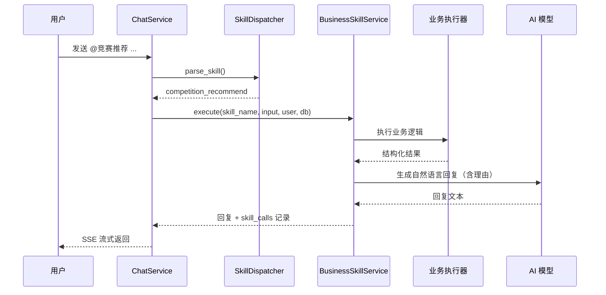
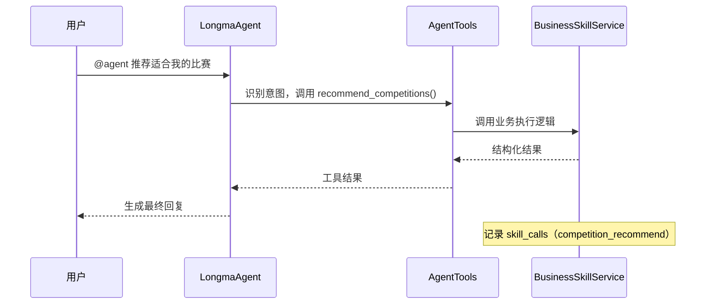
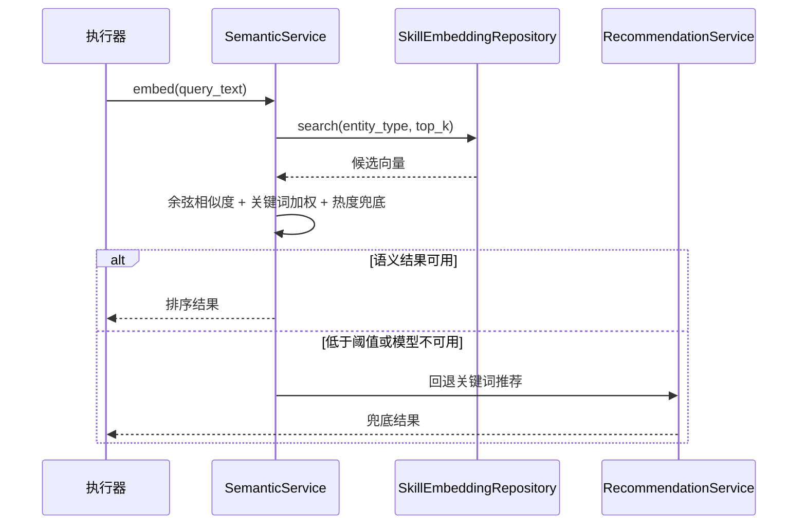
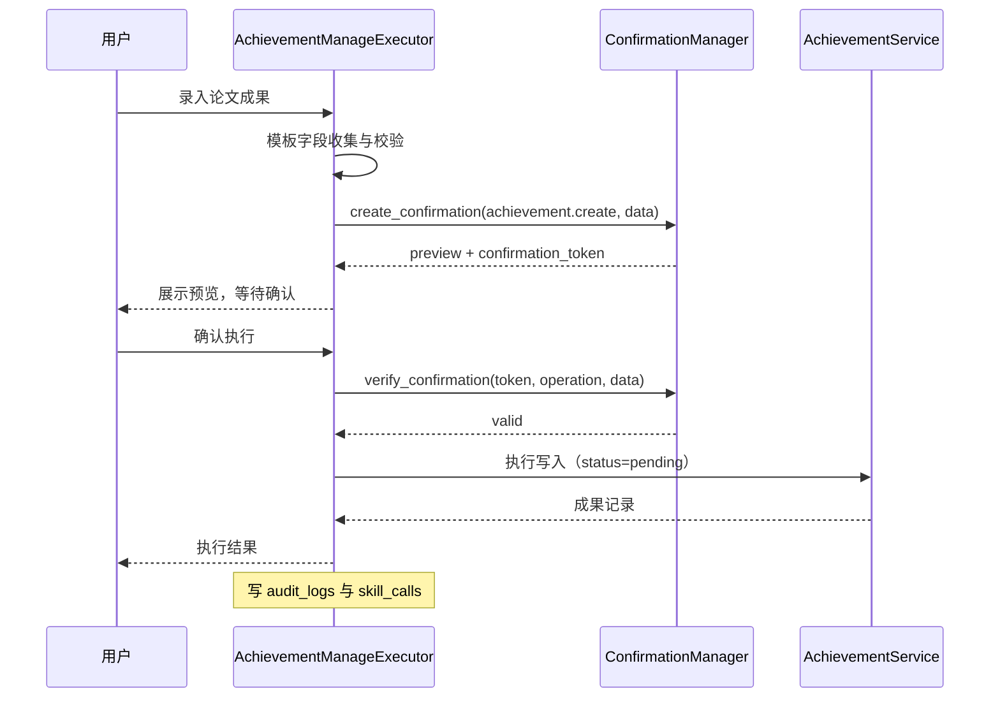
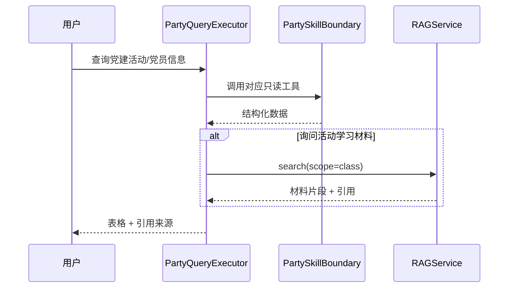

# AI Agent 业务 Skills 概要设计

> 文档版本：v0.1
> 编写日期：2026-08-05
> 输入文档：[AI Agent 业务 Skills 需求文档](./skills_proposal.md)
> 适用范围：AI Agent 业务 Skills（竞赛推荐、导师匹配、党建查询、成果管理）
> 技术基线：FastAPI + SQLAlchemy + SQLite/PostgreSQL + sentence-transformers + 原生 JS 前端，沿用现有 model/schema/repository/service/route 分层与 Agent/Skill 调度机制

---

## 1. 设计目的与范围

本文档基于 `skills_proposal.md` 生成概要设计，用于指导 4 个 AI Agent 业务 Skill 的模块拆分、模块职责、模块关系、数据模型、接口、关键流程、前端组件和实施顺序。

本次设计覆盖：

1. Skill 注册与调度：4 个业务 Skill 的种子、触发词、Prompt 构建器、双通道接入。
2. 业务 Skill 执行层：`@触发词` 与 `@agent` 统一执行入口、结果格式化、调用记录。
3. 语义向量服务：embedding 模型、`skill_embeddings` 存储、余弦匹配、关键词加权、回退策略。
4. 竞赛推荐 Skill：画像 + 比赛库语义推荐并解释理由。
5. 导师匹配 Skill：对话项目描述语义匹配教师方向。
6. 党建查询 Skill：复用已实现党建模块与 `PartySkillBoundary`，只读查询。
7. 成果管理 Skill：本人 8 类成果查询/新增/修改/删除，写操作任务确认。
8. 前端与兼容迁移：对话 Skill chips、确认卡片、管理端启停、Alembic 迁移。

本次设计不覆盖：

- 党建模块本身的扩展、创新项目空间、Workflow 调度器。
- Agent 记忆持久化、RAG 通用向量化、OCR、MCP 生产化。
- 竞赛结构化字段、成果导出、Skill 配置编辑等 P1/P2 内容。
- 导师匹配后的“一键发起交流申请”（本期不实现，仅保留接口边界）。

---

## 2. 设计决策记录

需求文档第 13 章待确认事项已按确认结论落定如下：

| 序号 | 待确认事项 | 最终设计决策 |
| --- | --- | --- |
| 1 | embedding 模型选型 | 默认 `BAAI/bge-small-zh-v1.5`（512 维），支持通过 `EMBEDDING_MODEL_NAME` 配置模型名或本地模型路径 |
| 2 | 竞赛结构化字段 | 本期不做，语义匹配使用 `title/content/tags/source`；结构化字段归 P1 竞赛信息迭代 |
| 3 | 成果证明材料 | AI 写操作在证明材料缺失时不落库，回复中提示用户先上传或到“我的成果”页补充；本期不新增草稿状态 |
| 4 | 修改后审核状态 | 修改本人成果后统一重置为 `pending`，重新进入审核流程 |
| 5 | 一键发起交流申请 | 本期不做，导师匹配只返回教师与匹配方向 |
| 6 | 向量存储格式 | `skill_embeddings.embedding_json` 存 JSON 数组，兼容 SQLite/PostgreSQL；pgvector 后续生产优化 |
| 7 | Skill 配置编辑 | 本期仅启停，不改触发词/说明/模型配置；编辑能力归 P2 |

补充设计决策：

- 业务 Skill 采用“Prompt + 执行器”双通道：`@触发词` 由 `ChatService` 分流到业务 Skill 执行层；`@agent` 通过 `AgentTools` 新增业务工具调用同一套执行逻辑。
- 新增公共接口 `GET /api/v1/skills`（登录用户可访问），供前端动态加载 Skill chips；管理端仍使用 `/api/v1/admin/skills`。
- 语义向量只对业务实体持久化：`competition`、`teacher_direction`、`teacher_profile`；用户画像向量按请求即时生成，不批量入库。
- 向量刷新采用仓储层同步钩子：资源审核通过/更新/软删除、教师方向新增/更新/软删除、教师资料更新时更新对应 embedding。
- 语义服务不可用时回退到 `RecommendationService` 关键词打分，接口不报错。
- 业务 Skill 在 `@agent` 路径产生的调用也记录到 `skill_calls`，`skill_name` 记录具体业务 Skill 名，便于统计。
- 成果写操作确认令牌：POST/PUT 使用请求体 `confirmation_token`，DELETE 使用查询参数 `confirmation_token`（或等价请求头），统一由 `ConfirmationManager.verify_confirmation` 校验。
- 触发优先级：`@agent` 前缀优先进入 Agent 模式；其他消息按 Skill 触发词匹配；同时命中多个触发词时取注册顺序第一个。
- 党建查询 Skill 不新增 HTTP 业务路由，执行层直接调用 `PartySkillBoundary` 的 5 个只读工具；活动学习材料检索复用 `RAGService`（scope=class），涉敏发展材料始终排除。

---

## 3. 模块划分

### 3.1 模块清单

| 编号 | 模块 | 职责摘要 |
| --- | --- | --- |
| M1 | Skill 注册与调度（Skill Registry & Dispatcher） | 4 个业务 Skill 种子、触发词、Prompt 构建器、调度优先级、权限检查接入 |
| M2 | 业务 Skill 执行层（Business Skill Executor） | 意图解析、执行编排、结果格式化、`skill_calls` 记录、双通道统一入口 |
| M3 | 语义向量服务（Semantic Vector Service） | embedding 生成、`skill_embeddings` 持久化、余弦匹配、关键词加权、回退 |
| M4 | 竞赛推荐 Skill（Competition Recommend） | 画像组装、比赛召回、排序、推荐理由生成 |
| M5 | 导师匹配 Skill（Mentor Match） | 项目描述向量化、教师方向匹配、推荐理由生成 |
| M6 | 党建查询 Skill（Party Query） | 包装 `PartySkillBoundary`、活动材料 RAG、权限隔离 |
| M7 | 成果管理 Skill（Achievement Manage） | 本人成果查询/新增/修改/删除、模板校验、任务确认、审计 |
| M8 | 前端与兼容迁移（Frontend & Compatibility） | 动态 Skill chips、确认卡片、管理端展示、Alembic 迁移、文档更新 |

### 3.2 模块关系图

```mermaid
flowchart LR
    subgraph FE["前端"]
        CHAT["chat.js 对话页"] -->|@触发词 / @agent| API
        ADM["admin.js Skill 管理"] -->|启停| ADMIN_API["/admin/skills"]
    end

    subgraph BE["后端"]
        API["ChatService / chat 路由"]
        DISP["M1 Skill 注册与调度"]
        EXEC["M2 业务 Skill 执行层"]
        SEM["M3 语义向量服务"]
        REC["M4 竞赛推荐 Skill"]
        MEN["M5 导师匹配 Skill"]
        PAR["M6 党建查询 Skill"]
        ACH["M7 成果管理 Skill"]
        REPO["Repositories"]
        CONF["ConfirmationManager"]
        PARTY["PartySkillBoundary"]
        ACHSV["AchievementService"]
    end

    CHAT --> API
    API --> DISP
    DISP --> EXEC
    EXEC --> REC
    EXEC --> MEN
    EXEC --> PAR
    EXEC --> ACH
    REC --> SEM
    MEN --> SEM
    SEM --> REPO
    REC --> REPO
    MEN --> REPO
    PAR --> PARTY
    PARTY --> REPO
    ACH --> ACHSV
    ACH --> CONF
    ACHSV --> REPO
    EXEC --> CONF
    EXEC --> SKC["skill_calls / audit_logs"]
    REPO --> DB[("resources / teacher_directions / users / achievements / skill_embeddings")]
    ADM --> ADMIN_API
    ADMIN_API --> DISP
```

### 3.3 依赖关系

| 模块 | 依赖 | 被依赖 |
| --- | --- | --- |
| M1 Skill 注册与调度 | skills 表、ChatService、skill_dispatcher | M2、M8 |
| M2 业务 Skill 执行层 | M1、M3、M4、M5、M6、M7、ConfirmationManager、skill_calls | M8 |
| M3 语义向量服务 | sentence-transformers、skill_embeddings、RecommendationService（回退） | M4、M5 |
| M4 竞赛推荐 Skill | M3、resources 仓储 | M2 |
| M5 导师匹配 Skill | M3、teacher_directions/users 仓储 | M2 |
| M6 党建查询 Skill | PartySkillBoundary、RAGService、party 数据 | M2 |
| M7 成果管理 Skill | AchievementService、ConfirmationManager、模板校验、审计 | M2 |
| M8 前端与兼容迁移 | M1-M7、前端静态资源、Alembic | 全局约束 |

---

## 4. 模块职责与内部组成

### 4.1 M1 Skill 注册与调度

职责：

- 在 `SYSTEM_SKILLS` 注册 4 个业务 Skill（`category=business`），启动时写入 `skills` 表。
- 在 `SKILL_TRIGGERS` 增加数据库不可用时的兜底映射。
- 在 `SKILL_PROMPT_BUILDERS` 注册 4 个业务 Prompt 构建器。
- 调整调度优先级：`@agent` 前缀 > 业务 Skill 触发词 > 普通 Skill 触发词。
- 扩展 `_check_skill_permission`：业务 Skill 统一放行登录用户，具体业务权限由执行层校验。

内部组成：

- `backend/app/repositories/skill_repo.py`：`SYSTEM_SKILLS` 新增 4 条种子数据。
- `backend/app/ai/skill_dispatcher.py`：`SKILL_TRIGGERS` 兜底映射与解析优先级。
- `backend/app/ai/skills/__init__.py`：注册 `competition_recommend`、`mentor_match`、`party_query`、`achievement_manage` Prompt 构建器。
- `backend/app/ai/skills/competition_recommend.py`、`mentor_match.py`、`party_query.py`、`achievement_manage.py`：各 Skill 的 Prompt 模板。
- `backend/app/services/chat_service.py`：`send_message_stream` / `send_message_simple` 增加业务 Skill 分流分支。

### 4.2 M2 业务 Skill 执行层

职责：

- 统一接收 `(skill_name, user_input, user, db)`，执行意图解析与参数提取。
- 按 Skill 分派到 M4-M7 执行器。
- 将结构化结果交给 LLM 生成自然语言回复（推荐类必须含理由）。
- 记录 `skill_calls`；成果写操作额外写 `audit_logs`。
- 对 `@agent` 路径提供可复用服务方法，避免两套逻辑漂移。

内部组成：

- `backend/app/ai/business_skills/__init__.py`：`BUSINESS_SKILL_REGISTRY`（skill_name -> executor 类）。
- `backend/app/ai/business_skills/base.py`：`BusinessSkillExecutor` 抽象基类，定义 `execute() -> dict`。
- `backend/app/ai/business_skills/service.py`：`BusinessSkillService`，负责分流、LLM 生成、记录调用。
- `backend/app/ai/business_skills/competition_recommend.py`、`mentor_match.py`、`party_query.py`、`achievement_manage.py`。
- `backend/app/ai/agent_tools.py`：新增 `recommend_competitions`、`match_mentors`、党建查询工具、成果管理工具。
- `backend/app/ai/agent.py`：`_build_system_prompt` 与工具描述中补充业务 Skill 说明。

### 4.3 M3 语义向量服务

职责：

- 懒加载 embedding 模型（首次调用时初始化，支持 CPU）。
- 生成用户查询文本与业务实体文本的向量，归一化后计算余弦相似度。
- 按 `score = 0.7 × cosine + 0.2 × keyword_hit + 0.1 × popularity` 综合排序；低于 `SEMANTIC_MIN_SCORE` 的候选剔除。
- 业务数据变更时增量刷新 `skill_embeddings`。
- 模型不可用、向量缺失或全部低于阈值时调用 `RecommendationService` 回退。

内部组成：

- `backend/app/models/skill_embedding.py`：`SkillEmbedding` 模型。
- `backend/app/repositories/skill_embedding_repo.py`：`SkillEmbeddingRepository`（upsert、search、delete_by_entity、list_stale）。
- `backend/app/services/semantic_service.py`：`SemanticService`（embed、search、score、fallback）。
- 刷新钩子：
  - 资源：`ResourceRepository.update_status`（approved）、`update`、`soft_delete` 后同步刷新 `competition` 向量。
  - 教师方向：`TeacherRepository.create_direction`、`update_direction`、`soft_delete_direction` 后刷新。
  - 教师资料：`UserRepository.set_profile` 且 `role=teacher` 时刷新 `teacher_profile` 向量。
- 配置项见第 5.4 节。

### 4.4 M4 竞赛推荐 Skill

职责：

- 组装用户文本：`profile_json`（`major/research/skills/field/directions/grade`）+ 对话补充描述。
- 从 `resources` 表取 `type=competition`、`status=approved`、未删除、未截止的比赛。
- 调用 M3 语义匹配，输出 Top N 比赛及理由。
- 无画像关键词或语义不可用时回退热度推荐。

内部组成：

- `backend/app/ai/business_skills/competition_recommend.py`：`CompetitionRecommendExecutor`。
- `backend/app/services/recommendation_service.py`：保留现有关键词逻辑作为回退。
- 输入参数：`query`、`tags`、`source`、`limit`（默认 5，上限 10）。
- 输出字段：`id/title/tags/source/deadline/view_count/like_count/reason/score`。

### 4.5 M5 导师匹配 Skill

职责：

- 校验项目描述长度（建议最少 20 字），不足时返回引导文案。
- 对 `teacher_directions`（标题+描述+标签）与教师 `profile_json`（`research/skills/directions/field`）做向量匹配。
- 每个教师取最优研究方向作为推荐依据，输出理由。

内部组成：

- `backend/app/ai/business_skills/mentor_match.py`：`MentorMatchExecutor`。
- 输入参数：`project_description`、`tag`、`teacher_name`、`limit`。
- 输出字段：教师 `id/name`、方向 `id/title/description/tags`、`score/reason`。
- 不调用交流申请接口；后续增强时通过现有 `POST /api/v1/applications` 与确认机制接入。

### 4.6 M6 党建查询 Skill

职责：

- 直接包装 `PartySkillBoundary` 的 5 个只读工具：`list_party_members`、`get_party_member`、`list_party_activities`、`get_party_activity`、`get_party_my_records`。
- 用户询问活动学习材料内容时，调用 `RAGService.search`（`scope=class`）并附带引用来源。
- 不提供任何写工具；涉敏发展材料不进入检索。

内部组成：

- `backend/app/ai/business_skills/party_query.py`：`PartyQueryExecutor`。
- 复用 `backend/app/services/party_skill_boundary.py`，不新增业务路由。
- 权限沿用现有 `require_admin`、`require_party_member`、活动可见性逻辑。

### 4.7 M7 成果管理 Skill

职责：

- 查询本人成果：按分类/状态/年份/关键词，复用 `AchievementRepository.list_by_user`。
- 查询公开成果：仅 `approved` 且 `is_public=true`。
- 查询模板说明：复用 `achievement_service` 的 8 类模板定义。
- 新增/修改/删除本人成果，写操作全部走任务确认。
- 新增默认 `pending`；修改后重置 `pending`；删除为软删除。
- 证明材料缺失时提示用户上传，不落库。

内部组成：

- `backend/app/ai/agent_tools.py` 新增：
  - `list_my_achievements`、`get_my_achievement`、`get_achievement_templates`
  - `create_achievement`、`update_achievement`、`delete_achievement`
- `backend/app/ai/business_skills/achievement_manage.py`：`AchievementManageExecutor`。
- `backend/app/core/confirmation.py`：新增 `require_confirmation_token(operation, token, data, user_id)` 辅助函数，内部调用 `ConfirmationManager.verify_confirmation`。
- `backend/app/api/routes/achievements.py`：POST/PUT 支持 body `confirmation_token`，DELETE 支持 query `confirmation_token`。
- `backend/app/services/achievement_service.py`：修改后重置状态的逻辑复用 `AchievementRepository.update_status(..., "pending")`。

### 4.8 M8 前端与兼容迁移

职责：

- 对话页 Skill chips 从 `GET /api/v1/skills` 动态加载，保留 `@agent` 入口。
- 对话中展示业务 Skill 结果表格与推荐理由。
- 成果确认环节展示预览卡片（操作类型、字段摘要、影响说明），提供确认/取消。
- 管理端 Skill 列表自动展示 4 个业务 Skill，可启停。
- 新增 `skill_embeddings` 迁移，更新 README 与任务文档。

内部组成：

- `frontend/js/views/chat.js`：`SKILLS` 常量改为动态加载。
- `frontend/js/ui.js`：新增确认卡片渲染与事件绑定。
- `frontend/js/views/admin.js`：Skill 表格展示 `category=business`（现有启停逻辑复用）。
- `alembic/versions/j1234f5a6b7c_add_skill_embeddings.py`：新增表迁移。
- `README.md`、`backend-task-list.md`、`doc/tasks/*`：记录新增模块与依赖。

---

## 5. 数据模型设计

### 5.1 新增 `skill_embeddings` 表

| 字段 | 类型 | 说明 |
| --- | --- | --- |
| `id` | int PK | 主键 |
| `entity_type` | str(40) | `competition` / `teacher_direction` / `teacher_profile` |
| `entity_id` | int | 业务实体 ID |
| `source_text` | text | 生成向量所用文本，便于排查与重建 |
| `embedding_json` | text | 向量数组 JSON（SQLite/PG 通用；后续可迁移 pgvector） |
| `version` | int | 向量版本，模型或文本变化时递增 |
| `created_at` | datetime | 创建时间 |
| `updated_at` | datetime | 更新时间 |

索引：

- 唯一索引 `(entity_type, entity_id)`。
- 索引 `(entity_type, updated_at)`，支持增量刷新。
- 不存放敏感文本；党建发展材料不生成向量。

### 5.2 现有模型调整

- `AchievementCreate` / `AchievementUpdate`：新增可选 `confirmation_token: str | None`。
- 成果删除接口：新增可选 `confirmation_token` 查询参数（或等价请求头）。
- `skills` 表：不改结构，通过种子数据新增 4 个业务 Skill。
- `users.profile_json`：保持现有字段，本期不新增画像字段。

### 5.3 业务 Skill 种子数据

| name | display_name | category | triggers |
| --- | --- | --- | --- |
| `competition_recommend` | 竞赛推荐 | business | `@竞赛推荐`、`@比赛推荐`、`@推荐比赛`、`@competition` |
| `mentor_match` | 导师匹配 | business | `@导师匹配`、`@找导师`、`@匹配导师`、`@mentor` |
| `party_query` | 党建查询 | business | `@党建查询`、`@党建`、`@党员查询`、`@party` |
| `achievement_manage` | 成果管理 | business | `@成果管理`、`@我的成果`、`@成果录入`、`@achievement` |

### 5.4 新增配置项

| 配置 | 推荐值 | 说明 |
| --- | --- | --- |
| `EMBEDDING_MODEL_NAME` | `BAAI/bge-small-zh-v1.5` | embedding 模型名或本地模型路径 |
| `EMBEDDING_DEVICE` | `cpu` | 模型运行设备 |
| `EMBEDDING_DIM` | 512 | 与模型输出维度一致 |
| `SKILL_RECOMMEND_LIMIT` | 5 | 默认推荐数量 |
| `SEMANTIC_MIN_SCORE` | 0.35 | 语义候选最低得分 |
| `EMBEDDING_BATCH_SIZE` | 32 | 批量生成向量的大小 |

### 5.5 Alembic 迁移

- 新增迁移 `j1234f5a6b7c_add_skill_embeddings.py`，创建 `skill_embeddings` 表与索引。
- `main.py` 模型导入区补充 `SkillEmbedding`，确保 `create_all` 与迁移一致。

---

## 6. 接口设计（概要）

### 6.1 新增接口

| 方法 | 路径 | 权限 | 说明 |
| --- | --- | --- | --- |
| GET | `/api/v1/skills` | 登录用户 | 返回启用的 Skill 列表（含 4 个业务 Skill），供前端动态加载 |
| POST | `/api/v1/skills/business/competition-recommend` | 登录用户 | 竞赛推荐；body：`query`、`tags`、`source`、`limit` |
| POST | `/api/v1/skills/business/mentor-match` | 登录用户 | 导师匹配；body：`project_description`、`tag`、`teacher_name`、`limit` |

> 党建查询不新增业务路由；对话与 Agent 内部直接调用 `PartySkillBoundary`。

### 6.2 变更接口

| 方法 | 路径 | 变更 | 说明 |
| --- | --- | --- | --- |
| POST | `/api/v1/achievements` | 新增可选 `confirmation_token` | 校验令牌后创建 |
| PUT | `/api/v1/achievements/{id}` | 新增可选 `confirmation_token`；修改后重置 `pending` | 校验令牌后修改 |
| DELETE | `/api/v1/achievements/{id}` | 新增可选 `confirmation_token` 查询参数 | 校验令牌后软删除 |
| GET | `/api/v1/admin/skills` | 无需改结构 | 自动包含新增业务 Skill，可启停 |

### 6.3 复用接口

| 方法 | 路径 | 用途 |
| --- | --- | --- |
| POST | `/api/v1/confirm/preview` | 成果写操作生成预览与确认令牌 |
| POST | `/api/v1/confirm/verify` | 前端确认前校验令牌 |
| GET | `/api/v1/party/activities`、`/api/v1/party/mine` 等 | 党建查询 Skill 数据源（或直接调用 `PartySkillBoundary`） |
| GET | `/api/v1/recommendations/resources?type=competition` | 语义能力不可用时的兜底 |

### 6.4 请求/响应示例

竞赛推荐请求：

```json
{
  "query": "想做机器学习相关的比赛",
  "tags": ["机器学习"],
  "limit": 5
}
```

竞赛推荐响应（概要）：

```json
{
  "total": 2,
  "items": [
    {
      "id": 12,
      "title": "全国大学生数据挖掘竞赛",
      "tags": ["机器学习", "数据挖掘"],
      "source": "XX 学会",
      "deadline": "2026-09-30T23:59:59",
      "view_count": 120,
      "like_count": 8,
      "reason": "与你的研究方向“机器学习”匹配，截止 2026-09-30",
      "score": 0.82
    }
  ]
}
```

---

## 7. 关键流程时序

### 7.1 `@触发词` 业务 Skill 流程



### 7.2 `@agent` 意图自动调度流程



### 7.3 竞赛/导师语义推荐流程



### 7.4 成果写操作确认流程



### 7.5 党建查询流程



---

## 8. 前端组件划分

| 组件 | 现状 | 改造 |
| --- | --- | --- |
| 对话页 Skill chips | `chat.js` 硬编码 6 个 Skill | 改为 `GET /api/v1/skills` 动态加载，4 个业务 Skill 自动出现 |
| 推荐结果展示 | 纯文本消息 | 支持表格渲染，理由行突出显示 |
| 成果确认卡片 | 仅文字“确认执行” | 新增预览卡片：操作类型、字段摘要、影响说明、确认/取消 |
| Agent 待确认列表 | `/chat/agent/status` 返回列表 | 继续展示成果写操作待确认项 |
| 管理端 Skill 列表 | `admin.js` 已有启停 | 自动显示 4 个业务 Skill，类别为 `business` |

---

## 9. 实施顺序

| 阶段 | 模块 | 对应需求任务 | 出口标准 |
| --- | --- | --- | --- |
| 1 | M1 Skill 注册与调度 + M2 业务 Skill 执行层 | M1 | 4 个 Skill 种子可见，`@触发词` 与 `@agent` 可进入执行流程 |
| 2 | M3 语义向量服务 | M2 | 向量可生成、持久化、刷新，模型不可用时回退关键词 |
| 3 | M4 竞赛推荐 + M5 导师匹配 | M3 | 两个 Skill 返回带理由的推荐结果 |
| 4 | M6 党建查询 Skill | M4 | 权限隔离生效，只读查询可用 |
| 5 | M7 成果管理 Skill | M5 | 本人成果全流程可用，未确认不落库 |
| 6 | M8 前端与兼容迁移 | M6 | 前端动态 chips、确认卡片、迁移与文档完成 |

---

## 10. 设计假设与决策记录

设计假设：

- `sentence-transformers` 通过 `requirements-optional.txt` 安装；开发环境允许下载模型，生产环境通过 `EMBEDDING_MODEL_NAME` 指向本地模型路径。
- 现有党建模块接口与 `PartySkillBoundary` 契约保持稳定，本期不做结构变更。
- `RecommendationService` 保持为语义能力不可用时的兜底实现。
- SQLite 下 JSON 向量适合当前数据量；数据量增长后切换 pgvector。
- 本期不改变聊天存储结构；`AgentMemory` 仍为进程内实现。
- 未配置真实 AI 时使用 `MockAdapter`，业务执行器的确定性逻辑仍可独立测试。
- 成果修改后重置 `pending` 会改变现有接口行为，属于本期已确认的决策，需同步更新前端提示。

---

## 11. 风险与依赖

| 风险/依赖 | 影响 | 缓解措施 |
| --- | --- | --- |
| `sentence-transformers` 与 torch 体积大（约 2GB） | 安装、部署耗时 | 保持 optional 依赖；生产预置模型文件 |
| embedding 模型下载失败 | 语义推荐不可用 | 懒加载 + 失败回退关键词推荐 |
| 首次向量化延迟 | 对话响应慢 | 启动时或后台预热；增量刷新异步化（本期可先同步） |
| SQLite JSON 向量全表扫描 | 数据量大时性能下降 | 控制实体规模；后续迁移 pgvector |
| `SEMANTIC_MIN_SCORE` 阈值不理想 | 推荐质量波动 | 配置化，验收时用用例校准 |
| 意图识别依赖 LLM | 参数提取不稳定 | 执行层做参数兜底与引导，缺失必填项时返回明确提示 |
| 确认令牌 5 分钟过期 | 用户确认慢导致失败 | 前端展示剩余时间；过期后重新预览 |
| 成果修改重置 `pending` | 用户可能误解 | 确认卡片说明“修改后需重新审核” |
| 党建材料检索权限 | 涉敏信息泄露 | 只查班级知识库活动材料，发展材料不生成向量 |
| 既有测试回归 | Skill 优先级、Prompt 变化影响现有用例 | 保留旧 Skill 行为；补充业务 Skill 回归测试 |

---

## 12. 验收映射

| 需求验收要点 | 设计落点 | 验收方式 |
| --- | --- | --- |
| 4 个业务 Skill 注册并可启停 | M1、M8 | 管理端列表与启停测试 |
| `@触发词` 与 `@agent` 双通道可用 | M1、M2、M4-M7 | 集成测试两条路径 |
| 竞赛推荐返回理由并过滤截止比赛 | M4、M3 | 用例：画像含“机器学习”时推荐命中；过期比赛不出现 |
| 语义不可用时回退关键词 | M3 | 模拟模型不可用，接口仍返回 |
| 导师匹配基于对话项目描述 | M5、M3 | 用例：NLP 项目描述匹配对应方向 |
| 党建查询权限隔离且只读 | M6 | 角色矩阵测试，无写工具 |
| 成果管理覆盖 8 类、仅本人、软删除 | M7 | 分类模板用例 + 权限用例 |
| 成果写操作必须确认 | M7、ConfirmationManager | 无令牌拒绝、过期拒绝、数据不一致拒绝 |
| 新增默认 `pending`、修改后重置 `pending` | M7 | 状态流转测试 |
| `skill_embeddings` 可生成/持久化/刷新 | M3、M8 | 迁移 + 仓储单元测试 |
| 审计与调用记录 | M2、M7 | 写操作断言 `audit_logs` 与 `skill_calls` |
| 全量回归通过 | M1-M8 | `pytest` 全量执行 |
