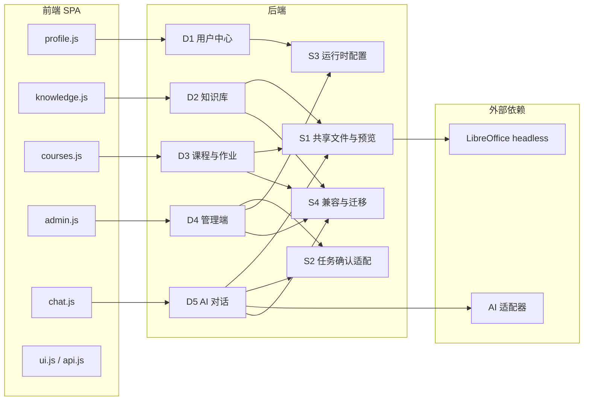
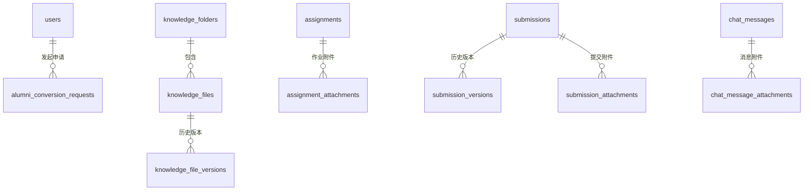
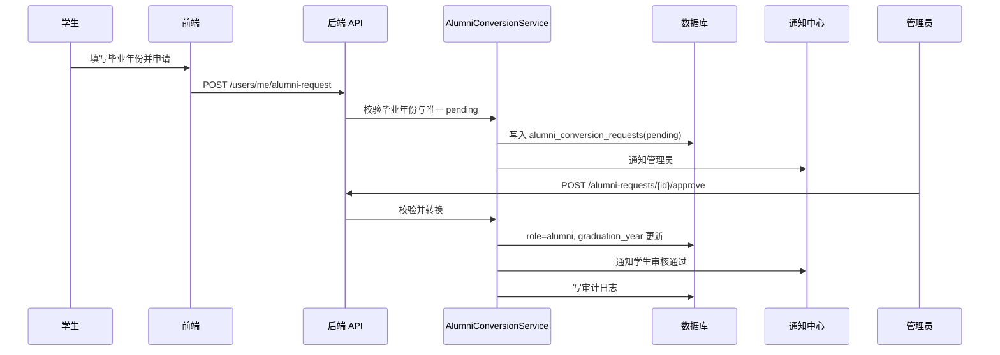
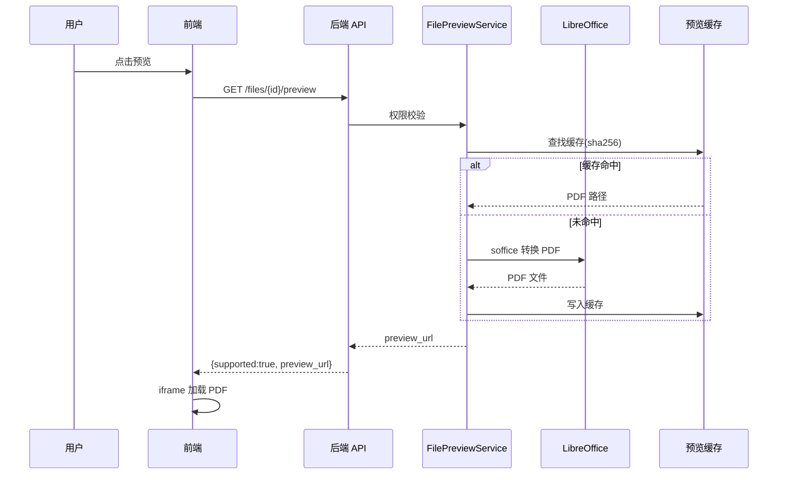
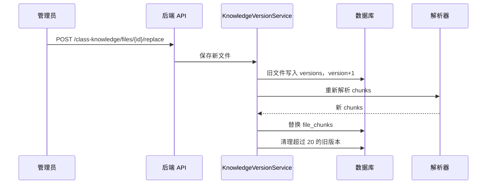
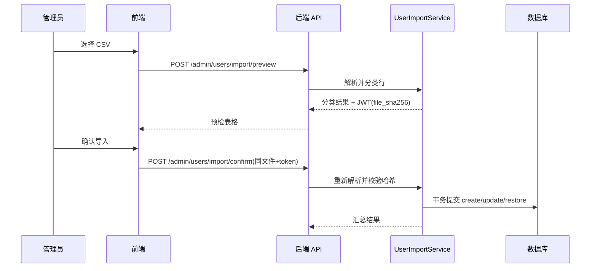
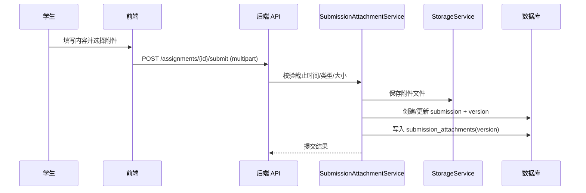
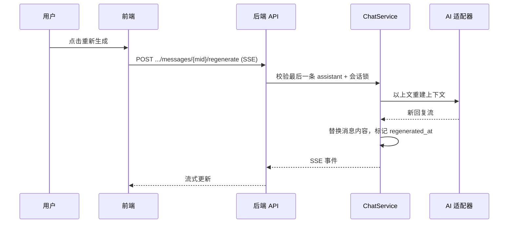
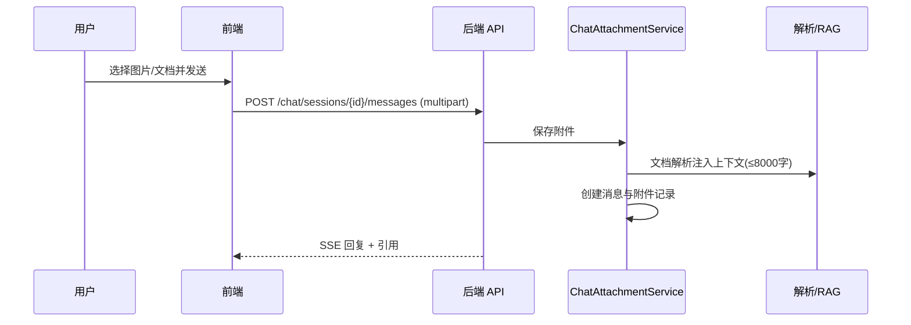

# 通用平台功能概要设计

> 文档版本：v0.1
> 编写日期：2026-08-06
> 输入文档：[通用平台功能需求文档](./tongyong_proposal.md)
> 适用范围：通用平台功能（用户中心、知识库、课程与作业、管理端、AI 对话）
> 技术基线：FastAPI + SQLAlchemy + SQLite/PostgreSQL + 原生 JS 前端 + LibreOffice headless（高保真预览），沿用现有 model/schema/repository/service/route 分层

---

## 1. 设计目的与范围

本文档基于 `tongyong_proposal.md` 生成概要设计，用于指导通用平台功能各模块的拆分、职责、关系、数据模型、接口、关键流程、前端组件和实施顺序。

本次设计覆盖需求文档全部 15 个里程碑（P1+P2 全量）：

| 方向 | 里程碑 | 优先级 |
| --- | --- | --- |
| 用户中心 | M1 个人资料字段扩展 | P1 |
| 用户中心 | M2 校友转换 | P1 |
| 知识库 | M3 文件夹与移动 | P1 |
| 知识库 | M4 在线预览 | P1 |
| 知识库 | M5 班级文件版本管理 | P2 |
| 课程与作业 | M6 作业附件 | P1 |
| 管理端 | M7 用户导入预检 | P1 |
| 管理端 | M8 用户列表 CSV 导出 | P1 |
| 管理端 | M9 精确 DAU/活跃趋势 | P1 |
| 管理端 | M10 Skill 配置编辑 + AI/配额/提醒时间配置 | P2 |
| 管理端 | M11 党建/竞赛/项目/成果多维统计 | P0/P1 |
| 管理端 | M12 任务确认接入业务接口与前端 | P1 |
| AI 对话 | M13 重新生成 | P2 |
| AI 对话 | M14 附件消息 | P2 |
| AI 对话 | M15 回答展示规范 | P2 |

本次设计不覆盖：

- Workflow 调度器与作业/比赛/计划截止提醒：仅预留 `assignment_reminder_hours` 配置字段。
- 创新项目空间业务本身：项目多维统计只定义“未上线占位”接入边界。
- 党建模块、竞赛/资源共享模块、成果档案模块自身功能。
- OCR 图片解析：聊天附件图片本期保存并展示，不强制 OCR。
- 学生画像、RAG 向量化、成果导出、PostgreSQL 实测、CI/CD 等清单其他部分内容。

---

## 2. 设计决策记录

| 序号 | 决策点 | 最终设计决策 |
| --- | --- | --- |
| 1 | 覆盖范围 | 全量覆盖 P1+P2 的 15 个里程碑，按需求文档 M1-M15 编号管理，实施顺序保留优先级。 |
| 2 | 在线预览方案 | Office（Word/Excel/PPT）采用 LibreOffice headless 转 PDF 实现高保真预览；PDF/图片原生 inline；文本/Markdown 服务端安全渲染；转换失败或环境缺失时降级为“下载查看”，不暴露内部错误。 |
| 3 | 配置持久化优先级 | `runtime_configs`（数据库）> 环境变量 > 默认值；管理员修改后重启不丢失。 |
| 4 | 导入预检确认 | 无状态 JWT 令牌绑定原始文件 SHA-256 与行摘要，确认阶段重新上传同一文件并校验，不做服务端临时存储。 |
| 5 | AI 重新生成语义 | 替换最后一条助手消息内容并标记 `regenerated_at`，前端展示“已重新生成”，不追加重复消息。 |
| 6 | 文档结构 | 对齐 `doc/dangjian/dangjian_design.md`：模块划分、关系图、职责、数据模型、接口、时序、前端、实施顺序、假设、风险、验收映射。 |

补充设计决策：

- 预览缓存键使用 `sha256(stored_name + size + version)`，Office 转换产物存入 `storage/preview_cache/`，由现有后台清理 worker 扩展 TTL 清理。
- Office 转换使用隔离的 LibreOffice user profile，禁止共享默认 profile，避免并发转换互相锁定。
- 附件存储新增 `scope`：`assignment`、`submission`、`chat`，物理路径沿用 `storage/{scope}/{user_id}/`，不写入知识库表。
- 提交附件按 `submission_versions.version` 绑定，重新提交后旧版本附件保留。
- 用户导入单次最多 1000 行，确认阶段与预检阶段重新解析同一文件，事务内提交，错误行不落库。
- DAU 统计直接读 `user_sessions.last_active_at`（登录与 refresh 已维护），新增 `(user_id, last_active_at)` 复合索引。
- 多维统计采用“模块适配器”模式：党建/竞赛/成果由现有服务聚合，项目模块未上线时返回 `not_available` 占位。
- 前端 Markdown 渲染引入本地 vendor 的 `marked` + `DOMPurify`（离线环境，不使用 CDN），所有渲染结果先脱敏。
- Skill 配置编辑与系统配置编辑均走白名单校验；API Key 永不回显。

---

## 3. 模块划分

### 3.1 模块清单

| 编号 | 模块 | 职责摘要 | 对应里程碑 |
| --- | --- | --- | --- |
| D1 | 用户中心模块（User Center） | 个人资料字段扩展、校友转换申请/审核/直接转换、通知与审计 | M1、M2 |
| D2 | 知识库模块（Knowledge Base） | 文件夹与移动、预览入口、班级文件版本管理、面包屑导航 | M3、M4、M5 |
| D3 | 课程与作业模块（Courses & Assignments） | 作业附件上传/预览/下载、提交附件与版本绑定 | M6 |
| D4 | 管理端模块（Admin Platform） | 用户导入预检、CSV 导出、DAU、Skill/系统配置、多维统计、任务确认接入 | M7-M12 |
| D5 | AI 对话模块（AI Chat） | 重新生成、附件消息、回答展示规范 | M13、M14、M15 |
| S1 | 共享文件与预览服务（Shared File & Preview） | 文件存储 scope 适配、Office 高保真转换、文本安全渲染、预览缓存 | 横切（M4/M6/M14） |
| S2 | 共享任务确认适配（Confirmation Adapter） | 业务接口确认令牌校验、预览-确认两阶段复用 | 横切（M12） |
| S3 | 运行时配置服务（Runtime Config） | `runtime_configs` 持久化、启动合并、白名单键校验 | 横切（M10） |
| S4 | 兼容与迁移（Compatibility & Migration） | Alembic 迁移、旧数据兼容、路由注册顺序、前端兼容 | 横切 |

### 3.2 模块关系图

### 3.3 依赖关系

| 模块 | 依赖 | 被依赖 |
| --- | --- | --- |
| D1 用户中心 | 用户仓储、通知服务、审计、S3 | D4（审核/直接转换）、通知中心 |
| D2 知识库 | 文件仓储、S1 | D3（复用预览）、D5（附件预览边界） |
| D3 课程与作业 | 作业/提交仓储、S1、S2 | D4（统计） |
| D4 管理端 | 用户/统计/配置/Skill 仓储、S2、S3、党建/成果/资源现有服务 | 无 |
| D5 AI 对话 | 对话仓储、S1、LLM 适配器、RAG | 无 |
| S1 共享文件与预览 | `StorageService`、LibreOffice、解析器 | D2、D3、D5 |
| S2 任务确认适配 | `ConfirmationManager` | D3、D4、D5 |
| S3 运行时配置 | `settings`、`runtime_configs` | D1、D4 |
| S4 兼容与迁移 | Alembic、全部模型 | 全局约束 |

---

## 4. 模块职责与内部组成

### 4.1 D1 用户中心模块

#### 4.1.1 U1 个人资料字段扩展（M1）

职责：

- `users.profile_json` 新增 `interests`（数组）、`development_plan`（文本）、`grade`（文本）三个可选键。
- `PUT /api/v1/users/me` 的 `profile` 增加白名单校验：未知键忽略，已知键超限拒绝。
- 前端 `profile.js` 编辑弹窗与展示区同步新增三字段。

内部组成：

- 服务：`backend/app/services/profile_service.py`（或并入现有用户服务）：字段校验、标签分隔转换、兼容旧数据。
- Schema：`schemas/user.py` 增加 `ProfileUpdate` 白名单与长度约束。
- 路由：复用 `api/routes/users.py` 的 `PUT /users/me`，不改路径。

设计要点：

- `interests` 输入分隔符兼容逗号/顿号，与 `skills` 一致。
- 竞赛推荐等 AI 画像读取 `profile_json` 已有键，新字段无需额外迁移。

#### 4.1.2 U2 校友转换（M2）

职责：

- 学生自助申请：校验毕业年份、唯一 pending、写入 `alumni_conversion_requests`，通知管理员。
- 管理员审核：通过/驳回，驳回必填原因，通过后执行转换。
- 管理员直接转换：填毕业年份直接转换。
- 转换统一入口：角色改 `alumni`、更新 `graduation_year`、保留全部历史数据、写审计。

内部组成：

- 模型：`models/alumni_conversion.py`（`AlumniConversionRequest`）。
- 服务：`services/alumni_conversion_service.py`（校验、申请、审核、转换、通知）。
- 路由：`api/routes/users.py` 增加 `/me/alumni-request`；`api/routes/admin_users.py` 增加申请审核与直接转换。
- 前端：`frontend/js/views/profile.js`（申请入口）、`frontend/js/views/admin.js`（审核列表/直接转换）。

设计要点：

- 转换状态机：`pending` → `approved/rejected`；转换后请求记录保留归档。
- 通知 `ref_type="alumni_request"`，幂等规则沿用 `type + ref_type + ref_id`。
- 审计动作：`alumni_request.create/approve/reject`、`alumni_convert.direct`。

### 4.2 D2 知识库模块

#### 4.2.1 K1 文件夹与移动（M3）

职责：

- `knowledge_folders` 表 CRUD：新建、重命名、删除（仅空文件夹）。
- `knowledge_files.folder_id` 归属与移动；上传时可选 `folder_id`。
- 个人/班级两套路由的文件夹与文件列表过滤；前端面包屑导航。

内部组成：

- 模型：`models/file.py` 增加 `KnowledgeFolder`，`KnowledgeFile.folder_id`。
- 仓储：`repositories/file_repo.py` 增加文件夹查重、列表、移动、非空校验。
- 服务：`services/knowledge_folder_service.py`。
- 路由：`api/routes/knowledge.py`、`class_knowledge.py` 增加 folders 段。
- 前端：`frontend/js/views/knowledge.js` 增加文件夹工具栏、面包屑、移动弹窗。

设计要点：

- 唯一性在服务层校验：`(scope, owner_user_id, name)` 且未软删除。
- 单层目录，移动目标只能是根目录或其他同级文件夹。
- 班级知识库写权限仅 admin；读权限所有登录用户。

#### 4.2.2 K2 在线预览（M4）

职责：

- 个人/班级知识库文件预览入口：`GET /files/{id}/preview`。
- 委托 S1：PDF/图片 inline、文本/Markdown 安全 HTML、Office 高保真转 PDF。
- 预览不计入 `download_count`，权限复用现有文件权限。

内部组成：

- 路由：`knowledge.py`、`class_knowledge.py` 增加 preview。
- 服务：`services/file_preview_adapter.py`（权限检查 → 调用 S1）。
- 前端：`knowledge.js` 增加预览按钮与预览弹窗（iframe/img/HTML）。

#### 4.2.3 K3 班级文件版本管理（M5）

职责：

- 班级文件“上传新版本”替换：旧文件写入 `knowledge_file_versions`，主记录版本 +1。
- 替换后重新解析 `file_chunks`；历史版本可查看、下载。
- 版本上限 20，超出清理最旧记录与物理文件。

内部组成：

- 模型：`models/file.py` 增加 `KnowledgeFileVersion`。
- 服务：`services/knowledge_version_service.py`。
- 路由：`class_knowledge.py` 增加 `replace`、`versions`、`versions/{version}/download`。
- 前端：`knowledge.js` 增加“上传新版本”“版本历史”入口。

设计要点：

- 物理文件保留策略：软删除主记录后，版本物理文件由现有 `file_cleanup` worker 扩展清理。
- 预览缓存键包含 `version`，替换后旧预览缓存不命中新版本。

### 4.3 D3 课程与作业模块

#### 4.3.1 C1 作业附件（M6）

职责：

- 教师发布作业附件：多文件上传、删除、列表、下载、预览。
- 学生提交附件：multipart 提交，附件绑定提交版本；历史版本附件保留。
- 兼容保留 `attachment_url`（教师侧外部链接）与 `attachment_name`（文本字段）。

内部组成：

- 模型：`models/school.py` 增加 `AssignmentAttachment`、`SubmissionAttachment`。
- 服务：`services/assignment_attachment_service.py`、`services/submission_attachment_service.py`（或扩展现有服务）。
- 路由：`api/routes/assignments.py` 增加附件段与 multipart 提交。
- 前端：`frontend/js/views/courses.js` 增加附件上传区、附件列表、预览/下载按钮。

设计要点：

- `submission_attachments.version` 与 `submission_versions.version` 对齐；提交更新时新版本写新附件。
- 附件校验：类型白名单、单文件 50MB、单作业/单次提交总量 200MB、单次提交最多 10 个文件。
- 存储 scope：`assignment`、`submission`；下载/预览权限：作业附件登录可看，提交附件仅本人/admin。

### 4.4 D4 管理端模块

#### 4.4.1 A1 用户导入预检（M7）

职责：

- 两阶段导入：`import/preview` 解析并分类（新增/更新/恢复/跳过/错误），生成 JWT 令牌；`import/confirm` 重新上传同文件，校验哈希后事务提交。

内部组成：

- 服务：`services/user_import_service.py`：CSV 解析（UTF-8 BOM/GBK）、行分类、哈希令牌、事务提交。
- 路由：`api/routes/admin_users.py` 增加 preview/confirm。
- 前端：`admin.js` 导入弹窗改为“预检表格 + 确认导入”。

设计要点：

- 令牌载荷：`{ file_sha256, row_count, summary_hash, exp }`，有效期 10 分钟。
- 单次上限 1000 行；确认时哈希不一致直接拒绝。
- 错误行不导入，返回明细最多 20 条。

#### 4.4.2 A2 用户列表 CSV 导出（M8）

职责：

- `GET /api/v1/admin/users/export`：按列表筛选条件导出全部用户，UTF-8 BOM CSV。
- 列：学号、姓名、角色、状态、年级、毕业年份、最近活跃时间、创建时间。
- 导出行为写审计。

内部组成：

- 服务：`services/user_export_service.py`。
- 前端：`admin.js` 用户工具栏“导出 CSV”。

#### 4.4.3 A3 精确 DAU/活跃趋势（M9）

职责：

- 按 Asia/Shanghai 自然日聚合 `user_sessions.last_active_at` 去重用户数。
- 返回近 N 天逐日 DAU、平均值、峰值日与启用账号数对照；支持 CSV 导出。

内部组成：

- 服务：`services/activity_stats_service.py`。
- 路由：`api/routes/admin_stats.py` 增加 activity 与 export。
- 前端：`admin.js` 概览卡片改真实 DAU，新增 30 天趋势面板。

设计要点：

- 新增索引 `(user_id, last_active_at)`；时间聚合在 SQL 层完成，避免逐用户计算。
- 被撤销会话不计入；同日多设备去重。

#### 4.4.4 A4 Skill 与系统配置（M10）

职责：

- Skill 配置编辑：展示名、说明、触发词、启停、`model_config`（模型/温度/max_tokens/top_p）。
- 系统配置：班级名、默认配额、登录限制、AI 模型、AI Base URL、提醒时间档位；持久化到 `runtime_configs`。

内部组成：

- Schema：`schemas/skill.py` 增加 `model_config`；`schemas/audit.py` 扩展 `SystemConfigInfo/Update`。
- 服务：`services/skill_config_service.py`、`services/runtime_config_service.py`（S3）。
- 路由：`admin_skills.py`（已有 PUT 扩展字段）、`admin_config.py`（读写改为持久化）。
- 前端：`admin.js` Skill 行“编辑”弹窗、系统配置可编辑表单。

设计要点：

- `model_config` 键白名单：`model/temperature/max_tokens/top_p`。
- 配置优先级：数据库 > 环境变量 > 默认值；保存后更新内存 `settings` 并写库。
- API Key 只显示“已配置/未配置”。

#### 4.4.5 A5 党建/竞赛/项目/成果多维统计（M11）

职责：

- `GET /api/v1/admin/stats/business`：按年份/班级/年级/类别聚合党建、竞赛、成果统计；项目统计预留占位。

内部组成：

- 服务：`services/business_stats_service.py` + 各模块适配器（party/resource/achievement/project）。
- 路由：`api/routes/admin_stats.py` 增加 business。
- 前端：`admin.js` 新增“业务统计”Tab。

设计要点：

- 统一响应结构：`{ module, dimensions, summary, items }`。
- 项目适配器：模块未实现时返回 `not_available` 与空数据，不报错。
- 统计查询复用现有 `party_stats_service`、成果分类统计、`resources` 查询。

#### 4.4.6 A6 任务确认接入业务接口（M12）

职责：

- 为成果/资源写接口提供可选 `confirmation_token` 校验；令牌缺失保持旧流程，存在则校验用户、操作与数据哈希。
- 前端高风险操作统一走确认卡片。

内部组成：

- 服务：`services/confirmation_adapter.py`（S2）：包装 `ConfirmationManager.verify_confirmation`。
- 路由：`achievements.py`、`resources.py` 接入依赖。
- 前端：`ui.js` 复用 `renderConfirmationCard`，`api.js` 增加令牌携带。

### 4.5 D5 AI 对话模块

#### 4.5.1 AI1 重新生成（M13）

职责：

- `POST /api/v1/chat/sessions/{id}/messages/{message_id}/regenerate`（SSE）：
  - 仅允许最后一条 assistant 消息。
  - 以上文为上下文重新调用 LLM。
  - 替换原消息 `content/citations/token_usage/duration_ms`，标记 `regenerated_at`。

内部组成：

- 模型：`chat_messages` 增加 `regenerated_at` 可空列。
- 服务：`services/chat_service.py` 增加 `regenerate_message`，会话级并发锁。
- 前端：`chat.js` 助手消息悬停“重新生成”，生成中禁用。

#### 4.5.2 AI2 附件消息（M14）

职责：

- 消息发送支持 multipart 附件（图片/文档），`chat_message_attachments` 持久化。
- 文档解析入上下文（最多 3 个、单文件 10MB、注入文本 ≤8000 字符）；图片保存并展示，不强制 OCR。
- 附件可预览/下载，仅本人会话可访问。

内部组成：

- 模型：`models/chat.py` 增加 `ChatMessageAttachment`。
- 服务：`services/chat_attachment_service.py`（保存、解析、上下文组装、权限）。
- 路由：`chat.py` 扩展 multipart 发送、附件列表/下载/预览。
- 前端：`chat.js` composer 附件按钮与 chips，消息气泡附件区。

#### 4.5.3 AI3 回答展示规范（M15）

职责：

- ChatService prompt 加入展示规范：原生 Markdown、表格、标签列表、末尾可选操作、禁止内部技术话术、禁止整篇代码块。
- 前端安全 Markdown 渲染（`marked` + `DOMPurify` 本地 vendor），表格小屏横向滚动。

内部组成：

- Prompt：`doc/prompt.md`、`doc/skills_prompt.md` 同步维护。
- 前端：`chat.js` 替换 `escapeHtml(content)` 为安全渲染；`ui.js` 新增渲染工具。

### 4.6 S1 共享文件与预览服务

#### 4.6.1 S1.1 存储适配

- 扩展 `StorageService` scope：`personal/class/assignment/submission/chat`。
- 统一上传参数校验：类型白名单、大小限制、UUID 物理名。

#### 4.6.2 S1.2 Office 高保真转换

- 依赖：部署环境安装 LibreOffice，提供 `soffice`。
- 命令基线：`soffice --headless --norestore -env:UserInstallation=file:///{profile_dir} --convert-to pdf --outdir {cache_dir} {source}`。
- 转换范围：`.doc/.docx/.xls/.xlsx/.ppt/.pptx`；目标为 PDF，前端用浏览器原生阅读器。
- 隔离 profile：每个转换任务使用独立临时 profile，避免并发互锁。
- 超时与重试：单次默认 60s，失败重试 1 次；超时/失败返回降级结果。
- 配置：`PREVIEW_OFFICE_ENABLED`、`PREVIEW_OFFICE_TIMEOUT_SECONDS`、`PREVIEW_OFFICE_MAX_MB`（默认 20）、`PREVIEW_CACHE_TTL_DAYS`（默认 7）。

#### 4.6.3 S1.3 文本/Markdown 安全渲染

- 文本/代码类按纯文本 `<pre>` 渲染。
- Markdown 转 HTML 后脱敏：移除 script、事件属性、iframe、外部资源；Excel 只输出单元格值。
- 预览 HTML 不执行脚本，样式白名单。

#### 4.6.4 S1.4 预览缓存与清理

- 缓存键：`sha256(stored_name + size + version)`；产物 `storage/preview_cache/{scope}/{user_id}/{hash}.pdf`。
- 扩展现有 `workers/file_cleanup.py`：定期清理超 TTL 预览缓存与版本物理文件。

错误防护（防止转换异常外泄）：

- 转换失败、文件损坏、加密文件、soffice 缺失、超时、超限统一返回 `supported=false` + 用户可读提示“暂不支持预览，请下载查看”。
- 内部异常仅记日志，不进入响应体。
- 并发限制：每文件转换锁 + 全局信号量（默认 2 个并发），防止 CPU/磁盘打满。

### 4.7 S2 共享任务确认适配

- 提供 `verify_optional_confirmation(db, request, operation, target_payload, token)`。
- 令牌缺失：放行（兼容旧客户端）；令牌存在：校验有效期、用户、数据哈希。
- 失败统一抛 `AppException("CONFIRMATION_INVALID", ...)`。
- 成功/失败均写审计。

### 4.8 S3 运行时配置服务

- `runtime_configs` 表：`key` 唯一、`value_json`、`updated_by`、`updated_at`。
- 启动加载：默认值 ← 环境变量 ← 数据库配置覆盖，刷新 `settings`。
- 保存接口：白名单键 + 类型校验 + 审计。

### 4.9 S4 兼容与迁移

- Alembic 迁移：新增 7 张表、`knowledge_files.folder_id`、`chat_messages.regenerated_at`、`user_sessions` 索引。
- 旧数据兼容：`profile_json` 缺字段视为空；`attachment_url/attachment_name` 字段保留；旧导入接口保留。
- 路由注册顺序与前端 Tab 兼容旧版本。

---

## 5. 数据模型设计

### 5.1 实体关系

### 5.2 新增表

#### alumni_conversion_requests

| 字段 | 类型 | 说明 |
| --- | --- | --- |
| id | int PK | 申请 ID |
| user_id | int FK users.id, index | 申请人 |
| requested_graduation_year | int | 申请毕业年份 |
| reason | str nullable | 申请说明 |
| status | str | pending/approved/rejected |
| review_note | str nullable | 审核意见 |
| reviewed_by | int FK users.id nullable | 审核人 |
| reviewed_at | datetime nullable | 审核时间 |
| requested_at / created_at / updated_at | datetime | 时间 |

#### knowledge_folders

| 字段 | 类型 | 说明 |
| --- | --- | --- |
| id | int PK | 文件夹 ID |
| scope | str | personal/class |
| owner_user_id | int FK users.id | 归属人（class 为创建管理员） |
| name | str(100) | 文件夹名 |
| created_by | int FK users.id | 创建人 |
| created_at / updated_at / deleted_at | datetime | 时间/软删除 |

#### knowledge_file_versions

| 字段 | 类型 | 说明 |
| --- | --- | --- |
| id | int PK | 版本 ID |
| file_id | int FK knowledge_files.id, index | 所属文件 |
| version | int | 历史版本号 |
| stored_name / original_name | str | 物理名/原名 |
| mime_type / size | str / int | 元数据 |
| uploaded_by | int FK users.id | 上传人 |
| uploaded_at | datetime | 时间 |

#### assignment_attachments / submission_attachments

| 字段 | 类型 | 说明 |
| --- | --- | --- |
| id | int PK | 附件 ID |
| assignment_id / submission_id | int FK, index | 所属作业/提交 |
| version | int nullable | 仅提交附件：对应提交版本 |
| original_name / stored_name | str | 文件名/物理名 |
| mime_type / size | str / int | 元数据 |
| uploaded_by | int FK users.id | 上传人 |
| created_at / deleted_at | datetime | 时间/软删除 |

#### runtime_configs

| 字段 | 类型 | 说明 |
| --- | --- | --- |
| key | str PK/unique | 配置键白名单 |
| value_json | text | JSON 值 |
| updated_by | int FK users.id nullable | 最后修改人 |
| updated_at | datetime | 修改时间 |

#### chat_message_attachments

| 字段 | 类型 | 说明 |
| --- | --- | --- |
| id | int PK | 附件 ID |
| message_id | int FK chat_messages.id, index | 所属消息 |
| original_name / stored_name | str | 文件名/物理名 |
| mime_type / size | str / int | 元数据 |
| created_at | datetime | 时间 |

### 5.3 既有表变更

| 表 | 变更 | 说明 |
| --- | --- | --- |
| `knowledge_files` | 新增 `folder_id`（nullable FK, index） | NULL 表示根目录 |
| `chat_messages` | 新增 `regenerated_at`（nullable datetime） | 重新生成标记 |
| `user_sessions` | 新增 `(user_id, last_active_at)` 复合索引 | DAU 查询 |
| `skills` | 无 DDL 变更 | `model_config_json` 已存在，暴露到 API |
| `users.profile_json` | 无 DDL 变更 | JSON 内新增 `interests/development_plan/grade` |

---

## 6. 接口设计（概要）

### 6.1 用户中心

| 方法 | 路径 | 权限 | 说明 |
| --- | --- | --- | --- |
| PUT | `/api/v1/users/me` | 本人 | 扩展 profile 白名单校验 |
| POST | `/api/v1/users/me/alumni-request` | student | 发起校友转换申请 |
| GET | `/api/v1/users/me/alumni-request` | 本人 | 查询申请状态 |
| GET | `/api/v1/admin/users/alumni-requests` | admin | 申请列表 |
| POST | `/api/v1/admin/users/alumni-requests/{id}/approve` | admin | 通过 |
| POST | `/api/v1/admin/users/alumni-requests/{id}/reject` | admin | 驳回（必填原因） |
| POST | `/api/v1/admin/users/{id}/convert-alumni` | admin | 直接转换 |

### 6.2 知识库

| 方法 | 路径 | 权限 | 说明 |
| --- | --- | --- | --- |
| POST/GET | `/api/v1/knowledge/folders` | 本人 | 个人文件夹 |
| PUT/DELETE | `/api/v1/knowledge/folders/{id}` | 本人 | 重命名/删除 |
| GET | `/api/v1/knowledge/files?folder_id=` | 本人 | 按文件夹过滤 |
| PUT | `/api/v1/knowledge/files/{id}/move` | 本人 | 移动 |
| POST | `/api/v1/knowledge/upload` | 本人 | 上传（folder_id） |
| GET | `/api/v1/knowledge/files/{id}/preview` | 本人 | 预览 |
| POST/GET | `/api/v1/class-knowledge/folders` | admin/登录用户 | 班级文件夹 |
| PUT/DELETE | `/api/v1/class-knowledge/folders/{id}` | admin | 重命名/删除 |
| GET | `/api/v1/class-knowledge/files?folder_id=` | 登录用户 | 过滤列表 |
| PUT | `/api/v1/class-knowledge/files/{id}/move` | admin | 移动 |
| POST | `/api/v1/class-knowledge/upload` | admin | 上传 |
| GET | `/api/v1/class-knowledge/files/{id}/preview` | 登录用户 | 预览 |
| POST | `/api/v1/class-knowledge/files/{id}/replace` | admin | 上传新版本（P2） |
| GET | `/api/v1/class-knowledge/files/{id}/versions` | 登录用户 | 版本列表（P2） |
| GET | `/api/v1/class-knowledge/files/{id}/versions/{version}/download` | 登录用户 | 历史版本下载（P2） |

### 6.3 课程与作业

| 方法 | 路径 | 权限 | 说明 |
| --- | --- | --- | --- |
| POST | `/api/v1/assignments/{id}/attachments` | admin | 上传作业附件 |
| DELETE | `/api/v1/assignments/attachments/{id}` | admin | 删除附件 |
| GET | `/api/v1/assignments/{id}/attachments` | 登录用户 | 附件列表 |
| GET | `/api/v1/assignments/attachments/{id}/download` | 登录用户 | 下载 |
| GET | `/api/v1/assignments/attachments/{id}/preview` | 登录用户 | 预览 |
| POST | `/api/v1/assignments/{id}/submit` | student/alumni | multipart 提交（含附件） |
| GET | `/api/v1/submissions/{id}/attachments?version=` | 本人/admin | 提交附件列表 |
| GET | `/api/v1/submissions/attachments/{id}/download` | 本人/admin | 下载 |
| GET | `/api/v1/submissions/attachments/{id}/preview` | 本人/admin | 预览 |

### 6.4 管理端

| 方法 | 路径 | 权限 | 说明 |
| --- | --- | --- | --- |
| POST | `/api/v1/admin/users/import/preview` | admin | 导入预检 |
| POST | `/api/v1/admin/users/import/confirm` | admin | 确认导入 |
| GET | `/api/v1/admin/users/export` | admin | 用户 CSV 导出 |
| GET | `/api/v1/admin/stats/activity` | admin | DAU/活跃趋势 |
| GET | `/api/v1/admin/stats/activity/export` | admin | 趋势 CSV |
| PUT | `/api/v1/admin/skills/{id}` | admin | Skill 配置编辑 |
| GET/PUT | `/api/v1/admin/config` | admin | 系统配置（持久化） |
| GET | `/api/v1/admin/stats/business` | admin | 多维统计 |
| POST | `/api/v1/confirm/preview` | 登录用户 | 确认预览（现有） |
| POST | `/api/v1/confirm/confirm` | 登录用户 | 确认执行（现有） |

### 6.5 AI 对话

| 方法 | 路径 | 权限 | 说明 |
| --- | --- | --- | --- |
| POST | `/api/v1/chat/sessions/{id}/messages/{mid}/regenerate` | 本人 | 重新生成（SSE） |
| POST | `/api/v1/chat/sessions/{id}/messages` | 本人 | multipart 附件消息 |
| GET | `/api/v1/chat/messages/{id}/attachments` | 本人 | 附件列表 |
| GET | `/api/v1/chat/attachments/{id}/download` | 本人 | 下载 |
| GET | `/api/v1/chat/attachments/{id}/preview` | 本人 | 预览 |

---

## 7. 关键流程时序

### 7.1 校友转换申请与审核

### 7.2 Office 高保真预览

### 7.3 班级文件版本替换

### 7.4 用户导入预检

### 7.5 作业提交附件

### 7.6 AI 重新生成

### 7.7 聊天附件消息

---

## 8. 前端组件划分

| 文件 | 新增/改造 | 说明 |
| --- | --- | --- |
| `frontend/js/views/profile.js` | 改造 | 资料三字段、校友申请入口与状态 |
| `frontend/js/views/knowledge.js` | 改造 | 文件夹工具栏、面包屑、移动弹窗、预览弹窗、版本历史 |
| `frontend/js/views/courses.js` | 改造 | 作业附件上传区、附件列表、提交附件、预览/下载 |
| `frontend/js/views/admin.js` | 改造 | 导入预检表格、导出按钮、校友申请、Skill 编辑、系统配置、业务统计、活跃趋势 |
| `frontend/js/views/chat.js` | 改造 | 重新生成、附件 composer、安全 Markdown 渲染、展示规范 |
| `frontend/js/ui.js` | 改造 | 预览弹窗、附件列表组件、确认卡片复用、统计图（CSS 柱状） |
| `frontend/js/api.js` | 改造 | multipart 上传、文件名下载、确认令牌携带 |
| `frontend/assets/vendor/` | 新增 | 本地 `marked.min.js`、`dompurify.min.js`（离线可用） |
| `frontend/assets/styles.css` | 改造 | 面包屑、附件 chips、表格横向滚动、Markdown 样式 |

---

## 9. 实施顺序

| 批次 | 里程碑/模块 | 说明 |
| --- | --- | --- |
| 基础设施先行 | S1（存储/预览）、S3（运行时配置）、S4（迁移） | 为上层模块提供公共能力 |
| P1 第一批 | M1、M2、M3、M4、M6、M7、M8、M9 | 用户中心 + 知识库 + 作业附件 + 管理端基础 |
| P1/P0 第二批 | M11、M12 | 多维统计、任务确认接入 |
| P2 第三批 | M5、M10、M13、M14、M15 | 版本管理、配置编辑、AI 对话增强 |

每个里程碑建议沿用项目现有 M 系列任务卡格式：`doc/tasks/` 下建任务目录，包含设计、任务拆分、进度文档。

---

## 10. 设计假设与决策记录

- 假设部署环境可安装 LibreOffice；开发环境缺失时 Office 预览自动降级为“下载查看”，其余预览不受影响。
- 假设生产为单进程/有限 worker；会话级重新生成锁采用进程内锁，多 worker 部署时存在局限，后续可用 Redis 锁替换。
- 假设导入文件规模不超过 1000 行，超过时引导拆分文件。
- 假设前端静态资源离线部署，`marked`/`DOMPurify` 以本地 vendor 引入。
- 假设 DAU 口径以 `last_active_at` 为准，不做额外埋点。
- 假设业务统计只读，不修改业务表。
- 假设 `runtime_configs` 仅存储白名单键，API Key 与密钥仍走环境变量。

---

## 11. 风险与依赖

| 风险/依赖 | 影响 | 缓解措施 |
| --- | --- | --- |
| LibreOffice 转换质量/性能 | 高保真预览延迟或失败 | 缓存 + 超时/重试 + 并发限制 + 降级下载 |
| 预览缓存磁盘增长 | 存储占用 | TTL 清理 worker + 缓存键绑定版本 |
| Office 加密/损坏文件 | 转换进程卡死 | 超时强杀、错误统一降级、日志内部记录 |
| 配置优先级变更影响现有环境变量 | 行为不一致 | 文档明确 DB > env > 默认值，迁移前检查 |
| 导入确认需重新上传 | 用户体验 | 前端保留原文件引用，确认时自动重传 |
| SSE 重新生成并发 | 状态覆盖 | 会话锁 + 最后消息校验 |
| 附件存储增长 | 磁盘占用 | 软删除 + 清理 worker 扩展 |
| 项目统计依赖未上线模块 | 统计缺口 | `not_available` 占位，不虚构数据 |

---

## 12. 验收映射

| 设计模块 | 需求文档验收要点 | 验收方式 |
| --- | --- | --- |
| D1/U1 | 三字段填写/保存/展示、AI 读取 | 前端手测 + 接口测试 |
| D1/U2 | 两种转换方式、数据保留、审计 | 接口测试 + 管理端手测 |
| D2/K1 | 文件夹、面包屑、移动、空删 | 前端手测 |
| D2/K2、S1 | 六类格式预览、权限、脱敏 | 接口测试 + 浏览器预览 |
| D2/K3 | 版本递增、历史下载、20 上限 | 接口测试 |
| D3/C1 | 附件全链路、版本附件保留 | 接口测试 + 前端手测 |
| D4/A1 | 预检表格、错误不落库、防篡改 | 接口测试 |
| D4/A2 | 筛选导出、CSV 不乱码 | 接口测试 |
| D4/A3 | DAU 口径、30 天趋势、导出 | 接口测试 + 管理端手测 |
| D4/A4、S3 | Skill/系统配置编辑、重启持久化 | 接口测试 |
| D4/A5 | 党建/竞赛/成果聚合、项目占位 | 接口测试 |
| D4/A6、S2 | 令牌校验、旧流程兼容 | 接口测试 |
| D5/AI1 | 重新生成替换、并发保护 | 前端手测 + 接口测试 |
| D5/AI2 | 附件消息、文档引用、权限 | 接口测试 + 前端手测 |
| D5/AI3 | Markdown 表格、无内部话术 | Prompt 评审 + 前端手测 |
